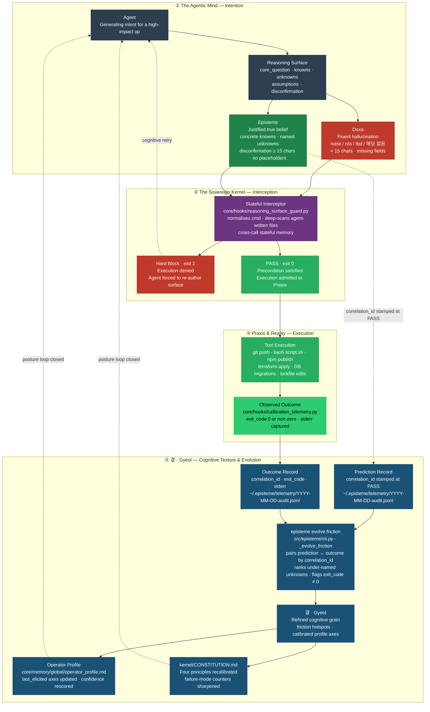

<h1 align="center">
  <picture>
    <source media="(prefers-color-scheme: dark)" srcset="docs/assets/logo-dark.svg?v=2">
    
  </picture>
</h1>

<p align="center">
  <a href="https://github.com/junjslee/episteme/releases"></a>
  <a href="https://github.com/junjslee/episteme/blob/master/LICENSE"></a>
  <a href="https://github.com/junjslee/episteme"></a>
</p>

<p align="center">
  <a href="README.md">English</a> &bull;
  <a href="README.ko.md">한국어</a> &bull;
  <a href="README.es.md"><b>Español</b></a> &bull;
  <a href="README.zh.md">中文</a>
</p>

<p align="center"><a href="https://epistemekernel.com"><b>epistemekernel.com</b></a></p>

> **episteme obliga a un agente de IA a mostrar su razonamiento antes de actuar.**
>
> Conoces la sensación: el diff se ve bien, el análisis suena correcto, y una vocecita dice *quizá debería leer esto con más cuidado.* episteme es esa voz, pero con dientes. Antes de cualquier cosa irreversible — un push, un deploy, una migración — tu agente tiene que escribir qué sabe, qué no sabe y qué probaría que está equivocado. En disco, donde puedas leerlo. Una puerta silenciosa y determinista aguanta cerrada hasta que el razonamiento sea real.
>
> Se integra con las herramientas que ya usas (hoy Claude Code; una capa de adaptadores neutral respecto al proveedor para las demás). Las lecciones de decisiones verificadas se quedan como protocolos a prueba de manipulación que reaparecen justo cuando vuelven a importar — así el agente se afila sobre *tu* codebase con el tiempo, y tu documentación se sostiene con el mismo estándar que tu código.

**[Qué aspecto tiene ↓](#qué-aspecto-tiene)** · **[Instalación ↓](#instalación)** · **[Las demos ↓](#las-demos)** · **[Cómo se compara ↓](#cómo-se-compara)** · **[Bajo el capó ↓](#bajo-el-capó)** · **[¿Funciona? ↗](docs/EVALUATION_METHOD.md)**

---

## Qué aspecto tiene

Digamos que le pides a tu agente: *"Evalúa si nuestro sistema de memoria con retrieval-augmented está mejorando realmente la calidad de las respuestas."*

**Sin episteme**, el agente lo trata como una tarea de medición. Saca 30 días de métricas, encuentra un 7% de lift en la tasa de thumbs-up y te escribe un memo confiado: *"la memoria ayuda; sigamos enviando."* Se lee precioso. También está equivocado de tres formas a la vez:

- El thumbs-up mide la *confianza* de la respuesta, no su *corrección* — midió un proxy de tu pregunta, no la pregunta.
- Las respuestas con memoria son un 30% más largas, y la longitud por sí sola empuja el thumbs-up — ese "lift" podría ser el efecto de la longitud.
- Nunca se nombró ninguna condición bajo la cual la conclusión se juzgaría errónea — así que no puede serlo.

**Con episteme**, el memo todavía no puede aterrizar. Primero, el agente tiene que dejar esto en disco:

| Campo | Lo que el agente debe escribir |
|---|---|
| **Core Question** | La única pregunta que este trabajo responde de verdad — *"¿mejora la memoria la corrección, controlando por longitud?"* |
| **Knowns** | Hechos verificados con fuentes, no conjeturas que suenan plausibles |
| **Unknowns** | Vacíos con nombre (*"si el lift sobrevive al control por longitud"*) — dejarlo en blanco hace fallar el gate |
| **Assumptions** | Las creencias que sostienen la carga, marcadas para poder falsarlas |
| **Disconfirmation** | Un observable comprometido de antemano — *"si el lift desaparece al re-ejecutar controlando por longitud, la memoria está añadiendo tokens, no señal"* |

Las respuestas perezosas (`none`, `n/a`, `tbd`, `해당 없음`) no pasan. Las evasivas vagas (*"si surgen problemas"*) tampoco — solo pasa una forma concreta y observable de quedar refutado. Y aquí está la magia silenciosa: el acto mismo de escribir esa surface es lo que deja al descubierto que el thumbs-up nunca fue la pregunta. Ese es el producto. **El agente tiene que pensar de una forma que puedas auditar, antes de que las consecuencias existan.**


*Grabado desde `scripts/demo_posture.sh` — una eliminación de restricción bloqueada, una reescritura validada, un refactor obligado a declarar su blast radius, y el protocolo sintetizado disparándose en una decisión posterior.*

## Qué obtienes

- **Una puerta en el punto de no retorno.** Las operaciones de alto impacto se interceptan antes de ejecutarse, y se revisa que el razonamiento del agente tenga sustancia — incluidas las formas escurridizas (`subprocess.run(['git','push'])`, scripts de shell escritos por el agente, comandos envueltos). Sin una surface real, no hay ejecución. Strict por defecto; y si quieres, puedes suavizarlo por proyecto.
- **Una segunda opinión que nunca tocó el borrador.** La estructura por sí sola no distingue el pensamiento del teatro. Así que para las decisiones que soportan carga, el gate acepta un artefacto más fuerte: la decisión descompuesta en afirmaciones, cada una verificada por un contexto fresco que nunca vio el razonamiento original, con la oposición más fuerte realmente argumentada. Si el veredicto dice parar, se para.
- **Memoria que se acumula en vez de decaer.** Cada lección verificada se convierte en un protocolo a prueba de manipulación, acotado a su contexto. La próxima vez que aparezca una decisión que encaje, el kernel te trae la lección — `Protocol: In context X, do Y` — sin que tengas que acordarte de que existe. El agente se afila sobre tu codebase en concreto.
- **Documentación que se mantiene honesta.** Cada doc rastreado lleva un marcador de ciclo de vida, y CI falla cuando la realidad se desvía — un doc sin clasificar, un doc living que cita uno retirado, una cadena de versión que alguien copió a mano. Los docs obsoletos te saludan al inicio de sesión, y solo cuando algo está realmente obsoleto. Una única fuente de verdad, impuesta en lugar de aspirada.
- **Un sistema que recoge lo suyo.** Las colas tienen tope con contrapresión visible, los logs rotan, los marcadores expirados se barren al inicio de sesión. Nada se apila en una esquina; borrar es una operación diseñada, no un accidente del descuido.
- **Una sola identidad entre herramientas.** Tu estilo de trabajo, tu postura ante el riesgo y tus preferencias de razonamiento viven en markdown versionado — sincronizado a cada adaptador con un solo comando. El kernel sobrevive a la herramienta que estés usando este año.

## Instalación

**Opción A — plugin de Claude Code (dos comandos, autocontenido):**

```
/plugin marketplace add junjslee/episteme
/plugin install episteme@episteme
```

Los hooks, agentes y skills están vivos en tu sesión; sin pip de por medio.

**Opción B — clonar el kernel (CLI + fuente editable):**

```bash
git clone https://github.com/junjslee/episteme ~/episteme
cd ~/episteme && pip install -e .

episteme init      # generate personal memory files from templates
episteme setup .   # score working style + reasoning posture
episteme sync      # push identity to every adapter
episteme doctor    # verify wiring
```

¿Lo estás adoptando en un repo que ya existe? Corre `episteme docs lint` primero — le pide a cada doc rastreado que declare qué es, y esa primera corrida suele ser el inventario más honesto que el repo ha tenido nunca. Los detalles, los harnesses de proyecto y la referencia completa de comandos están en [`INSTALL.md`](./INSTALL.md) · [`docs/SETUP.md`](./docs/SETUP.md) · [`docs/COMMANDS.md`](./docs/COMMANDS.md).

## Las demos

Cada demo trae sus artefactos reales. Léelos antes que cualquier filosofía — son los recibos.

| Demo | Qué demuestra |
|---|---|
| [`demos/04_symbiosis/`](./demos/04_symbiosis/) | **La tesis, desde historia real (2026-04-27, Events 65–67):** el operador propuso un paquete irreversible impulsado por la ansiedad; la revisión adversarial del kernel afloró 3 hallazgos Critical; el camino descompuesto se volvió constitucional en `AGENTS.md`. Agente y humano depurando la intención *del otro*. [`DIFF.md`](./demos/04_symbiosis/DIFF.md) muestra el mundo alternativo lado a lado. |
| [`demos/03_differential/`](./demos/03_differential/) | **El mismo prompt, framework off vs on.** Off responde *cómo*; on responde *si acaso*. [`DIFF.md`](./demos/03_differential/DIFF.md) nombra los failure modes atrapados. |
| [`demos/02_debug_slow_endpoint/`](./demos/02_debug_slow_endpoint/) | Una regresión de p95 donde el fluido-pero-erróneo *"añade un cache"* muere en el gate de la Core Question; en su lugar se produce una causa raíz a nivel de esquema. |
| [`demos/01_attribution-audit/`](./demos/01_attribution-audit/) | La forma canónica de cuatro artefactos (reasoning-surface → decision-trace → verification → handoff) — el kernel auditando sus propias atribuciones. |
| [`demos/05_contract_gate/`](./demos/05_contract_gate/) | El complemento conductual: los contratos declarados corren al final del turno. |

Puedes regrabar tú mismo la demo estrella: `scripts/demo_posture.sh` (la receta está en la cabecera del script). El dashboard en vivo se renderiza contra la propia cadena hash del kernel — [`web/README.md`](./web/README.md).

## Cómo se compara

| Eje | episteme | Memory APIs (mem0, OpenMemory) | Runtimes de agentes (Agno, opencode) |
|---|---|---|---|
| **Qué es** | Capa de gobernanza del razonamiento + identidad sobre tus herramientas existentes | API de memoria embebida en una app | Un runtime que ejecuta agentes |
| **Dónde vive la identidad** | Markdown/JSON gobernado y versionado — cross-tool | Store de vectores/grafos, por app | System prompt, por sesión |
| **Know-how** | Extraído en la frontera del sistema de archivos, encadenado por hash, re-expuesto por contexto | Recuperación opaca | Ajustado por prompt, por sesión |
| **Higiene de docs/estado** | Lineada por ciclo de vida, con GC, con gate de drift en CI | N/A | N/A |

**¿No es esto solo contract testing?** Los contract tests preguntan *si el código hizo lo que dice el spec.* La Reasoning Surface pregunta algo anterior y más difícil: *¿era ese el spec correcto, era esa la pregunta correcta, y qué nos habría avisado de lo contrario?* Una suite de tests en verde no puede decirte que estás resolviendo el problema equivocado con elegancia — esa falla ocurre antes de que el spec exista. episteme envía ambas capas ([`docs/CONTRACT_GATE.md`](./docs/CONTRACT_GATE.md)).

**¿Por qué no puede hacer esto un prompt?** Porque los prompts son sugerencias. Viven una sola llamada, se saltan cuando vas con prisa, y se caen del contexto sin avisar. Un hook que sale con código distinto de cero no negocia. El benchmark MIRROR ([arXiv 2604.19809](https://arxiv.org/abs/2604.19809); 16 modelos, 8 laboratorios, ~250k instancias) probó exactamente esto: mostrarle a un modelo sus propias puntuaciones de calibración no cambió nada — *solo ayudó la restricción arquitectónica* (tasa de fallo confiado 0.60 → 0.14). La postura le gana al prompt.

## Límites honestos

- [`kernel/KERNEL_LIMITS.md`](./kernel/KERNEL_LIMITS.md) dice sin rodeos cuándo esta no es la herramienta para ti. *Una disciplina sin frontera es solo un credo.*
- Se somete al mismo estándar. En junio de 2026 el bucle de síntesis de protocolos disparó su propia condición de falsabilidad — 49 días, cero protocolos sintetizados — y se reconstruyó alrededor de interrogaciones verificadas. El rastro completo es público ([`kernel/FAILURE_MODES.md`](./kernel/FAILURE_MODES.md), [`docs/EVALUATION_METHOD.md`](./docs/EVALUATION_METHOD.md)). Una herramienta que le exige disconfirmation a tus decisiones te debe lo mismo sobre sí misma.
- Cada idea prestada está acreditada, junto al trabajo de 2025–26 que llegó a patrones parecidos de forma independiente: [`kernel/REFERENCES.md`](./kernel/REFERENCES.md).

## Bajo el capó

Estado: **<!-- episteme-fact:version -->1.10.0-rc.1<!-- /episteme-fact:version -->** · La práctica son cinco etapas — Frame → Decompose → Execute → Verify → Handoff — y cada una existe para contrarrestar una forma concreta en que la mente falla bajo la fluidez: question substitution, WYSIATI, anchoring, narrative fallacy, planning fallacy, overconfidence. La historia completa está en [`docs/THE_WAY_TO_THINK.md`](./docs/THE_WAY_TO_THINK.md); los cuatro Cognitive Blueprints (Axiomatic Judgment · Fence Reconstruction · Consequence Chain · Architectural Cascade) están especificados en [`docs/ARCHITECTURE.md`](./docs/ARCHITECTURE.md).



Cuatro ideas, en los colores de arriba. **Doxa** (rojo) es salida fluida pero no validada — el estado de falla que todo esto existe para prevenir. **Episteme** (verde) es una surface que de verdad se sostiene, y es el precio de entrada para ejecutar. **Praxis** es la acción que pasó, más lo que ocurrió realmente. **결 · Gyeol** (azul) es el bucle que devuelve esos resultados a tu calibración de la próxima vez. Agnóstico al stack por construcción: el kernel es markdown plano, el perfil JSON plano, y los adaptadores (Claude Code, Hermes, OMO/OMX) intercambiables.

El kernel mismo — markdown, sin código, nada que te ate — empieza en [`kernel/`](./kernel/):

| Archivo | Qué define |
|---|---|
| [`SUMMARY.md`](./kernel/SUMMARY.md) | Destilación operativa en 30 líneas |
| [`CONSTITUTION.md`](./kernel/CONSTITUTION.md) | Afirmación raíz, cuatro principios, failure modes del razonador |
| [`FAILURE_MODES.md`](./kernel/FAILURE_MODES.md) | Taxonomía completa de 12 modos ↔ artefactos contadores |
| [`REASONING_SURFACE.md`](./kernel/REASONING_SURFACE.md) | El protocolo Knowns / Unknowns / Assumptions / Disconfirmation |
| [`MEMORY_ARCHITECTURE.md`](./kernel/MEMORY_ARCHITECTURE.md) | Cinco niveles de memoria (working → reflective) |
| [`KERNEL_LIMITS.md`](./kernel/KERNEL_LIMITS.md) | Cuándo el kernel es la herramienta equivocada |
| [`REFERENCES.md`](./kernel/REFERENCES.md) | Atribución + trabajo contemporáneo convergente |

```
episteme/
├── kernel/          philosophy (markdown; travels across runtimes)
├── core/hooks/      deterministic gates + session automation
├── src/episteme/    CLI + core library (doc lifecycle, sync, telemetry)
├── adapters/        delivery layers (Claude Code, Hermes, …)
├── demos/           end-to-end reference deliverables
├── skills/          reusable operator skills
├── templates/       project scaffolds
└── docs/            architecture, contracts, runtime docs — lifecycle-linted
```

Jerarquía de autoridad: **docs del proyecto > perfil del operador > defaults del kernel > defaults del runtime.** Contrato operativo del repo para agentes: [`AGENTS.md`](./AGENTS.md) · sitemap para LLM: [`llms.txt`](./llms.txt).

## Lee a continuación

| Tema | Dónde |
|---|---|
| La práctica, operacionalizada | [`docs/THE_WAY_TO_THINK.md`](./docs/THE_WAY_TO_THINK.md) |
| Arquitectura + specs de los blueprints | [`docs/ARCHITECTURE.md`](./docs/ARCHITECTURE.md) |
| ¿Funciona? (método de evaluación) | [`docs/EVALUATION_METHOD.md`](./docs/EVALUATION_METHOD.md) |
| Rutas de instalación (marketplace, CLI, dev) | [`INSTALL.md`](./INSTALL.md) |
| Ciclo de vida de docs + contratos de memoria | [`docs/MEMORY_CONTRACT.md`](./docs/MEMORY_CONTRACT.md) · [`docs/SYNC_AND_MEMORY.md`](./docs/SYNC_AND_MEMORY.md) |
| Hooks + governance packs | [`docs/HOOKS.md`](./docs/HOOKS.md) |
| Postura de seguridad (mapeo OWASP Agentic 2026) | [`docs/COMPLIANCE_CROSSWALK.md`](./docs/COMPLIANCE_CROSSWALK.md) |
| Personalización | [`docs/CUSTOMIZATION.md`](./docs/CUSTOMIZATION.md) |
| Índice completo de docs (generado) | [`docs/README.md`](./docs/README.md) |

## Licenciamiento comercial

¿Necesitas una licencia comercial, o ayuda para adoptar esto? [Escríbeme](mailto:junseong.lee652@gmail.com) — me interesa de verdad saber qué estás construyendo.

---

> **Nota sobre la traducción.** Este README es una traducción al español mantenida junto al [`README.md`](./README.md) canónico en inglés. Para la documentación más profunda, los recorridos de las demos y los diagramas de arquitectura, consulta el árbol de docs en inglés. Los términos de carga del kernel (Reasoning Surface, Core Question, Blueprint, hook, kernel, doxa/episteme/praxis, etc.) se conservan en inglés a propósito.
