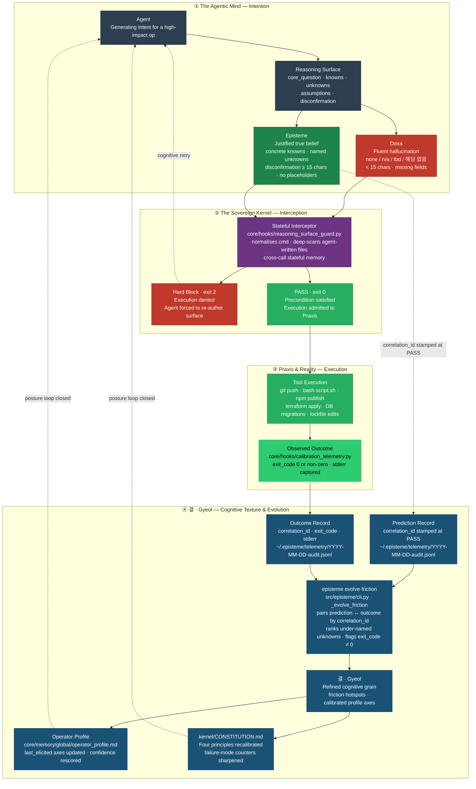

<h1 align="center">
  <picture>
    <source media="(prefers-color-scheme: dark)" srcset="docs/assets/logo-dark.svg?v=2">
    
  </picture>
</h1>

<p align="center">
  <a href="https://github.com/junjslee/episteme/releases"></a>
  <a href="https://github.com/junjslee/episteme/blob/master/LICENSE"></a>
  <a href="https://github.com/junjslee/episteme"></a>
</p>

<p align="center">
  <a href="README.md">English</a> &bull;
  <a href="README.ko.md"><b>한국어</b></a> &bull;
  <a href="README.es.md">Español</a> &bull;
  <a href="README.zh.md">中文</a>
</p>

<p align="center"><a href="https://epistemekernel.com"><b>epistemekernel.com</b></a></p>

> **episteme는 AI 에이전트가 행동하기 전에 자신의 추론을 증명하게 만들고 — 당신 저장소의 문서가 코드에 대해 거짓말하는 것을 멈추게 만든다.**
>
> 이미 쓰고 있는 코딩 도구 안에 설치된다 (오늘은 Claude Code; 나머지는 벤더 중립 어댑터 레이어). 모든 고위험 행동 이전에 — `git push`, 배포, 마이그레이션, 제약 삭제 — 에이전트는 디스크 위에, 자신이 아는 것, 모르는 것, 그리고 어떤 관측 가능한 사건이 자신을 틀렸다고 증명할지를 적어야 한다. 결정론적 훅이 그 아티팩트를 검사하고, 그것이 진짜가 되기 전까지 진행을 거부한다(`exit 2`). 검증된 결정에서 나온 교훈은 변조가 드러나는(tamper-evident) 컨텍스트 범위 프로토콜이 되어 다음 일치하는 결정에서 다시 떠오른다 — 그래서 에이전트는 시간이 지나며 *당신의* 코드베이스에 더 예리해지고, 당신의 문서는 코드가 테스트에 대해 린트되는 것과 똑같은 방식으로 코드에 대해 린트된다.

**[실제 모습 ↓](#실제-모습)** · **[설치 ↓](#설치)** · **[데모 ↓](#데모)** · **[어떻게 비교되는가 ↓](#어떻게-비교되는가)** · **[내부 구조 ↓](#내부-구조)** · **[작동하는가? ↗](docs/EVALUATION_METHOD.md)**

---

## 실제 모습

당신이 에이전트에게 묻는다: *"우리의 검색-증강 메모리(retrieval-augmented memory) 시스템이 실제로 응답 품질을 개선하고 있는지 평가해줘."*

**episteme 없이** — 에이전트는 이것을 측정 잡무로 취급한다. 30일치 메트릭을 끌어와 thumbs-up 비율에서 7%의 lift를 발견하고, 자신감 있는 메모를 쓴다: *"메모리는 도움이 된다; 계속 출하하라."* 당신은 그것을 읽는다. 그것은 세 가지 방식으로, 유창하게 틀렸다:

- Thumbs-up은 응답의 *정확성*이 아니라 *확신도*를 추적한다 — 에이전트는 질문 자체가 아니라 질문의 대리지표(proxy)를 측정했다.
- 메모리 응답은 30% 더 길고, 길이는 독립적으로 thumbs-up을 끌어올린다 — 그 "lift"는 길이 효과일 수 있다.
- 결론이 틀렸다고 판정될 조건이 한 번도 명명되지 않았다 — 그래서 그것은 틀릴 수가 없다.

**episteme와 함께** — 메모가 착지하기 전에, 에이전트는 이것을 디스크에 커밋해야 한다:

| 필드 | 에이전트가 반드시 기록해야 하는 것 |
|---|---|
| **Core Question** | 이 작업이 실제로 답하는 단 하나의 질문 — *"길이를 통제했을 때, 메모리가 정확성을 개선하는가?"* |
| **Knowns** | 출처가 있는 검증된 사실 — 그럴듯하게 들리는 추측이 아니다 |
| **Unknowns** | 명명된 결손(*"길이 통제 후에도 lift가 살아남는지"*) — 여기가 비면 게이트가 실패한다 |
| **Assumptions** | 하중을 지탱하는 신념, 반증될 수 있도록 표시됨 |
| **Disconfirmation** | 사전 약속된 관측 대상 — *"길이를 통제해 다시 돌렸을 때 lift가 사라지면, 메모리는 신호가 아니라 토큰을 더하고 있는 것이다"* |

게으른 토큰(`none`, `n/a`, `tbd`, `해당 없음`)은 거부된다. 모호한 회피 표현(*"문제가 생기면"*)은 거부된다 — 오직 구체적인 반증 조건만 통과한다. surface를 적는 행위 자체가 그 대리지표가 질문이 아니었음을 드러낸다. 그것이 제품이다: **에이전트는 결과가 존재하기 전에, 당신이 감사할 수 있는 방식으로 사고하도록 강제된다.**


*`scripts/demo_posture.sh`로 녹화됨 — 차단된 제약 제거, 검증된 재작성, 자신의 blast radius를 선언하도록 강제된 리팩터, 그리고 이후 결정에서 발화하는 합성된 프로토콜.*

## 무엇을 얻는가

- **돌아올 수 없는 지점에 놓인 추론 게이트.** 훅이 고위험 작업을 가로채고 Reasoning Surface를 구조적으로 검증한다 — 정규화된 명령어 스캔이 우회 형태(`subprocess.run(['git','push'])`, 에이전트가 작성한 셸 스크립트, 래핑된 실행기)를 잡아낸다. surface가 없거나 공허하면 → 작업이 거부된다. 기본은 strict; advisory 모드는 프로젝트별 opt-in이다.
- **하중을 받는 결정을 위한 심문(interrogation).** 구조만으로는 사고와 연극을 구분할 수 없다. 그래서 게이트는 더 강한 아티팩트도 받아들인다: 결정을 주장들로 분해하고, 하중을 받는 각 주장을 **초안 추론을 본 적 없는 새로운 컨텍스트**가 검증하며, 가장 강한 반론을 논증하고, 가장 약한 고리를 지목한다. `stop` 평결은 닫힌 채로 실패한다.
- **부패하는 대신 축적되는 기억.** 검증된 모든 교훈은 해시 체인으로 연결된, 컨텍스트 범위 프로토콜이 된다 — append-only이고 변조가 드러나므로(tamper-evident), 에이전트는 배운 것을 몰래 다시 쓸 수 없다. 다음 일치하는 결정에서 커널은 프로토콜을 선제적으로 표면화한다: `[episteme guide] … · overlap 5/6 · Protocol: In context X, do Y`. 당신이 물어보기를 기억할 필요가 없다.
- **현실에 대해 린트되는 문서.** 추적되는 모든 문서는 기계가 읽을 수 있는 생명주기 마커(`living / spec-implemented / design-history / report / tombstone`)를 지닌다. 새 문서가 분류되지 않은 채 착지하거나, living 문서가 폐기된 문서를 현행인 양 인용하거나, 특정 시점 보고서가 `docs/`에 눌러앉으려 하면 CI가 실패한다. 버전 문자열은 릴리스 매니페스트에서 찍히며, 손으로 복사하지 않는다. 낡은 문서는 세션 시작 시 표면화된다 — 조용히, 실제로 낡았을 때만. **단일 진리 원천(single source of truth), 열망이 아니라 강제된 것.**
- **스스로 뒤처리를 하는 시스템.** 검토 큐는 가시적 백프레셔와 함께 상한이 걸리고, 로그는 크기 상한에서 순환하며, 만료된 마커와 오래된 텔레메트리는 세션 시작 시 수거된다. 아티팩트는 쌓이지 않는다; 삭제는 방치의 사고가 아니라 설계된 작업이다.
- **도구를 가로지르는 하나의 정체성.** 당신의 작업 스타일, 리스크 자세, 추론 선호는 거버넌스가 적용된 버전 관리 마크다운에 산다 — 한 번의 명령으로 모든 어댑터에 동기화된다. 커널은 도구보다 오래 산다.

## 설치

**옵션 A — Claude Code 플러그인 (명령 두 개, 자기완결형):**

```
/plugin marketplace add junjslee/episteme
/plugin install episteme@episteme
```

훅, 에이전트, 스킬이 당신의 세션에서 살아난다; pip은 관여하지 않는다.

**옵션 B — 커널 클론 (CLI + 편집 가능한 소스):**

```bash
git clone https://github.com/junjslee/episteme ~/episteme
cd ~/episteme && pip install -e .

episteme init      # generate personal memory files from templates
episteme setup .   # score working style + reasoning posture
episteme sync      # push identity to every adapter
episteme doctor    # verify wiring
```

기존 저장소에 도입하기: `episteme docs lint`는 추적되는 모든 문서의 생명주기 분류를 강제한다 — 그 첫 lint 실행이 대부분의 저장소가 한 번도 가져본 적 없는 정직한 목록이다. 세부 사항, 프로젝트 하네스, 전체 명령 레퍼런스: [`INSTALL.md`](./INSTALL.md) · [`docs/SETUP.md`](./docs/SETUP.md) · [`docs/COMMANDS.md`](./docs/COMMANDS.md).

## 데모

모든 데모는 실제 아티팩트를 함께 출하한다 — 어떤 철학보다 먼저 그것들을 읽어라.

| 데모 | 무엇을 증명하는가 |
|---|---|
| [`demos/04_symbiosis/`](./demos/04_symbiosis/) | **실제 역사에서 나온 논지 (2026-04-27, Events 65–67):** 운영자가 불안에 이끌린 비가역적 묶음을 제안했고; 커널의 적대적 검토가 3개의 Critical 발견을 표면화했으며; 분해된 경로가 `AGENTS.md`에서 헌법이 되었다. 에이전트와 인간이 *서로의* 의도를 디버깅한다. [`DIFF.md`](./demos/04_symbiosis/DIFF.md)가 그 대안 세계를 나란히 보여준다. |
| [`demos/03_differential/`](./demos/03_differential/) | **같은 프롬프트, 프레임워크 off vs on.** off는 *어떻게*에 답하고; on은 *~인지 여부*에 답한다. [`DIFF.md`](./demos/03_differential/DIFF.md)가 잡아낸 실패 모드를 명명한다. |
| [`demos/02_debug_slow_endpoint/`](./demos/02_debug_slow_endpoint/) | 유창하게-틀린 *"캐시를 추가하라"*가 Core Question 게이트에서 죽고; 대신 스키마 수준의 근본 원인이 산출되는 p95 회귀. |
| [`demos/01_attribution-audit/`](./demos/01_attribution-audit/) | 정본 4-아티팩트 형태 (reasoning-surface → decision-trace → verification → handoff) — 커널이 자신의 귀속(attribution)을 감사한다. |
| [`demos/05_contract_gate/`](./demos/05_contract_gate/) | 행동적 보완물: 선언된 계약이 턴 종료 시 실행된다. |

히어로 데모를 직접 다시 녹화하기: `scripts/demo_posture.sh` (레시피는 스크립트 헤더에). 라이브 대시보드는 커널 자신의 해시 체인에 대해 렌더링된다 — [`web/README.md`](./web/README.md).

## 어떻게 비교되는가

| 축 | episteme | Memory API (mem0, OpenMemory) | Agent 런타임 (Agno, opencode) |
|---|---|---|---|
| **무엇인가** | 기존 도구 위에 얹는 추론 거버넌스 + 정체성 레이어 | 앱에 내장된 Memory API | 에이전트를 실행하는 런타임 |
| **정체성이 사는 곳** | 거버넌스가 적용된 버전 관리 마크다운/JSON — 도구 간 공유 | 벡터/그래프 스토어, 앱마다 | 시스템 프롬프트, 세션마다 |
| **노하우** | 파일 시스템 경계에서 추출되고, 해시 체인으로 연결되며, 컨텍스트에 의해 다시 표면화됨 | 불투명한 검색 | 프롬프트 튜닝, 세션마다 |
| **문서/상태 위생** | 생명주기 린트, GC, CI에서 드리프트 게이트 | N/A | N/A |

**이건 그냥 계약 테스트(contract testing) 아닌가?** 계약 테스트는 *행동적* 회귀를 잡는다 — 코드가 스펙이 말한 대로 했는가. Reasoning Surface는 *인식론적* 회귀를 잡는다 — 우리가 올바른 스펙을 썼는가, 올바른 질문을 프레이밍했는가, 우리를 틀렸다고 증명할 것을 명명했는가. 통과하는 테스트 스위트는 당신이 잘못된 문제를 유창하게 풀고 있다는 것을 알려줄 수 없다; 그 실패는 스펙이 존재하기 전에 일어난다. episteme는 두 레이어를 모두 출하한다([`docs/CONTRACT_GATE.md`](./docs/CONTRACT_GATE.md)).

**왜 프롬프트로는 이걸 할 수 없는가?** 프롬프트는 권고다: 한 번의 호출만 살고, 마감에서 건너뛰어지며, 컨텍스트에서 사라진다. non-zero로 종료하는 훅은 건너뛸 수 없다. MIRROR 벤치마크([arXiv 2604.19809](https://arxiv.org/abs/2604.19809); 16개 모델, 8개 랩, 약 25만 인스턴스)는 모델에게 자신의 캘리브레이션을 보여주는 것이 도움이 되지 않음을 발견했다 — *오직 아키텍처적 제약만이 효과적이다* (Confident Failure Rate 0.60 → 0.14). 프롬프트가 아니라 자세(Posture over prompt).

## 정직한 한계

- [`kernel/KERNEL_LIMITS.md`](./kernel/KERNEL_LIMITS.md)는 이 커널이 틀린 도구일 때를 명명한다. *경계 없는 규율은 신조다.*
- 커널은 자신의 주장을 스스로 측정한다: 프로토콜 합성 루프는 2026-06에 자신의 반증 가능성 조건을 발화시켰고 (49일, 합성된 프로토콜 0개), 검증된 심문에서 합성하도록 재구축되었다 — 감사 기록은 공개되어 있다([`kernel/FAILURE_MODES.md`](./kernel/FAILURE_MODES.md), [`docs/EVALUATION_METHOD.md`](./docs/EVALUATION_METHOD.md)). 당신의 결정에 disconfirmation을 강제하는 커널은 자신에게도 같은 것을 빚지고 있다.
- 차용한 모든 개념에 대한 귀속, 그리고 같은 패턴으로 독립적으로 수렴한 2025–26 업계 작업: [`kernel/REFERENCES.md`](./kernel/REFERENCES.md).

## 내부 구조

상태: **<!-- episteme-fact:version -->1.10.0-rc<!-- /episteme-fact:version -->** · 실천은 Frame → Decompose → Execute → Verify → Handoff이며, 특정 System-1 실패 모드(question substitution, WYSIATI, anchoring, narrative fallacy, planning fallacy, overconfidence)에 대한 명명된 반례에 근거한다 — 전체 운영화는 [`docs/THE_WAY_TO_THINK.md`](./docs/THE_WAY_TO_THINK.md)이고, 네 개의 Cognitive Blueprint(Axiomatic Judgment · Fence Reconstruction · Consequence Chain · Architectural Cascade)는 [`docs/ARCHITECTURE.md`](./docs/ARCHITECTURE.md)에 명세되어 있다.



**Doxa**(빨강) — 유창하지만 검증되지 않은 출력 — 은 커널이 막기 위해 존재하는 실패 상태다. **Episteme**(초록) — 검증된 surface — 는 실행의 전제조건이다. **Praxis** — 인가된 행동과 그 관측된 결과. **결 · Gyeol**(파랑) — 사이클을 가로질러 프레임워크를 다듬는 캘리브레이션 루프. 어떤 스택과도 작동한다: 커널은 순수 마크다운, 프로파일은 평범한 JSON, 어댑터 레이어(Claude Code, Hermes, OMO/OMX)는 플러그형이다.

커널 자체는 — 순수 마크다운, 코드 없음, 벤더 종속 없음 — [`kernel/`](./kernel/)에서 시작한다:

| 파일 | 무엇을 정의하는가 |
|---|---|
| [`SUMMARY.md`](./kernel/SUMMARY.md) | 30줄 운영 증류 |
| [`CONSTITUTION.md`](./kernel/CONSTITUTION.md) | 뿌리 주장, 네 원칙, 추론자 실패 모드 |
| [`FAILURE_MODES.md`](./kernel/FAILURE_MODES.md) | 전체 12-모드 분류학 ↔ 반례 아티팩트 |
| [`REASONING_SURFACE.md`](./kernel/REASONING_SURFACE.md) | Knowns / Unknowns / Assumptions / Disconfirmation 프로토콜 |
| [`MEMORY_ARCHITECTURE.md`](./kernel/MEMORY_ARCHITECTURE.md) | 다섯 기억 계층 (working → reflective) |
| [`KERNEL_LIMITS.md`](./kernel/KERNEL_LIMITS.md) | 커널이 틀린 도구일 때 |
| [`REFERENCES.md`](./kernel/REFERENCES.md) | 귀속 + 수렴하는 동시대 작업 |

```
episteme/
├── kernel/          philosophy (markdown; travels across runtimes)
├── core/hooks/      deterministic gates + session automation
├── src/episteme/    CLI + core library (doc lifecycle, sync, telemetry)
├── adapters/        delivery layers (Claude Code, Hermes, …)
├── demos/           end-to-end reference deliverables
├── skills/          reusable operator skills
├── templates/       project scaffolds
└── docs/            architecture, contracts, runtime docs — lifecycle-linted
```

권한 계층: **프로젝트 문서 > 운영자 프로파일 > 커널 기본값 > 런타임 기본값.** 에이전트를 위한 저장소 운영 계약: [`AGENTS.md`](./AGENTS.md) · LLM 사이트맵: [`llms.txt`](./llms.txt).

## 다음으로 읽을거리

| 주제 | 위치 |
|---|---|
| 운영화된 실천 | [`docs/THE_WAY_TO_THINK.md`](./docs/THE_WAY_TO_THINK.md) |
| 아키텍처 + 블루프린트 명세 | [`docs/ARCHITECTURE.md`](./docs/ARCHITECTURE.md) |
| 작동하는가? (평가 방법) | [`docs/EVALUATION_METHOD.md`](./docs/EVALUATION_METHOD.md) |
| 설치 경로 (마켓플레이스, CLI, 개발) | [`INSTALL.md`](./INSTALL.md) |
| 문서 생명주기 + 기억 계약 | [`docs/MEMORY_CONTRACT.md`](./docs/MEMORY_CONTRACT.md) · [`docs/SYNC_AND_MEMORY.md`](./docs/SYNC_AND_MEMORY.md) |
| 훅 + 거버넌스 팩 | [`docs/HOOKS.md`](./docs/HOOKS.md) |
| 보안 자세 (OWASP Agentic 2026 매핑) | [`docs/COMPLIANCE_CROSSWALK.md`](./docs/COMPLIANCE_CROSSWALK.md) |
| 개인 맞춤 설정 | [`docs/CUSTOMIZATION.md`](./docs/CUSTOMIZATION.md) |
| 전체 문서 색인 (생성됨) | [`docs/README.md`](./docs/README.md) |

## 상업용 라이선스

상업용 라이선스 또는 컨설팅은 [연락 주세요](mailto:junseong.lee652@gmail.com).
