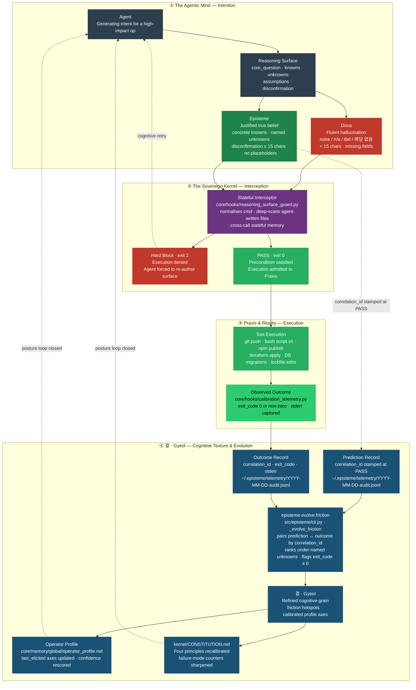

<h1 align="center">
  <picture>
    <source media="(prefers-color-scheme: dark)" srcset="docs/assets/logo-dark.svg?v=2">
    
  </picture>
</h1>

<p align="center">
  <a href="https://github.com/junjslee/episteme/releases"></a>
  <a href="https://github.com/junjslee/episteme/blob/master/LICENSE"></a>
  <a href="https://github.com/junjslee/episteme"></a>
</p>

<p align="center">
  <a href="README.md">English</a> &bull;
  <a href="README.ko.md"><b>한국어</b></a> &bull;
  <a href="README.es.md">Español</a> &bull;
  <a href="README.zh.md">中文</a>
</p>

<p align="center"><a href="https://epistemekernel.com"><b>epistemekernel.com</b></a></p>

> **episteme는 AI 에이전트가 행동하기 전에 자기 사고를 내보이게 합니다.**
>
> 그 느낌, 아실 겁니다. diff는 멀쩡해 보이고 분석도 그럴듯한데, 마음 한구석에서 *이건 좀 더 꼼꼼히 봐야 하는 거 아닌가* 하는 목소리가 들리는 순간. episteme는 그 목소리에 실제 권한을 쥐여준 것입니다. 되돌릴 수 없는 일을 하기 전에 — push, 배포, 마이그레이션 — 에이전트는 무엇을 알고, 무엇을 모르며, 무엇이 자신을 틀렸다고 증명할지를 적어야 합니다. 그것도 당신이 직접 읽을 수 있는 디스크 위에 말입니다. 그 사고가 진짜가 될 때까지, 조용한 결정론적 게이트가 문을 잡고 서 있습니다.
>
> 이미 쓰고 계신 도구 안에서 그대로 동작합니다(지금은 Claude Code, 나머지는 벤더 중립 어댑터 레이어로). 검증된 결정에서 나온 교훈은 변조가 드러나는 프로토콜로 남아 있다가 다시 중요해지는 바로 그 순간에 떠오릅니다 — 그래서 에이전트는 시간이 지날수록 *당신의* 코드베이스에 예리해지고, 문서도 코드와 똑같은 기준으로 관리됩니다.

**[실제 모습 ↓](#실제-모습)** · **[설치 ↓](#설치)** · **[데모 ↓](#데모)** · **[어떻게 비교되는가 ↓](#어떻게-비교되는가)** · **[내부 구조 ↓](#내부-구조)** · **[작동하는가? ↗](docs/EVALUATION_METHOD.md)**

---

## 실제 모습

에이전트에게 이렇게 물었다고 해봅시다: *"우리 검색-증강 메모리(retrieval-augmented memory) 시스템이 실제로 응답 품질을 개선하고 있는지 평가해줘."*

**episteme가 없으면** 에이전트는 이걸 측정 잡무로 처리합니다. 30일치 지표를 끌어와 thumbs-up 비율에서 7%의 lift를 발견하고, 자신감 있는 메모를 써서 가져옵니다: *"메모리는 효과가 있습니다. 계속 밀고 가시죠."* 잘 읽힙니다. 그리고 동시에 세 군데가 틀렸습니다:

- thumbs-up이 따라가는 건 응답의 *정확성*이 아니라 *확신도*입니다 — 질문 자체가 아니라 질문의 대리지표(proxy)를 잰 것입니다.
- 메모리를 쓴 응답은 30% 더 깁니다. 그리고 길이는 그 자체로 thumbs-up을 끌어올립니다 — 그 "lift"는 길이 효과일 수 있습니다.
- 결론이 틀렸다고 판정될 조건은 한 번도 명시된 적이 없습니다 — 그래서 애초에 틀릴 수가 없습니다.

**episteme가 있으면** 그 메모는 아직 도착하지 못합니다. 에이전트는 먼저 이것부터 디스크에 적어야 합니다:

| 필드 | 에이전트가 반드시 기록해야 하는 것 |
|---|---|
| **Core Question** | 이 작업이 실제로 답하는 단 하나의 질문 — *"길이를 통제했을 때 메모리가 정확성을 높이는가?"* |
| **Knowns** | 출처가 붙은 검증된 사실. 그럴듯하게 들리는 추측은 안 됩니다 |
| **Unknowns** | 이름 붙인 빈틈(*"길이를 통제해도 lift가 남는지"*) — 여기가 비면 게이트에서 걸립니다 |
| **Assumptions** | 결론을 떠받치는 믿음. 반증할 수 있도록 드러내 둡니다 |
| **Disconfirmation** | 미리 약속해 둔 관측 조건 — *"길이를 통제해 다시 돌렸을 때 lift가 사라지면, 메모리는 신호가 아니라 토큰을 늘린 것이다"* |

성의 없는 답(`none`, `n/a`, `tbd`, `해당 없음`)은 통과하지 못합니다. *"문제가 생기면"* 같은 두루뭉술한 회피도 마찬가지입니다 — 구체적이고 관측 가능한, 틀렸음을 증명할 방법만 통과합니다. 그리고 여기서 조용한 마법이 일어납니다. 그 surface를 적는 행위 자체가, thumbs-up은 애초에 질문이 아니었다는 사실을 드러냅니다. 그게 바로 이 제품입니다. **결과가 생기기 전에, 에이전트는 당신이 감사할 수 있는 방식으로 사고해야 합니다.**


*`scripts/demo_posture.sh`로 녹화했습니다 — 차단된 제약 제거, 검증을 통과한 재작성, 자신의 blast radius를 선언하도록 강제된 리팩터, 그리고 한참 뒤의 결정에서 다시 발화하는 합성된 프로토콜.*

## 무엇을 얻는가

- **되돌릴 수 없는 지점에 세워둔 게이트.** 고위험 작업은 실행되기 전에 가로채이고, 에이전트의 추론에 실속이 있는지 검사받습니다 — 슬쩍 빠져나가려는 형태들(`subprocess.run(['git','push'])`, 에이전트가 직접 짠 셸 스크립트, 한 겹 감싼 명령)까지 포함해서요. 제대로 된 surface가 없으면 실행도 없습니다. 기본값은 strict이고, 원하시면 프로젝트별로 느슨하게 풀 수 있습니다.
- **초안을 한 번도 본 적 없는 제2의 의견.** 구조만으로는 진짜 사고와 사고하는 시늉을 구분할 수 없습니다. 그래서 하중을 받는 결정에 대해 게이트는 더 강한 아티팩트를 받습니다: 결정을 주장 단위로 쪼개고, 각 주장을 원래 추론을 본 적 없는 새 컨텍스트가 검증하며, 가장 강한 반론을 실제로 펼칩니다. 평결이 멈추라고 하면, 멈춥니다.
- **닳지 않고 쌓이는 기억.** 검증된 교훈은 하나하나 변조가 드러나는 프로토콜이 되어 자기 컨텍스트에 묶입니다. 다음에 비슷한 결정이 올라오면 커널이 그 교훈을 먼저 꺼내 옵니다 — `Protocol: In context X, do Y` — 그런 게 있었다는 걸 당신이 기억해내지 않아도 됩니다. 에이전트는 다른 데가 아니라 바로 당신의 코드베이스에서 예리해집니다.
- **정직함을 유지하는 문서.** 추적되는 모든 문서는 생명주기 마커를 답니다. 그리고 현실과 어긋나는 순간 CI가 실패합니다 — 분류되지 않은 문서, 폐기된 문서를 현행인 양 인용하는 living 문서, 누군가 손으로 복사해 넣은 버전 문자열. 낡은 문서는 세션을 시작할 때 인사를 건네는데, 정말로 낡았을 때만 그렇습니다. 단일 진리 원천을 열망이 아니라 강제로 지킵니다.
- **뒷정리를 스스로 하는 시스템.** 큐에는 상한과 눈에 보이는 백프레셔가 있고, 로그는 돌아가며 비워지고, 만료된 마커는 세션 시작 시 쓸려 나갑니다. 구석에 쌓이는 게 없습니다. 삭제는 방치가 낳은 사고가 아니라 설계된 동작입니다.
- **도구가 바뀌어도 하나인 정체성.** 당신의 작업 방식, 리스크 자세, 추론 취향은 버전 관리되는 마크다운에 삽니다 — 명령 한 번이면 모든 어댑터로 동기화됩니다. 커널은 올해 당신이 쓰는 도구보다 오래 갑니다.

## 설치

**옵션 A — Claude Code 플러그인 (명령 두 개, 자기완결형):**

```
/plugin marketplace add junjslee/episteme
/plugin install episteme@episteme
```

훅과 에이전트, 스킬이 세션에서 바로 살아납니다. pip은 필요 없습니다.

**옵션 B — 커널 클론 (CLI + 편집 가능한 소스):**

```bash
git clone https://github.com/junjslee/episteme ~/episteme
cd ~/episteme && pip install -e .

episteme init      # generate personal memory files from templates
episteme setup .   # score working style + reasoning posture
episteme sync      # push identity to every adapter
episteme doctor    # verify wiring
```

이미 굴러가고 있는 저장소에 도입하시나요? `episteme docs lint`부터 돌려보세요 — 추적되는 모든 문서에게 스스로 무엇인지 밝히라고 요구하는데, 그 첫 실행이 대개 그 저장소가 가져본 것 중 가장 정직한 목록이 됩니다. 자세한 내용과 프로젝트 하네스, 전체 명령 레퍼런스는 여기 있습니다: [`INSTALL.md`](./INSTALL.md) · [`docs/SETUP.md`](./docs/SETUP.md) · [`docs/COMMANDS.md`](./docs/COMMANDS.md).

## 데모

모든 데모에는 실제로 나온 아티팩트가 함께 들어 있습니다. 어떤 철학보다 먼저 그것부터 읽어보세요 — 그게 증거니까요.

| 데모 | 무엇을 증명하는가 |
|---|---|
| [`demos/04_symbiosis/`](./demos/04_symbiosis/) | **실제 역사에서 나온 논지 (2026-04-27, Events 65–67):** 운영자가 불안에 이끌린 비가역적 묶음을 제안했고; 커널의 적대적 검토가 3개의 Critical 발견을 표면화했으며; 분해된 경로가 `AGENTS.md`에서 헌법이 되었다. 에이전트와 인간이 *서로의* 의도를 디버깅한다. [`DIFF.md`](./demos/04_symbiosis/DIFF.md)가 그 대안 세계를 나란히 보여준다. |
| [`demos/03_differential/`](./demos/03_differential/) | **같은 프롬프트, 프레임워크 off vs on.** off는 *어떻게*에 답하고; on은 *~인지 여부*에 답한다. [`DIFF.md`](./demos/03_differential/DIFF.md)가 잡아낸 실패 모드를 명명한다. |
| [`demos/02_debug_slow_endpoint/`](./demos/02_debug_slow_endpoint/) | 유창하게-틀린 *"캐시를 추가하라"*가 Core Question 게이트에서 죽고; 대신 스키마 수준의 근본 원인이 산출되는 p95 회귀. |
| [`demos/01_attribution-audit/`](./demos/01_attribution-audit/) | 정본 4-아티팩트 형태 (reasoning-surface → decision-trace → verification → handoff) — 커널이 자신의 귀속(attribution)을 감사한다. |
| [`demos/05_contract_gate/`](./demos/05_contract_gate/) | 행동적 보완물: 선언된 계약이 턴 종료 시 실행된다. |

히어로 데모는 직접 다시 녹화하실 수 있습니다: `scripts/demo_posture.sh` (레시피는 스크립트 헤더에 있습니다). 라이브 대시보드는 커널 자신의 해시 체인 위에서 렌더링됩니다 — [`web/README.md`](./web/README.md).

## 어떻게 비교되는가

| 축 | episteme | Memory API (mem0, OpenMemory) | Agent 런타임 (Agno, opencode) |
|---|---|---|---|
| **무엇인가** | 기존 도구 위에 얹는 추론 거버넌스 + 정체성 레이어 | 앱에 내장된 Memory API | 에이전트를 실행하는 런타임 |
| **정체성이 사는 곳** | 거버넌스가 적용된 버전 관리 마크다운/JSON — 도구 간 공유 | 벡터/그래프 스토어, 앱마다 | 시스템 프롬프트, 세션마다 |
| **노하우** | 파일 시스템 경계에서 추출되고, 해시 체인으로 연결되며, 컨텍스트에 의해 다시 표면화됨 | 불투명한 검색 | 프롬프트 튜닝, 세션마다 |
| **문서/상태 위생** | 생명주기 린트, GC, CI에서 드리프트 게이트 | N/A | N/A |

**이거 그냥 계약 테스트(contract testing) 아닌가요?** 계약 테스트는 *코드가 스펙이 말한 대로 했는가*를 묻습니다. Reasoning Surface는 그보다 앞서고 더 어려운 걸 묻습니다: *그게 맞는 스펙이었나, 맞는 질문이었나, 아니라면 무엇이 그걸 알려줬을까?* 초록불이 켜진 테스트 스위트는 당신이 엉뚱한 문제를 아름답게 풀고 있다는 사실을 알려주지 못합니다 — 그 실패는 스펙이 생기기 전에 일어나니까요. episteme는 두 레이어를 다 제공합니다([`docs/CONTRACT_GATE.md`](./docs/CONTRACT_GATE.md)).

**프롬프트로는 왜 안 되나요?** 프롬프트는 어디까지나 권유이기 때문입니다. 한 번의 호출만 살아 있고, 급할 때 건너뛰어지고, 조용히 컨텍스트 밖으로 밀려납니다. 하지만 0이 아닌 값으로 종료하는 훅은 협상하지 않습니다. MIRROR 벤치마크([arXiv 2604.19809](https://arxiv.org/abs/2604.19809); 16개 모델, 8개 연구소, 약 25만 인스턴스)가 정확히 이걸 실험했습니다. 모델에게 자기 캘리브레이션 점수를 보여주는 것으로는 아무것도 달라지지 않았고 — *오직 아키텍처적 제약만 효과가 있었습니다*(confident-failure rate 0.60 → 0.14). 프롬프트보다 자세입니다.

## 정직한 한계

- [`kernel/KERNEL_LIMITS.md`](./kernel/KERNEL_LIMITS.md)에는 이게 당신에게 맞지 않는 도구인 경우가 솔직하게 적혀 있습니다. *경계가 없는 규율은 그냥 신조입니다.*
- 이 커널은 자기 자신에게도 같은 잣대를 댑니다. 2026년 6월, 프로토콜 합성 루프가 스스로 걸어둔 반증 조건에 걸렸습니다 — 49일 동안 합성된 프로토콜 0개 — 그래서 검증된 심문을 기반으로 다시 만들어졌습니다. 그 과정은 전부 공개돼 있습니다([`kernel/FAILURE_MODES.md`](./kernel/FAILURE_MODES.md), [`docs/EVALUATION_METHOD.md`](./docs/EVALUATION_METHOD.md)). 당신의 결정에 disconfirmation을 요구하는 도구라면, 자기 자신에 대해서도 같은 것을 내놓아야 합니다.
- 빌려온 아이디어는 전부 출처를 밝혔고, 같은 패턴에 독립적으로 도달한 2025–26년 작업도 함께 정리해 뒀습니다: [`kernel/REFERENCES.md`](./kernel/REFERENCES.md).

## 내부 구조

상태: **<!-- episteme-fact:version -->1.10.0-rc.1<!-- /episteme-fact:version -->** · 실천은 다섯 단계입니다 — Frame → Decompose → Execute → Verify → Handoff — 그리고 각 단계는 유창함 아래에서 사고가 무너지는 특정한 방식에 맞서기 위해 존재합니다: question substitution, WYSIATI, anchoring, narrative fallacy, planning fallacy, overconfidence. 전체 이야기는 [`docs/THE_WAY_TO_THINK.md`](./docs/THE_WAY_TO_THINK.md)에 있고, 네 개의 Cognitive Blueprint(Axiomatic Judgment · Fence Reconstruction · Consequence Chain · Architectural Cascade)는 [`docs/ARCHITECTURE.md`](./docs/ARCHITECTURE.md)에 명세돼 있습니다.



위 색깔에 담긴 네 가지 개념입니다. **Doxa**(빨강)는 유창하지만 검증되지 않은 출력, 이 모든 게 막으려고 존재하는 바로 그 실패 상태입니다. **Episteme**(초록)는 실제로 버텨내는 surface이고, 실행에 들어가기 위한 입장료입니다. **Praxis**는 통과한 행동, 그리고 실제로 벌어진 일입니다. **결 · Gyeol**(파랑)은 그 결과를 다음번 당신의 캘리브레이션에 되접어 넣는 루프입니다. 설계상 스택을 가리지 않습니다: 커널은 평범한 마크다운, 프로파일은 평범한 JSON, 어댑터(Claude Code, Hermes, OMO/OMX)는 갈아 끼울 수 있습니다.

커널 자체는 — 마크다운뿐이고, 코드도 없고, 당신을 묶어둘 것도 없습니다 — [`kernel/`](./kernel/)에서 시작합니다:

| 파일 | 무엇을 정의하는가 |
|---|---|
| [`SUMMARY.md`](./kernel/SUMMARY.md) | 30줄 운영 증류 |
| [`CONSTITUTION.md`](./kernel/CONSTITUTION.md) | 뿌리 주장, 네 원칙, 추론자 실패 모드 |
| [`FAILURE_MODES.md`](./kernel/FAILURE_MODES.md) | 전체 12-모드 분류학 ↔ 반례 아티팩트 |
| [`REASONING_SURFACE.md`](./kernel/REASONING_SURFACE.md) | Knowns / Unknowns / Assumptions / Disconfirmation 프로토콜 |
| [`MEMORY_ARCHITECTURE.md`](./kernel/MEMORY_ARCHITECTURE.md) | 다섯 기억 계층 (working → reflective) |
| [`KERNEL_LIMITS.md`](./kernel/KERNEL_LIMITS.md) | 커널이 틀린 도구일 때 |
| [`REFERENCES.md`](./kernel/REFERENCES.md) | 귀속 + 수렴하는 동시대 작업 |

```
episteme/
├── kernel/          philosophy (markdown; travels across runtimes)
├── core/hooks/      deterministic gates + session automation
├── src/episteme/    CLI + core library (doc lifecycle, sync, telemetry)
├── adapters/        delivery layers (Claude Code, Hermes, …)
├── demos/           end-to-end reference deliverables
├── skills/          reusable operator skills
├── templates/       project scaffolds
└── docs/            architecture, contracts, runtime docs — lifecycle-linted
```

권한 계층은 이렇습니다: **프로젝트 문서 > 운영자 프로파일 > 커널 기본값 > 런타임 기본값.** 에이전트를 위한 저장소 운영 계약은 [`AGENTS.md`](./AGENTS.md), LLM 사이트맵은 [`llms.txt`](./llms.txt)에 있습니다.

## 다음으로 읽을거리

| 주제 | 위치 |
|---|---|
| 운영화된 실천 | [`docs/THE_WAY_TO_THINK.md`](./docs/THE_WAY_TO_THINK.md) |
| 아키텍처 + 블루프린트 명세 | [`docs/ARCHITECTURE.md`](./docs/ARCHITECTURE.md) |
| 작동하는가? (평가 방법) | [`docs/EVALUATION_METHOD.md`](./docs/EVALUATION_METHOD.md) |
| 설치 경로 (마켓플레이스, CLI, 개발) | [`INSTALL.md`](./INSTALL.md) |
| 문서 생명주기 + 기억 계약 | [`docs/MEMORY_CONTRACT.md`](./docs/MEMORY_CONTRACT.md) · [`docs/SYNC_AND_MEMORY.md`](./docs/SYNC_AND_MEMORY.md) |
| 훅 + 거버넌스 팩 | [`docs/HOOKS.md`](./docs/HOOKS.md) |
| 보안 자세 (OWASP Agentic 2026 매핑) | [`docs/COMPLIANCE_CROSSWALK.md`](./docs/COMPLIANCE_CROSSWALK.md) |
| 개인 맞춤 설정 | [`docs/CUSTOMIZATION.md`](./docs/CUSTOMIZATION.md) |
| 전체 문서 색인 (생성됨) | [`docs/README.md`](./docs/README.md) |

## 상업용 라이선스

상업용 라이선스가 필요하시거나 도입에 도움이 필요하시면 [연락 주세요](mailto:junseong.lee652@gmail.com) — 어떤 걸 만들고 계신지 정말 궁금합니다.
