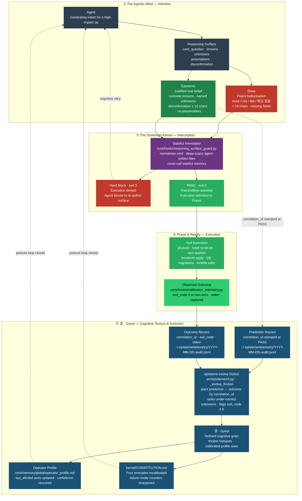

# episteme

> A **Sovereign Cognitive Kernel** that installs a mandatory **Thinking Framework (생각의 틀)** into every AI coding agent you use. Turns context-blind "average" answers into context-fit protocols, and turns every resolved conflict into permanent, proactively-surfaced know-how.

**[See it in 60 seconds ↓](#see-it-in-60-seconds)** · **[Install ↓](#quick-start)** · **[Why the file-system, not the prompt ↓](#the-problem--the-solution)** · **[Architecture & philosophy ↓](#architecture--philosophy)**

 

---

## TL;DR

Modern AI agents are **incredibly capable** — they write production code, navigate entire repos, plan multi-step workflows. What they lack is **context-awareness**.

When two credible sources disagree — *Source A says do it this way, Source B says do it that way* — an auto-regressive engine cannot tell which answer fits **your** project, **your** team's constraints, **your** op-class's history. So it defaults to the statistically average answer: fluent, confident, and fit for no specific context.

`episteme` closes that gap. Before any high-impact command runs, the agent is forced onto a four-field **Thinking Framework** on disk — **Knowns · Unknowns · Assumptions · Disconfirmation** — under a **Core Question**. Every conflict the framework resolves is extracted as a reusable protocol, committed to a tamper-evident knowledge base, and surfaced proactively at the next matching decision.

Enforcement is **structural**, not advisory. Prompts can be skipped; a file-system hook that exits non-zero cannot.

---

## The problem · the solution

### The problem — conflicting sources, averaged answers, no durable know-how

The internet is full of contradictory how-to. Docs say one thing; a senior engineer says another. Two libraries recommend opposite patterns for the same bug. Modern agents, being auto-regressive pattern engines, cannot tell which answer *fits this specific context* — because fit is a causal-world-model judgment, not a pattern match over token frequency. So they average. The output sounds authoritative, fits no specific context, and misleads by omission.

Prompts cannot fix this:

- A system-prompt reminder lives for one call.
- A `CLAUDE.md` nudge gets skipped the moment a deadline arrives.
- **Know-how** — the irreducibly context-specific rule of *"in this shape of problem, do this"* — cannot be taught through better wording. It has to be extracted, stored, and re-surfaced.

### The solution — a Thinking Framework at the file-system level

`episteme` intercepts the moment **intent meets state change**. Before any high-impact op (`git push`, `npm publish`, `terraform apply`, DB migrations, lockfile edits), the agent must project its reasoning onto a structured surface on disk:

| Field | What the agent must commit to |
|---|---|
| **Core Question** | The one question this action is actually trying to answer (counters question substitution). |
| **Knowns** | Verified facts, citations, measurements — not plausible-sounding guesses. |
| **Unknowns** | Named, classifiable gaps — not vague "there might be risks." |
| **Assumptions** | Load-bearing beliefs, flagged so they can be falsified. |
| **Disconfirmation** | The observable event that would prove this plan wrong — pre-committed before action. |

Validity is checked **structurally**: minimum content length, no lazy-token placeholders (`none`, `n/a`, `tbd`, `해당 없음`), normalized command scanning so bypass shapes like `subprocess.run(['git','push'])` and `os.system('git push')` are caught. Agent-written shell scripts are deep-scanned via a stateful interceptor across calls. If the surface is absent or invalid, the op is refused (`exit 2`). Default is strict; advisory mode (warn-don't-block) is opt-in per-project: `touch .episteme/advisory-surface`.

This is the difference between a prompt reminder and a compiler: one asks nicely, the other refuses to proceed.

---

## Protocol Synthesis & Active Guidance — the ultimate vision

`episteme` is **not just a blocker**. The framework's real job is to turn every conflict it resolves into durable know-how that the agent re-applies automatically at the next matching decision.

Here is the loop (v1.0 RC shipped · CP1–CP10 · 565 / 565 green — see [`docs/DESIGN_V1_0_SEMANTIC_GOVERNANCE.md`](./docs/DESIGN_V1_0_SEMANTIC_GOVERNANCE.md)):

1. **Detect conflict.** The agent encounters two valid-looking but incompatible approaches for a context it hasn't fully resolved before.
2. **Decompose, don't average.** The Thinking Framework refuses the "average" answer. It forces the agent to extract *why* the sources conflict and which feature of the context tips the decision.
3. **Synthesize a context-fit protocol.** The resolved *"in context X, do Y"* rule is committed to an append-only, hash-chained knowledge base — tamper-evident, so the agent cannot silently rewrite the lesson.
4. **Guide actively.** At the next matching decision — even weeks later, even across sessions or tools — the kernel surfaces the protocol **proactively**. You don't have to remember to ask.
5. **Self-maintain.** When the agent discovers drift (stale config, deprecated API, core-logic mismatch), it is forced to evaluate *patch vs. refactor* honestly and synchronize the cascade across the full blast radius — CLI, config, schemas, docs, tests, external surfaces — before moving on.

The knowledge base is not a vector store pretending to be memory. It is a **structural, human-readable, version-controlled artifact** you can read, edit, fork, and migrate between adapters (Claude Code, Cursor, Hermes, future tools). The kernel outlives the tooling.

---

## I want to… → do this

| Goal                                                | Command / pointer                                                   |
|-----------------------------------------------------|---------------------------------------------------------------------|
| See the Thinking Framework *off vs on* on the same prompt      | [`demos/03_differential/`](./demos/03_differential/) · [`scripts/demo_posture.sh`](./scripts/demo_posture.sh) |
| See what the framework produces end-to-end                     | [`demos/01_attribution-audit/`](./demos/01_attribution-audit/) · [`demos/02_debug_slow_endpoint/`](./demos/02_debug_slow_endpoint/) |
| Install as a Claude Code plugin (one line)          | `/plugin marketplace add junjslee/episteme`                     |
| Install on my machine (CLI + editable kernel)       | `pip install -e . && episteme init` — see [`INSTALL.md`](./INSTALL.md) |
| Understand what this installs in 3 minutes          | [`kernel/SUMMARY.md`](./kernel/SUMMARY.md) · [`docs/POSTURE.md`](./docs/POSTURE.md) |
| Draft a reasoning surface from a Slack thread       | `episteme capture --input thread.txt --output surface.json`    |
| Sync identity to every AI tool I use                | `episteme sync`                                                 |
| Encode working style + reasoning posture            | `episteme setup . --interactive`                                |
| Apply the right harness for my project type         | `episteme detect . && episteme harness apply <type> .`      |
| Know when *not* to use this kernel                  | [`kernel/KERNEL_LIMITS.md`](./kernel/KERNEL_LIMITS.md)              |
| Find attribution for any borrowed concept           | [`kernel/REFERENCES.md`](./kernel/REFERENCES.md)                    |
| Audit my setup                                      | `episteme doctor`                                               |
| Read the deeper philosophy (doxa · episteme · praxis · 결)  | [`docs/NARRATIVE.md`](./docs/NARRATIVE.md)                     |

---

## See it in 60 seconds

Live site + visual dashboard — both rendered against the kernel's own `cp7-chained-v1` hash chain. See [`web/README.md`](./web/README.md) for the Vercel deploy guide.

Three demos, increasing in what they prove:

- **[`demos/03_differential/`](./demos/03_differential/) — the demo that converts skeptics.** *Exact same prompt, Thinking Framework OFF vs. ON.* A PM asks for a 2-sprint semantic-search scope; off answers *how*; on answers *whether*. [`DIFF.md`](./demos/03_differential/DIFF.md) shows which named failure modes the framework caught.
- [`demos/02_debug_slow_endpoint/`](./demos/02_debug_slow_endpoint/) — framework applied to a realistic p95 regression. The fluent-wrong *"add a cache"* answer is rejected at the Core Question gate; a schema-level root cause is produced instead.
- [`demos/01_attribution-audit/`](./demos/01_attribution-audit/) — canonical four-artifact shape (reasoning-surface → decision-trace → verification → handoff). The kernel applied to itself, auditing whether every borrowed concept is traceable to a primary source.

Open any of the three. You will know what `episteme` produces before reading any philosophy.

---

## Quick start

```bash
git clone https://github.com/junjslee/episteme ~/episteme
cd ~/episteme
pip install -e .

episteme init              # generate personal memory files from templates
episteme setup . --write   # score working style + reasoning posture
episteme sync              # push identity to every adapter
episteme doctor            # verify wiring
```

Project-type harness:

```bash
episteme detect .                         # analyze repo, recommend a harness
episteme harness apply ml-research .      # apply it
episteme new-project . --harness auto     # scaffold + auto-detect
```

Deep-dive onboarding modes, scored dimensions, and defaults: **[`docs/SETUP.md`](./docs/SETUP.md)**.

---

## How episteme compares

Most tools in this space either build agent runtimes or provide memory APIs for applications. `episteme` augments the developer tools you already use.

| Axis                  | episteme                                          | Memory APIs (mem0, OpenMemory)  | Agent runtimes (Agno, opencode, omo) |
|-----------------------|---------------------------------------------------|---------------------------------|--------------------------------------|
| **What it is**        | Identity + governance layer across dev tools      | Memory API embedded in an app   | A runtime that executes agents       |
| **Where identity lives** | Governed markdown + JSON, cross-tool, versioned | Vector/graph store, per app     | System prompt per session            |
| **Sync**              | One command, all tools                            | N/A                             | N/A (per-project config)             |
| **Know-how extraction** | Enforced at file-system boundary; hash-chained | Opaque retrieval                | Prompt-tuned, per session            |

The gap `episteme` fills: no other project syncs a *governed cognitive contract* across multiple developer AI tools in one command, and no other project forces context-fit protocol extraction at the point of state mutation. Runtimes and memory APIs own different lanes; `episteme` sits above them and makes them aware of *who you are*, *how you think*, and *what your project has already learned*.

---

## Zero-trust execution

The OWASP Agentic AI Top 10 identifies prompt injection, goal hijacking, overreach, and unbounded action as the primary risk classes for autonomous agents. The Knowns / Unknowns / Assumptions / Disconfirmation structure is a structural counter to each:

| OWASP Agentic Risk | episteme counter |
|--------------------|------------------|
| Prompt injection / goal hijacking | Core Question declared before execution begins; deviations surface as Unknowns |
| Overreach / unbounded action | Constraint regime declared in Frame; reversible-first policy enforced |
| Fluent hallucination | Unknowns field cannot be blank; assumptions must be named before acting on them |
| Infinite planning loops | Disconfirmation condition required; loop exits when evidence fires |

No assumption is trusted unless named. No action is taken unless the precondition (Knowns) and constraint regime are declared. The kernel is the verification layer between intent and execution.

---

## Human prompt debugging

`episteme` doesn't just govern the agent — it **debugs the human's intent**. When the agent maps Knowns vs. Unknowns against a user request, it exposes logical gaps in the *original prompt* before executing flawed assumptions. The Unknowns field is often where the human realizes their question was underspecified. The Disconfirmation field is often where they realize they haven't thought about falsification at all.

This is not a side effect. It is a design property: a system that forces the agent to declare what it does not know forces the human to confront what they did not specify.

---

## Repository layout

```
episteme/
├── kernel/                     philosophy (markdown; travels across runtimes)
├── demos/                      end-to-end reference deliverables
├── core/
│   ├── memory/global/          operator memory (gitignored; personal)
│   ├── hooks/                  deterministic safety + workflow hooks
│   ├── harnesses/              per-project-type operating environments
│   └── schemas/                memory + evolution contract schemas
├── adapters/                   kernel delivery layers (Claude Code, Hermes, …)
├── skills/                     reusable operator skills
├── templates/                  project scaffolds, example answer files
├── docs/                       runtime docs, architecture, contracts
├── src/episteme/               CLI + core library
└── tests/
```

Repo operating contract (for any agent working here): **[`AGENTS.md`](./AGENTS.md)**. LLM sitemap: **[`llms.txt`](./llms.txt)**.

---

## CLI surface

```bash
episteme init
episteme doctor
episteme sync [--governance-pack minimal|balanced|strict]
episteme new-project [path] --harness auto
episteme detect [path]
episteme harness apply <type> [path]
episteme profile [survey|infer|hybrid] [path] [--write]
episteme cognition [survey|infer|hybrid] [path] [--write]
episteme setup [path] [--interactive] [--write] [--sync] [--doctor]
episteme bridge anthropic-managed --input <events.json> [--dry-run]
episteme bridge substrate [list-adapters|describe|verify|push|pull] ...
episteme capture [--input <file>] [--output <file>] [--by <name>]
episteme viewer [--host 127.0.0.1] [--port 37776]
episteme evolve [run|report|promote|rollback] ...
```

Full reference: [`docs/README.md`](./docs/README.md).

---

## Why this architecture

The product is a Thinking Framework; the rest of this list is what falls out when that framework is taken seriously.

- **Feedforward cognitive control, not reactive correction.** Most agent-safety systems observe an error and correct after the fact. `episteme` names the failure modes *before* execution and refuses to proceed until they are countered. Knowns, Unknowns, Assumptions, Disconfirmation are declared *first*, action *second*.
- **Cognitive contract (Design by Contract).** The Thinking Framework is Bertrand Meyer's *Design by Contract* applied to reasoning itself: **preconditions** (Knowns + validated Assumptions that must hold before execution), **postconditions** (Verification: what must be true at handoff), **invariants** (kernel principles that cannot be suspended). Breach a precondition and the agent does not proceed.
- **Hypothesis → test → update, observable across sessions.** Each Reasoning Surface carries a hypothesis; each execution carries an outcome; the episodic tier records both; the semantic-promotion job surfaces patterns where hypotheses *never* fire their declared disconfirmation (calibration debt). Thinking-quality drift is detectable over time.
- **Cognitive profile is hypothesis, not documentation.** The operator profile's nine cognitive-style axes (`dominant_lens`, `noise_signature`, `explanation_depth`, etc.) are control signals that modulate enforcement thresholds — and are themselves audited against the episodic record of actual behavior. Claimed posture vs. lived posture, with drift surfaced as re-elicitation.
- **Declared limits.** [`KERNEL_LIMITS.md`](./kernel/KERNEL_LIMITS.md) names when the kernel is the wrong tool. *A discipline without a boundary is a creed.*
- **Hard authority boundary.** Repo docs + global memory are the source of truth; tool-native memories are acceleration, not authority.
- **Cross-tool consistency.** One governed cognitive contract across Claude Code, Hermes, and future adapters. The framework outlives the tool.
- **Policy engine for agent cognition.** `episteme` plays the role OPA (Open Policy Agent) plays for cloud infrastructure: an independent layer that evaluates whether a proposed *reasoning state* meets declared policy before the action it authorizes is allowed. The LLM is the runtime; `episteme` is the policy engine.
- **AI-safety by construction, not by bolt-on.** The same structural gates that counter reasoning failure modes also close the OWASP Agentic risks. Security falls out of the framework.

Memory model, Memory Contract v1, Evolution Contract v1, and managed-runtime coexistence: **[`docs/SYNC_AND_MEMORY.md`](./docs/SYNC_AND_MEMORY.md)**.

---

## Architecture & philosophy

> Prose spine: [`docs/NARRATIVE.md`](./docs/NARRATIVE.md). Full diagram with node annotations and cross-references: [`docs/ARCHITECTURE.md`](./docs/ARCHITECTURE.md).

The Thinking Framework above is the *product surface*. Beneath it sits a structural vocabulary borrowed from ancient Greek epistemology and Korean aesthetics — a spine that every diagram, demo, and artifact in this repository renders onto.

### The triad — doxa · episteme · praxis

- **Doxa** (δόξα) — common opinion, fluent output produced by default. The nine named failure modes in [`kernel/FAILURE_MODES.md`](./kernel/FAILURE_MODES.md) are a taxonomy of *doxa mistaking itself for episteme*.
- **Episteme** (ἐπιστήμη) — justified knowledge: concrete Knowns, named Unknowns, falsifiable Disconfirmation. The precondition for execution. The repo's namesake.
- **Praxis** (πρᾶξις) — informed action: effects that land with their authorizing discipline intact. The four canonical artifacts (reasoning-surface / decision-trace / verification / handoff) are its visible form.

### The grain — 결 · gyeol

The Korean word **결** (*gyeol*) names the grain of wood or stone: the latent pattern-structure inside matter that, when followed, yields coherent form; when cut against, fractures. The Reasoning Surface's field ordering — Knowns → Unknowns → Assumptions → Disconfirmation — is the 결 of epistemic discipline: *settled → open → provisional → falsification-condition*. The calibration loop (prediction + outcome joined by `correlation_id`, analyzed by `episteme evolve friction`) is the grain refining itself across cycles.

### Lifecycle

```
┌─────────────────────────────────────────────────────────────────────┐
│                         operator (you)                              │
│           ├── cognitive preferences   ├── working style             │
└──────────────────────────────┬──────────────────────────────────────┘
                               │
                    episteme sync
                               │
      ┌────────────────────────┼────────────────────────┐
      ▼                        ▼                        ▼
 Claude Code             Hermes (OMO)            future adapter
 (CLAUDE.md)             (OPERATOR.md)           (same kernel)
      │                        │                        │
      └────────────────────────┼────────────────────────┘
                               │
                       per-session loop
                               │
      ┌────────┬────────┬──────┴─────┬────────┬────────┐
      ▼        ▼        ▼            ▼        ▼        ▼
    FRAME → DECOMPOSE → EXECUTE → VERIFY → HANDOFF → (next session)
      │                                        │
      │ Reasoning Surface                      │ docs/PROGRESS.md
      │ (Knowns / Unknowns /                   │ docs/NEXT_STEPS.md
      │  Assumptions / Disconfirmation)        │ decision artifact
      │                                        │
      └────────────── feedback ────────────────┘
```

### Four strata, one loop



Four subgraphs, one lifecycle. **Doxa** (red) — fluent-but-unvalidated output or a hard block — is the failure state the kernel exists to prevent. **Episteme** (green) — a validated Reasoning Surface — is the precondition for execution. **Praxis** (light green) — the admitted tool execution and its observed outcome. **결 · Gyeol** (blue) — the calibration loop that refines the framework across cycles, feeding back into the operator profile and the kernel constitution.

**Works with any stack.** `episteme` operates independently of the LLM runtime — LangChain, CrewAI, Claude Code, Cursor, MCP. Kernel is pure markdown; operator profile is plain JSON; workflow loop is vendor-neutral. Adapter layer (Claude Code, Hermes, OMO/OMX) is pluggable.

### The kernel files

Start at **[`kernel/`](./kernel/)**. Pure markdown. No code. No vendor lock-in.

| File                                                              | What it defines                                              |
|-------------------------------------------------------------------|--------------------------------------------------------------|
| [`SUMMARY.md`](./kernel/SUMMARY.md)                               | 30-line operational distillation                             |
| [`CONSTITUTION.md`](./kernel/CONSTITUTION.md)                     | Root claim, four principles, nine failure modes              |
| [`REASONING_SURFACE.md`](./kernel/REASONING_SURFACE.md)           | Knowns / Unknowns / Assumptions / Disconfirmation protocol   |
| [`FAILURE_MODES.md`](./kernel/FAILURE_MODES.md)                   | Nine fluent-agent failure modes ↔ counter artifacts (6 Kahneman · 3 governance) |
| [`OPERATOR_PROFILE_SCHEMA.md`](./kernel/OPERATOR_PROFILE_SCHEMA.md) | Schema for encoding an operator's cognitive preferences   |
| [`MEMORY_ARCHITECTURE.md`](./kernel/MEMORY_ARCHITECTURE.md)       | Five memory tiers (working / episodic / semantic / procedural / reflective) |
| [`KERNEL_LIMITS.md`](./kernel/KERNEL_LIMITS.md)                   | When the kernel is the wrong tool; declared gaps             |
| [`REFERENCES.md`](./kernel/REFERENCES.md)                         | Attribution for every load-bearing borrowed concept          |
| [`CHANGELOG.md`](./kernel/CHANGELOG.md)                           | Versioned kernel history                                     |

Authority hierarchy: **project docs > operator profile > kernel defaults > runtime defaults.** Specific beats general.

---

## Read next

| Topic                                      | Where                                                            |
|--------------------------------------------|------------------------------------------------------------------|
| What `episteme` installs (posture framing) | [`docs/POSTURE.md`](./docs/POSTURE.md)                         |
| The v1.0 RC direction                      | [`docs/DESIGN_V1_0_SEMANTIC_GOVERNANCE.md`](./docs/DESIGN_V1_0_SEMANTIC_GOVERNANCE.md) |
| Kernel distillation (30 lines)             | [`kernel/SUMMARY.md`](./kernel/SUMMARY.md)                       |
| What the kernel produces                   | [`demos/01_attribution-audit/`](./demos/01_attribution-audit/) · [`demos/02_debug_slow_endpoint/`](./demos/02_debug_slow_endpoint/) |
| Same prompt, framework off vs. on            | [`demos/03_differential/`](./demos/03_differential/)             |
| Install paths (marketplace, CLI, dev)      | [`INSTALL.md`](./INSTALL.md)                                     |
| Benchmark with disconfirmation target      | [`benchmarks/kernel_v1/`](./benchmarks/kernel_v1/)               |
| Substrate bridge (mem0, memori, noop)      | [`docs/SUBSTRATE_BRIDGE.md`](./docs/SUBSTRATE_BRIDGE.md)         |
| Profile + cognition setup                  | [`docs/SETUP.md`](./docs/SETUP.md)                               |
| Sync matrix, memory model, contracts       | [`docs/SYNC_AND_MEMORY.md`](./docs/SYNC_AND_MEMORY.md)           |
| Harness system                             | [`docs/HARNESSES.md`](./docs/HARNESSES.md)                       |
| Hook reference + governance packs          | [`docs/HOOKS.md`](./docs/HOOKS.md)                               |
| Skills + agent personas + provenance       | [`docs/SKILLS_AND_PERSONAS.md`](./docs/SKILLS_AND_PERSONAS.md)   |
| Personal customization (memory/hooks/skills) | [`docs/CUSTOMIZATION.md`](./docs/CUSTOMIZATION.md)             |
| Agent repo operating contract              | [`AGENTS.md`](./AGENTS.md)                                       |
| Architecture deep-dive                     | [`docs/EPISTEME_ARCHITECTURE.md`](./docs/EPISTEME_ARCHITECTURE.md) |
| Cognitive system playbook                  | [`docs/COGNITIVE_SYSTEM_PLAYBOOK.md`](./docs/COGNITIVE_SYSTEM_PLAYBOOK.md) |

---

## Push-readiness checklist

```bash
PYTHONPATH=. pytest -q tests/test_profile_cognition.py
python3 -m py_compile src/episteme/cli.py
episteme doctor
git status && git rev-list --left-right --count @{u}...HEAD
```
