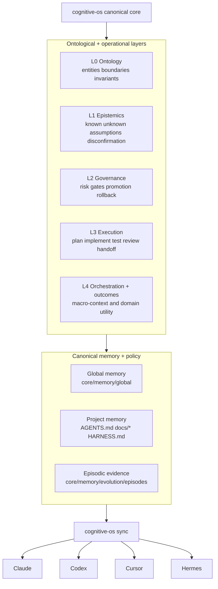

     1|# cognitive-os
     2|
     3|**Every AI tool you open starts cold. cognitive-os fixes that.**
     4|
     5|`cognitive-os` is a cognitive + execution operating system for AI work that operationalizes decision quality, memory governance, how agents think, how agents execute, and accountable evolution.
     6|
     7|`cognitive-os` is a platform-agnostic CLI that provisions memory, skills, hooks, and project harnesses across Claude Code, Codex CLI, Cursor, Hermes, and future adapters.
     8|
> Not a web UI, not a session manager, not a skill marketplace. It's the layer that runs *before* your agent starts work.

## System in 20 seconds



## Quick start (60 seconds)
    12|
    13|```bash
    14|git clone https://github.com/junjslee/cognitive-os ~/cognitive-os
    15|cd ~/cognitive-os
    16|pip install -e .
    17|cognitive-os init
    18|cognitive-os sync
    19|```
    20|
    21|## Verify setup
    22|
    23|```bash
    24|cognitive-os doctor
    25|```
    26|
    27|Expected outcome:
    28|- `Doctor passed.`
    29|- Claude/Codex/Cursor/Hermes adapter wiring checks shown as `[ok]` or `[info]`
    30|
    31|## Read this next
    32|
    33|- Docs index: `docs/README.md`
    34|- Architecture: `docs/AGENT_OS_ARCHITECTURE.md`
    35|- Cognitive System Playbook: `docs/COGNITIVE_SYSTEM_PLAYBOOK.md`
    36|
    37|---
    38|
    39|## Why cognitive-os
    40|
    41|You use multiple AI coding agents. Each one starts cold. You repeat yourself. Skills drift out of sync. One agent knows your workflow; another doesn't. A context reset wipes everything. Every project gets the same generic scaffold regardless of whether it's ML research on a GPU cluster or a React app on your laptop.
    42|
    43|`cognitive-os` fixes this with a single repo that acts as the operating layer for your entire AI stack:
    44|
    45|```
    46|┌─────────────────────── cognitive-os ────────────────────────────┐
    47|│                                                              │
    48|│  core/memory/     →  who you are, how you work              │
    49|│  core/agents/     →  planner, implementer, reviewer …       │
    50|│  core/hooks/      →  safety guards, formatter, quality gate │
    51|│  core/harnesses/  →  per-project-type operating contexts    │
    52|│  skills/          →  reusable prompt + tool packages        │
    53|│  templates/       →  standard scaffold for every new project│
    54|│                                                              │
    55|└───────────┬──────────────────────────────────────────────────┘
    56|           │   cognitive-os sync / detect / harness apply
    57|  ┌────────┼────────┬──────────┬───────────┐
    58|  ▼        ▼        ▼          ▼           ▼
    59|Claude   Codex   Cursor     Hermes    new machines
    60| Code     CLI   (skills)  (skills)   (cognitive-os init)
    61|```
    62|
    63|---
    64|
    65|## Design principles
    66|
    67|- cognitive-os operationalizes cognitive policy (how agents think) and execution policy (how agents act) into repeatable workflows.
    68|- Canonical project truth lives in repository docs (`AGENTS.md`, `docs/*`), not in any single agent tool.
    69|- Global operator memory (cross-project) is separate from project memory (repo-local delivery context).
    70|- Adapters (Claude, Codex, Cursor, Hermes, others) are delivery mechanisms for the same operating contract, not separate authorities.
    71|- Plugin or tool-native memory systems accelerate retrieval, but do not replace canonical records.
    72|
    73|---
    74|
    75|## Architecture at a glance
    76|
    77|cognitive-os has four layers:
    78|
    79|1) **Global operator layer** (`core/memory/global/*`)
    80|- your stable workflow + cognitive defaults across projects
    81|
    82|2) **Story layer** (`core/memory/global/build_story.md`, `docs/DECISION_STORY.md`)
    83|- narratable what/why/how traces so decisions are replayable in your head and explainable to others
    84|
    85|3) **Project truth layer** (`AGENTS.md`, `docs/*`)
    86|- what this specific repo is building right now
    87|
    88|4) **Adapter layer** (Claude/Codex/Cursor/Hermes)
    89|- delivery surfaces that consume the same contract
    90|
    91|Adapters are not the authority. Repo docs + global memory are.
    92|
    93|---
    94|
    95|## Quick start
    96|
    97|```bash
    98|git clone https://github.com/junjslee/cognitive-os ~/cognitive-os
    99|cd ~/cognitive-os
   100|pip install -e .            # install cognitive-os command
   101|cognitive-os init           # create personal memory files from templates
   102|# edit core/memory/global/*.md with your context
   103|cognitive-os sync           # push everything to all tools
   104|cognitive-os new-project .  # scaffold any existing or new project
   105|```
   106|
   107|## Why this architecture wins
   108|
   109|- Cross-tool consistency: one canonical operating contract across Claude/Codex/Cursor/Hermes.
   110|- Deterministic setup: profile/cognition onboarding is explainable (`survey`/`infer`/`hybrid`) instead of implicit drift.
   111|- Canonical boundary: repo docs + global memory are authority; tool-native memories are acceleration layers.
   112|
   113|### Coexistence model (self-evolving agents)
   114|
   115|`cognitive-os` is designed to work with agent runtimes that keep learning locally (Hermes memory/skills, Claude/Codex/Cursor local context):
   116|
   117|1. Local runtime memory evolves fast during execution (high-velocity adaptation).
   118|2. Durable lessons are promoted into canonical files (`core/memory/global/*`, `docs/*`, reusable skills).
   119|3. `cognitive-os sync` republishes that contract to every runtime.
   120|4. Runtime-native memory remains a cache/acceleration layer, not the source of truth.
   121|
   122|This gives you both: fast local learning and deterministic cross-platform consistency.
   123|
   124|### Demo
   125|
   126|Guided setup in one command:
   127|
   128|
   129|
   130|### 60-second demo (workflow + cognition + sync)
   131|
   132|```bash
   133|cognitive-os profile hybrid . --write
   134|cognitive-os cognition survey --write
   135|cognitive-os sync
   136|cognitive-os doctor
   137|```
   138|
   139|Expected outcome:
   140|- deterministic score artifacts generated under `core/memory/global/.generated/`
   141|- global memory markdown updated (if `--write` and overwrite rules allow)
   142|- adapters receive updated runtime context after `sync`
   143|
   144|That's it. Every agent you open now inherits your memory, skills, and hooks.
   145|
   146|To provision the right operating environment for your project type:
   147|
   148|```bash
   149|cognitive-os detect .                          # analyze repo and recommend a harness
   150|cognitive-os harness apply ml-research .       # apply it
   151|# or in one shot:
   152|cognitive-os new-project . --harness auto      # scaffold + auto-detect harness
   153|```
   154|
   155|---
   156|
   157|## What gets synced
   158|
   159|| Asset | Claude Code | Codex CLI | Cursor | Hermes |
   160||---|---|---|---|---|
   161|| Global memory index (`CLAUDE.md`) | ✅ | — | — | — |
   162|| Operator/cognitive/workflow source files (`core/memory/global/*.md`) | via include | source only | source only | composed into `OPERATOR.md` |
   163|| Agent personas | ✅ | — | — | — |
   164|| Skills | ✅ | ✅ | ✅ | ✅ |
   165|| Lifecycle hooks | ✅ | — | — | — |
   166|| Operator context composite (`OPERATOR.md`) | — | — | — | ✅ |
   167|
   168|Note: this matrix describes current adapter capabilities, not architectural authority. Canonical truth remains in repository docs and global cognitive-os memory.
   169|
   170|---
   171|
   172|## Deterministic safety hooks (Claude adapter)
   173|
   174|Hooks run deterministically — they can't be overridden by model behavior.
   175|
   176|| Hook | Event | What it does |
   177||---|---|---|
   178|| `session_context.py` | `SessionStart` | Prints branch, git status, and `NEXT_STEPS.md` at session open |
   179|| `block_dangerous.py` | `PreToolUse Bash` | Blocks `rm -rf`, `git reset --hard`, `git push --force`, `sudo`, `pkill`, and more |
   180|| `format.py` | `PostToolUse Write\|Edit` | Auto-runs `ruff` (Python) or `prettier` (JS/TS) after every file write |
   181|| `test_runner.py` | `PostToolUse Write\|Edit` | Runs pytest / jest on the file if it's a test file |
   182|| `quality_gate.py` | `Stop` | Blocks completion if tests fail (opt-in via `.quality-gate` in project root) |
   183|| `checkpoint.py` | `Stop` | Auto-commits uncommitted changes as `chkpt:` after every turn |
   184|| `precompact_backup.py` | `PreCompact` | Backs up session transcripts before context compaction |
   185|
   186|---
   187|
   188|## Skills included
   189|
   190|### Custom (your own)
   191|`repo-bootstrap` · `requirements-to-plan` · `progress-handoff` · `worktree-split` · `bounded-loop-runner` · `review-gate` · `research-synthesis`
   192|
   193|### Vendor (curated upstream)
   194|`swing-clarify` · `swing-options` · `swing-research` · `swing-review` · `swing-trace` · `swing-mortem` · `create-prd` · `sprint-plan` · `pre-mortem` · `test-scenarios` · `prioritization-frameworks` · `retro` · `release-notes`
   195|
   196|Add your own skills under `skills/custom/` — each skill is a folder with a `SKILL.md`.
   197|
   198|---
   199|
## Agent personas included

Eleven subagent definitions installed into `~/.claude/agents/`:

Execution: `planner` · `researcher` · `implementer` · `reviewer` · `test-runner` · `docs-handoff`

Ontological governance: `ontologist` · `epistemic-auditor` · `governance-safety` · `orchestrator` · `domain-owner`
   205|
   206|---
   207|
   208|## Project scaffold
   209|
   210|`cognitive-os new-project [path]` creates a standard project structure:
   211|
   212|```
   213|AGENTS.md            vendor-neutral operating manual for any agent
   214|CLAUDE.md            Claude-native memory index
   215|docs/
   216| REQUIREMENTS.md    what is being built
   217| PLAN.md            staged execution
   218| PROGRESS.md        completed work and decisions
   219| NEXT_STEPS.md      next-session handoff
   220| RUN_CONTEXT.md     runtime assumptions, APIs, execution profiles
   221| DECISION_STORY.md  narratable what/why/how for major decisions
   222|.claude/
   223| settings.json      permission rules
   224| settings.local.json  machine-local overrides (gitignored)
   225|```
   226|
   227|---
   228|
   229|## Command reference
   230|
   231|```
   232|cognitive-os init                               bootstrap personal memory files from templates
   233|cognitive-os doctor                             verify Conda, tools, and runtime wiring
   234|cognitive-os sync                               push all assets to Claude, Codex, Cursor, Hermes
   235|cognitive-os update                             pull latest cognitive-os from git
   236|cognitive-os validate                           check manifest — every declared skill needs SKILL.md
   237|cognitive-os list                               show agents, skills, plugins, active hooks
   238|cognitive-os new-project [path]                 scaffold a new project (alias: bootstrap)
   239|cognitive-os new-project [path] --harness TYPE  scaffold and apply a harness (or --harness auto)
   240|cognitive-os detect [path]                      detect the best harness type for a project
   241|cognitive-os harness list                       show available harness types
   242|cognitive-os harness apply <type> [path]        apply a harness to an existing project
   243|cognitive-os profile survey [--answers-file JSON] [--write] [--overwrite]        deterministic survey-based workstyle scoring
   244|cognitive-os profile infer [path] [--write] [--overwrite]                         deterministic repository-signal-based scoring
   245|cognitive-os profile hybrid [path] [--answers-file JSON] [--write] [--overwrite]  blend survey + infer (60/40)
   246|cognitive-os profile show                                                          show latest generated workstyle scorecard
   247|cognitive-os cognition survey [--answers-file JSON] [--write] [--overwrite]       deterministic cognitive philosophy survey
   248|cognitive-os cognition infer [path] [--write] [--overwrite]                        infer cognitive philosophy scores from repo signals
   249|cognitive-os cognition hybrid [path] [--answers-file JSON] [--write] [--overwrite] blend cognitive survey + infer (60/40)
   250|cognitive-os cognition show                                                        show latest generated cognitive scorecard
   251|cognitive-os setup [path] [--interactive] [--profile-mode ...] [--cognition-mode ...] [--answers-file JSON] [--profile-answers-file JSON] [--cognition-answers-file JSON] [--write] [--overwrite] [--sync] [--doctor]  guided setup for profile+cognition (non-interactive defaults: infer/infer; interactive defaults: survey/survey)
   252|cognitive-os evolve run --hypothesis ... --mutation-type ... --target ... --expected-effect ...   create a candidate evolution episode
   253|cognitive-os evolve report <episode_id>          inspect episode status and gate reasons
   254|cognitive-os evolve promote <episode_id> [--force] promote episode after gate checks
   255|cognitive-os evolve rollback <episode_id> --ref <reason>  mark episode rolled back with reference
   256|cognitive-os worktree <type> <name>             create a git worktree for a bounded task
   257|cognitive-os start [claude|cursor|codex]        open a tool surface
   258|cognitive-os private-skill enable <name>        enable a local experimental skill for Claude
   259|cognitive-os private-skill disable <name>       disable it
   260|cognitive-os private-skill status <name>        check its install state
   261|```
   262|
   263|---
   264|
   265|## Memory model
   266|
   267|```
   268|global memory (this repo)
   269| └── stable cross-project context: who you are, how you work, safety policy, build narrative
   270|
   271|project memory (each repo's docs/)
   272| └── what is being built, current state, next handoff, decision story (what/why/how)
   273|
   274|episodic memory (session/run traces)
   275| └── observations, decisions, verification outcomes for replay and audit
   276|
   277|plugin memory (claude-mem, etc.)
   278| └── cache and retrieval — never the canonical record
   279|```
   280|
   281|Global memory never belongs in chat. Project memory never belongs in global. Plugins help but don't replace either.
   282|
   283|### Memory Contract v1 (schema + conflict semantics)
   284|
   285|For portable integrations and deterministic reconciliation, `cognitive-os` defines a formal contract:
   286|- Spec: `docs/MEMORY_CONTRACT.md`
   287|- Schemas: `core/schemas/memory-contract/*.json`
   288|
   289|Includes:
   290|- required provenance fields (`source_type`, `source_ref`, `captured_at`, `captured_by`, `confidence`)
   291|- explicit memory classes (`global`, `project`, `episodic`)
   292|- conflict order (`project > global > episodic`, then status/recency/confidence, with human override)
   293|
   294|### Evolution Contract v1 (gated self-evolution)
   295|
   296|cognitive-os adds a safe self-improvement loop inspired by self-evolving agent systems while preserving canonical governance:
   297|- Spec: `docs/EVOLUTION_CONTRACT.md`
   298|- Schemas: `core/schemas/evolution/*.json`
   299|
   300|Core loop:
   301|1. Generator proposes bounded mutation
   302|2. Critic attempts disconfirmation
   303|3. Deterministic replay + evaluation
   304|4. Promotion gates decide pass/fail
   305|5. Human-approved promotion + rollback reference
   306|
   307|---
   308|
   309|## Customization
   310|
   311|### Personal memory
   312|Edit `core/memory/global/*.md` — these are gitignored and never leave your machine. The `*.example.md` files in the same directory are committed templates that show what belongs in each file.
   313|
   314|Recommended additions:
   315|- `core/memory/global/build_story.md` from `build_story.example.md`
   316|- keep it short and stable; it should describe your recurring builder narrative, not project-specific details.
   317|
   318|### Skills
   319|- Add to `skills/custom/` for your own skills
   320|- Add to `skills/vendor/` and declare in `runtime_manifest.json` for curated upstream skills
   321|- Add to `skills/private/` for experimental skills that are never synced globally
   322|
   323|### Hooks
   324|Edit scripts in `core/hooks/`. All hooks run with your Conda Python — no extra dependencies needed. The path is resolved dynamically so the same scripts work on any machine.
   325|
   326|### Conda root
   327|```bash
   328|export AGENT_OS_CONDA_ROOT=/path/to/your/conda   # default: ~/miniconda3
   329|```
   330|
   331|---
   332|
   333|## Harness system
   334|
   335|A **harness** defines the operating environment for a specific project type — execution profile, workflow constraints, safety notes, and recommended agents. Where a generic scaffold gives every project the same shape, a harness gives it the right shape.
   336|
   337|```
   338|cognitive-os detect .
   339|```
   340|
   341|```
   342|Analyzing /your/project ...
   343|
   344|Harness scores:
   345|
   346| ml-research            score 11  ← recommended
   347|   · dependency: torch
   348|   · dependency: transformers
   349|   · file: **/*.ipynb (3+ found)
   350|   · directory: checkpoints/
   351|
   352|Recommended: ml-research
   353| cognitive-os harness apply ml-research .
   354|```
   355|
   356|Applying a harness writes `HARNESS.md` to the project root and extends `docs/RUN_CONTEXT.md` with profile-specific context — GPU constraints, cost acknowledgment requirements, data safety rules, or dev-server reminders, depending on type.
   357|
   358|| Harness | Best for |
   359||---|---|
   360|| `ml-research` | PyTorch / JAX / HuggingFace projects, GPU training, experiment tracking |
   361|| `python-library` | Packages and libraries intended for distribution or reuse |
   362|| `web-app` | React / Vue / Next.js frontends with optional backend |
   363|| `data-pipeline` | ETL, dbt, Airflow, Prefect, analytics workflows |
   364|| `generic` | Everything else |
   365|
   366|Add your own by dropping a JSON file into `core/harnesses/`.
   367|
   368|---
   369|
   370|## Story layer (mental model + narrative memory)
   371|
   372|To make your system explainable in your own head (and to teammates), add:
   373|- Global: `core/memory/global/build_story.md` (your stable builder narrative)
   374|- Project: `docs/DECISION_STORY.md` (what/why/how trace for major decisions)
   375|
   376|```bash
   377|cp core/memory/global/build_story.example.md core/memory/global/build_story.md
   378|```
   379|
   380|Why this matters:
   381|- avoids "good reasoning but no coherent story"
   382|- preserves decision intent across sessions/tools
   383|- improves handoffs by keeping causal context
   384|
   385|## Deterministic profile + cognition setup
   386|
   387|`cognitive-os profile` and `cognitive-os cognition` are deterministic onboarding layers:
   388|
   389|- **profile** = how work runs (planning, testing, docs, automation)
   390|- **cognition** = how decisions are made (reasoning depth, challenge style, uncertainty posture)
   391|
   392|Important: treat survey/infer outputs as a starting point, not doctrine.
   393|For long-term quality, manually author your canonical philosophy in `core/memory/global/cognitive_profile.md`
   394|using a top-down structure (epistemics -> agency -> adaptation -> governance -> operating thesis), then sync.
   395|
   396|`cognitive-os` includes deterministic profiling to bootstrap this process and keep it explainable.
   397|
   398|Modes:
   399|- `survey` — explicit questionnaire, 4-level choices mapped to scores 0..3
   400|- `infer` — deterministic repo-signal scoring (docs/tests/CI/branch patterns/guardrails)
   401|- `hybrid` — weighted merge (`60% survey + 40% infer`, rounded)
   402|
   403|Tip: `survey` and `hybrid` support `--answers-file templates/profile_answers.example.json` for non-interactive runs.
   404|
   405|Dimensions (all scored 0..3):
   406|- `planning_strictness`
   407|- `risk_tolerance`
   408|- `testing_rigor`
   409|- `parallelism_preference`
   410|- `documentation_rigor`
   411|- `automation_level`
   412|
   413|Examples:
   414|
   415|```bash
   416|cognitive-os profile survey --answers-file templates/profile_answers.example.json
   417|cognitive-os profile infer .
   418|cognitive-os profile hybrid . --answers-file templates/profile_answers.example.json --write
   419|cognitive-os profile show
   420|```
   421|
   422|Generated artifacts (machine-generated):
   423|- `core/memory/global/.generated/workstyle_profile.json`
   424|- `core/memory/global/.generated/workstyle_scores.json`
   425|- `core/memory/global/.generated/workstyle_explanations.md`
   426|- `core/memory/global/.generated/personalization_blueprint.md` (combined user system profile)
   427|
   428|To compile generated scores into global memory files:
   429|
   430|```bash
   431|cognitive-os profile hybrid . --write --overwrite
   432|```
   433|
   434|Local integration after `--write`:
   435|
   436|```bash
   437|cognitive-os sync
   438|cognitive-os doctor
   439|```
   440|
   441|### One-command setup wizard
   442|
   443|For first-time setup (or reconfiguration), use:
   444|
   445|Defaults by mode:
   446|- Non-interactive (`cognitive-os setup .`): `profile-mode=infer`, `cognition-mode=infer`
   447|- Interactive (`cognitive-os setup . --interactive`): questionnaire-first (`profile-mode=survey`, `cognition-mode=survey`)
   448|- `write=false` (preview first)
   449|- `overwrite=false`
   450|- `sync=false`
   451|- `doctor=false`
   452|
   453|Important:
   454|- In non-interactive setup, `survey` or `hybrid` requires complete answers via `--profile-answers-file` / `--cognition-answers-file` (or shared `--answers-file`).
   455|- In interactive setup, you can accept questionnaire-first onboarding or manually choose modes.
   456|- Use `--interactive` if you want terminal prompts for each question.
   457|
   458|```bash
   459|# interactive prompts (questionnaire-first by default; you can choose manual mode selection)
   460|cognitive-os setup . --interactive
   461|
   462|# non-interactive with explicit post-steps
   463|cognitive-os setup . --write --sync --doctor
   464|
   465|# fully scripted with separate answer files (required for survey/hybrid in non-interactive mode)
   466|cognitive-os setup . \
   467| --profile-mode hybrid \
   468| --cognition-mode infer \
   469| --profile-answers-file templates/profile_answers.example.json \
   470| --cognition-answers-file templates/profile_answers.example.json \
   471| --write --overwrite --sync --doctor
   472|```
   473|
   474|Answer-file precedence in setup:
   475|1) `--profile-answers-file` / `--cognition-answers-file` (most specific)
   476|2) `--answers-file` fallback for both
   477|
   478|This command is designed for end users to self-select setup options instead of editing files manually.
   479|
   480|### Deterministic cognitive profile
   481|
   482|For philosophy of work, thinking posture, and decision attitude:
   483|
   484|Modes:
   485|- `survey` — explicit cognitive questionnaire
   486|- `infer` — deterministic repo-signal cognitive scoring
   487|- `hybrid` — weighted merge (`60% survey + 40% infer`, rounded)
   488|
   489|Tip: `survey` and `hybrid` support `--answers-file templates/profile_answers.example.json` for non-interactive runs.
   490|
   491|```bash
   492|cognitive-os cognition survey --answers-file templates/profile_answers.example.json
   493|cognitive-os cognition infer .
   494|cognitive-os cognition hybrid . --answers-file templates/profile_answers.example.json --write
   495|cognitive-os cognition show
   496|```
   497|
   498|Cognitive dimensions (0..3):
   499|- `first_principles_depth`
   500|- `exploration_breadth`
   501|