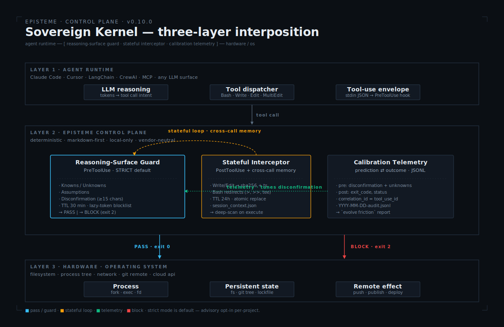

# episteme

> **episteme installs an epistemic posture.** The artifacts are how the posture becomes enforceable. Markdown. Vendor-neutral. The kernel outlives the tooling.

A *posture* is how a reasoner holds themselves before a decision: which questions get asked, which unknowns get named, which options are pre-rejected, and which conditions force a pivot. Tools and memory stores cycle every 18–36 months — the posture does not. `episteme` is the layer that installs the posture once and delivers it into every runtime and substrate you use.

**Most AI frameworks focus on execution—giving agents memory and tools to act faster. Episteme focuses on governance.** It is a deterministic control plane that sits between the LLM and the runtime. **By default, episteme *blocks* (exit 2) any high-impact op — `git push`, `npm publish`, `terraform apply`, DB migrations, lockfile edits, and more — until a valid Reasoning Surface is on disk.** A surface is only valid when Knowns, Unknowns, Assumptions, and Disconfirmation are all filled with concrete, measurable content (≥ 15 chars, no `none` / `n/a` / `tbd` / `해당 없음` placeholders). Command text is normalized before matching, so `subprocess.run(['git','push'])` and `os.system('git push')` bypass shapes are caught. It is the prefrontal cortex for your agentic stack—preventing fluent-wrong hallucinations and enabling zero-trust execution.

Advisory mode (warn-don't-block) is opt-in per-project: `touch .episteme/advisory-surface`.

**[What this installs →](./docs/POSTURE.md)** · **[Differential demo (off vs on) →](./demos/03_differential/)** · **[Install as plugin →](./.claude-plugin/README.md)** · **[Quick start ↓](#quick-start)**


> **Quick demo above:** a lazy agent writes `disconfirmation: "None"`, attempts `git push`, and gets blocked with exit 2. Then it rewrites a valid surface — execution passes. Reproduce it yourself with [`scripts/demo_strict_mode.sh`](./scripts/demo_strict_mode.sh). Recording instructions: [`docs/CONTRIBUTING.md`](./docs/CONTRIBUTING.md#recording-the-strict-mode-demo).

---

## I want to… → do this

| Goal                                                | Command / pointer                                                   |
|-----------------------------------------------------|---------------------------------------------------------------------|
| Understand what this is in 3 minutes                | [`docs/POSTURE.md`](./docs/POSTURE.md) · [`kernel/SUMMARY.md`](./kernel/SUMMARY.md) |
| See the posture *off vs on* on the same prompt      | [`demos/03_differential/`](./demos/03_differential/)                |
| See what it produces end-to-end                     | [`demos/01_attribution-audit/`](./demos/01_attribution-audit/) · [`demos/02_debug_slow_endpoint/`](./demos/02_debug_slow_endpoint/) |
| Install as a Claude Code plugin (one line)          | `/plugin marketplace add junjslee/episteme`                     |
| Install on my machine (CLI + editable kernel)       | `pip install -e . && episteme init` — see [`INSTALL.md`](./INSTALL.md) |
| Draft a reasoning surface from a Slack thread       | `episteme capture --input thread.txt --output surface.json`    |
| Sync identity to every AI tool I use                | `episteme sync`                                                 |
| Encode working style + reasoning posture            | `episteme setup . --interactive`                                |
| Apply the right harness for my project type         | `episteme detect . && episteme harness apply <type> .`      |
| Know when *not* to use this kernel                  | [`kernel/KERNEL_LIMITS.md`](./kernel/KERNEL_LIMITS.md)              |
| Find attribution for any borrowed concept           | [`kernel/REFERENCES.md`](./kernel/REFERENCES.md)                    |
| Audit my setup                                      | `episteme doctor`                                               |

---

## See it in 60 seconds

Three demos, increasing in what they prove:

- [`demos/01_attribution-audit/`](./demos/01_attribution-audit/) — canonical four-artifact shape (reasoning-surface → decision-trace → verification → handoff). The kernel applied to itself, auditing whether every borrowed concept is traceable to a primary source.
- [`demos/02_debug_slow_endpoint/`](./demos/02_debug_slow_endpoint/) — posture applied to a realistic p95 regression. The fluent-wrong "add a cache" answer rejected at the Core Question gate.
- [`demos/03_differential/`](./demos/03_differential/) — **same prompt, posture off vs. on**. The demo that converts skeptics: a PM asks for a 2-sprint semantic-search scope; off answers *how*, on answers *whether*. [`DIFF.md`](./demos/03_differential/DIFF.md) shows which failure modes the posture caught.

Open any of the three. You will know what episteme produces before reading any philosophy.

---

## The lifecycle

```
┌─────────────────────────────────────────────────────────────────────┐
│                         operator (you)                              │
│           ├── cognitive preferences   ├── working style             │
└──────────────────────────────┬──────────────────────────────────────┘
                               │
                    episteme sync
                               │
      ┌────────────────────────┼────────────────────────┐
      ▼                        ▼                        ▼
 Claude Code             Hermes (OMO)            future adapter
 (CLAUDE.md)             (OPERATOR.md)           (same kernel)
      │                        │                        │
      └────────────────────────┼────────────────────────┘
                               │
                       per-session loop
                               │
      ┌────────┬────────┬──────┴─────┬────────┬────────┐
      ▼        ▼        ▼            ▼        ▼        ▼
    FRAME → DECOMPOSE → EXECUTE → VERIFY → HANDOFF → (next session)
      │                                        │
      │ Reasoning Surface                      │ docs/PROGRESS.md
      │ (Knowns / Unknowns /                   │ docs/NEXT_STEPS.md
      │  Assumptions / Disconfirmation)        │ decision artifact
      │                                        │
      └────────────── feedback ────────────────┘
```

Every element is the operational form of a kernel principle. The loop is the unit of progress (IV). Orientation precedes observation (II). Knowns/Unknowns/Assumptions/Disconfirmation are explicit before action (I). Multiple lenses are required at high-impact decisions (III).

---

## The kernel

Start at **[`kernel/`](./kernel/)**. Pure markdown. No code. No vendor lock-in.

| File                                                              | What it defines                                              |
|-------------------------------------------------------------------|--------------------------------------------------------------|
| [`SUMMARY.md`](./kernel/SUMMARY.md)                               | 30-line operational distillation                             |
| [`CONSTITUTION.md`](./kernel/CONSTITUTION.md)                     | Root claim, four principles, six failure modes               |
| [`REASONING_SURFACE.md`](./kernel/REASONING_SURFACE.md)           | Knowns / Unknowns / Assumptions / Disconfirmation protocol   |
| [`FAILURE_MODES.md`](./kernel/FAILURE_MODES.md)                   | Six fluent-agent failure modes ↔ counter artifacts           |
| [`OPERATOR_PROFILE_SCHEMA.md`](./kernel/OPERATOR_PROFILE_SCHEMA.md) | Schema for encoding an operator's cognitive preferences   |
| [`KERNEL_LIMITS.md`](./kernel/KERNEL_LIMITS.md)                   | When the kernel is the wrong tool; declared gaps             |
| [`REFERENCES.md`](./kernel/REFERENCES.md)                         | Attribution for every load-bearing borrowed concept          |
| [`CHANGELOG.md`](./kernel/CHANGELOG.md)                           | Versioned kernel history                                     |

Authority hierarchy: **project docs > operator profile > kernel defaults > runtime defaults.** Specific beats general.

---

## System overview

<p align="center">
  
</p>

Structural stack: kernel (philosophy) → operator profile (personalization) → adapters (delivery) → runtime (execution).

### Control plane (v0.10.0 · The Sovereign Kernel)

<p align="center">
  
</p>

Three layers. **Agent runtime** issues tool calls (Bash / Write / Edit / MultiEdit). The **episteme control plane** mediates every one of them via a **Reasoning-Surface Guard** (strict by default — blocks high-impact ops without a declared surface), a **Stateful Interceptor** (persists sha256+ts of agent-written files to `~/.episteme/state/session_context.json`, closing the write-then-execute bypass across calls), and a **Calibration Telemetry** feed (pairs pre-call predictions with post-call exit codes, JSONL, local-only). Only after PASS does **hardware / OS** observe any effect. On BLOCK (exit 2) the tool dispatcher returns the guard's reason and the effect never reaches the filesystem, the git remote, or the cloud.

**Works with any stack.** Episteme is an agnostic layer that operates independently of the LLM runtime—whether you use LangChain, CrewAI, Claude Code, Cursor, or MCP. The kernel is pure markdown; the operator profile is plain JSON; the workflow loop is vendor-neutral. The adapter layer (currently: Claude Code, Hermes) is pluggable. The kernel outlives the tooling.

---

## Quick start

```bash
git clone https://github.com/junjslee/episteme ~/episteme
cd ~/episteme
pip install -e .

episteme init              # generate personal memory files from templates
episteme setup . --write   # score working style + reasoning posture
episteme sync              # push identity to every adapter
episteme doctor            # verify wiring
```

Project-type harness:

```bash
episteme detect .                         # analyze repo, recommend a harness
episteme harness apply ml-research .      # apply it
episteme new-project . --harness auto     # scaffold + auto-detect
```

Deep-dive onboarding modes, scored dimensions, and defaults: **[`docs/SETUP.md`](./docs/SETUP.md)**.

---

## How episteme compares

Most tools in this space either build agent runtimes or provide memory APIs for applications. `episteme` augments the developer tools you already use.

| Axis                  | episteme                                          | Memory APIs (mem0, OpenMemory)  | Agent runtimes (Agno, opencode, omo) |
|-----------------------|---------------------------------------------------|---------------------------------|--------------------------------------|
| **What it is**        | Identity + governance layer across dev tools      | Memory API embedded in an app   | A runtime that executes agents       |
| **Where identity lives** | Governed markdown + JSON, cross-tool, versioned | Vector/graph store, per app     | System prompt per session            |
| **Sync**              | One command, all tools                            | N/A                             | N/A (per-project config)             |

The gap episteme fills: no other project syncs a *governed identity + cognitive contract* across multiple developer AI tools in one command. Runtimes and memory APIs own different lanes; episteme sits above them and makes them aware of *who you are* and *how you think*.

---

## Repository layout

```
episteme/
├── kernel/                     philosophy (markdown; travels across runtimes)
├── demos/                      end-to-end reference deliverables
├── core/
│   ├── memory/global/          operator memory (gitignored; personal)
│   ├── hooks/                  deterministic safety + workflow hooks
│   ├── harnesses/              per-project-type operating environments
│   └── schemas/                memory + evolution contract schemas
├── adapters/                   kernel delivery layers (Claude Code, Hermes, …)
├── skills/                     reusable operator skills
├── templates/                  project scaffolds, example answer files
├── docs/                       runtime docs, architecture, contracts
├── src/episteme/               CLI + core library
└── tests/
```

Repo operating contract (for any agent working here): **[`AGENTS.md`](./AGENTS.md)**. LLM sitemap: **[`llms.txt`](./llms.txt)**.

---

## CLI surface

```bash
episteme init
episteme doctor
episteme sync [--governance-pack minimal|balanced|strict]
episteme new-project [path] --harness auto
episteme detect [path]
episteme harness apply <type> [path]
episteme profile [survey|infer|hybrid] [path] [--write]
episteme cognition [survey|infer|hybrid] [path] [--write]
episteme setup [path] [--interactive] [--write] [--sync] [--doctor]
episteme bridge anthropic-managed --input <events.json> [--dry-run]
episteme bridge substrate [list-adapters|describe|verify|push|pull] ...
episteme capture [--input <file>] [--output <file>] [--by <name>]
episteme viewer [--host 127.0.0.1] [--port 37776]
episteme evolve [run|report|promote|rollback] ...
```

Full reference: [`docs/README.md`](./docs/README.md).

---

## Why this architecture

- **Cross-tool consistency.** One authoritative operating contract across Claude Code, Hermes, and future adapters.
- **Deterministic setup.** Onboarding is explainable (`survey` / `infer` / `hybrid`) instead of implicit drift.
- **Hard authority boundary.** Repo docs + global memory are the source of truth; tool-native memories are acceleration, not authority.
- **Declared limits.** [`KERNEL_LIMITS.md`](./kernel/KERNEL_LIMITS.md) names when the kernel is the wrong tool. A discipline without a boundary is a creed.
- **Coexistence, not replacement.** Self-evolving runtimes adapt fast locally; durable lessons get promoted into authoritative files, then re-synced. Managed runtimes (execution substrate) and episteme (control plane) are complementary.
- **Deterministic agent governance.** Pre-execution policy enforcement, not post-hoc correction. Knowns / Unknowns / Assumptions / Disconfirmation are structural gates, not suggestions.
- **AI safety and guardrails by design.** We provide a deterministic cognitive sandbox to prevent agents from falling into fluent hallucinations and infinite loops before they write a single line of code.

**Feedforward, not feedback.** Most AI agents rely on reactive feedback control—observe an error, correct after the fact. Episteme enforces *feedforward* cognitive control: failure modes are named and countered before execution begins. The Reasoning Surface is the feedforward gate. Nothing executes until Knowns, Unknowns, Assumptions, and Disconfirmation are declared.

**Cognitive contract (Design by Contract).** The Reasoning Surface is a cognitive contract in the sense of Bertrand Meyer's *Design by Contract*: **Preconditions** (Knowns + validated Assumptions that must hold before execution), **Postconditions** (Verification step: what must be true at handoff), **Invariants** (the kernel itself—the four principles that cannot be suspended). Breach a precondition and the agent should not proceed.

**Policy engine for agent cognition.** Episteme plays the same role for agent reasoning that OPA (Open Policy Agent) plays for cloud infrastructure: an independent policy layer that evaluates whether a proposed action complies with declared epistemic policy before it executes. The LLM is the runtime; episteme is the policy engine.

Memory model, Memory Contract v1, Evolution Contract v1, and managed-runtime coexistence: **[`docs/SYNC_AND_MEMORY.md`](./docs/SYNC_AND_MEMORY.md)**.

---

## Zero-trust execution

The OWASP Agentic AI Top 10 identifies prompt injection, goal hijacking, overreach, and unbounded action as the primary risk classes for autonomous agents. The Knowns / Unknowns / Assumptions / Disconfirmation structure is a structural counter to each:

| OWASP Agentic Risk | episteme counter |
|--------------------|------------------|
| Prompt injection / goal hijacking | Core Question declared before execution begins; deviations surface as Unknowns |
| Overreach / unbounded action | Constraint regime declared in Frame; reversible-first policy enforced |
| Fluent hallucination | Unknowns field cannot be blank; assumptions must be named before acting on them |
| Infinite planning loops | Disconfirmation condition required; loop exits when evidence fires |

No assumption is trusted unless named. No action is taken unless the precondition (Knowns) and constraint regime are declared. The kernel is the verification layer between intent and execution.

---

## Human prompt debugging

Episteme doesn't just govern the AI—it debugs the human's intent. When an agent maps Knowns vs. Unknowns against a user request, it exposes logical gaps in the *original prompt* before executing flawed assumptions. The Unknowns field is often where the human realizes their question was underspecified. The Disconfirmation field is often where they realize they have not thought about falsification at all.

This is not a side effect. It is a design property. A system that forces the agent to declare what it does not know forces the human to confront what they did not specify.

---

## Read next

| Topic                                      | Where                                                            |
|--------------------------------------------|------------------------------------------------------------------|
| What episteme installs (posture framing) | [`docs/POSTURE.md`](./docs/POSTURE.md)                         |
| Kernel distillation (30 lines)             | [`kernel/SUMMARY.md`](./kernel/SUMMARY.md)                       |
| What the kernel produces                   | [`demos/01_attribution-audit/`](./demos/01_attribution-audit/) · [`demos/02_debug_slow_endpoint/`](./demos/02_debug_slow_endpoint/) |
| Same prompt, posture off vs. on            | [`demos/03_differential/`](./demos/03_differential/)             |
| Install paths (marketplace, CLI, dev)      | [`INSTALL.md`](./INSTALL.md)                                     |
| Benchmark with disconfirmation target      | [`benchmarks/kernel_v1/`](./benchmarks/kernel_v1/)               |
| Substrate bridge (mem0, memori, noop)      | [`docs/SUBSTRATE_BRIDGE.md`](./docs/SUBSTRATE_BRIDGE.md)         |
| Profile + cognition setup                  | [`docs/SETUP.md`](./docs/SETUP.md)                               |
| Sync matrix, memory model, contracts       | [`docs/SYNC_AND_MEMORY.md`](./docs/SYNC_AND_MEMORY.md)           |
| Harness system                             | [`docs/HARNESSES.md`](./docs/HARNESSES.md)                       |
| Hook reference + governance packs          | [`docs/HOOKS.md`](./docs/HOOKS.md)                               |
| Skills + agent personas + provenance       | [`docs/SKILLS_AND_PERSONAS.md`](./docs/SKILLS_AND_PERSONAS.md)   |
| Personal customization (memory/hooks/skills) | [`docs/CUSTOMIZATION.md`](./docs/CUSTOMIZATION.md)             |
| Agent repo operating contract              | [`AGENTS.md`](./AGENTS.md)                                       |
| Architecture deep-dive                     | [`docs/EPISTEME_ARCHITECTURE.md`](./docs/EPISTEME_ARCHITECTURE.md) |
| Cognitive system playbook                  | [`docs/COGNITIVE_SYSTEM_PLAYBOOK.md`](./docs/COGNITIVE_SYSTEM_PLAYBOOK.md) |

---

## Push-readiness checklist

```bash
PYTHONPATH=. pytest -q tests/test_profile_cognition.py
python3 -m py_compile src/episteme/cli.py
episteme doctor
git status && git rev-list --left-right --count @{u}...HEAD
```
