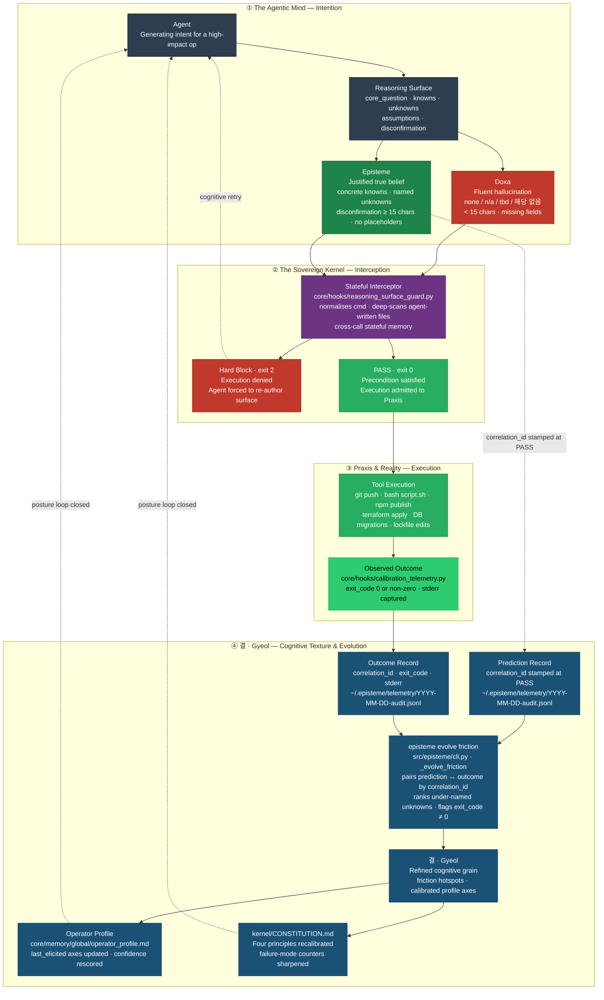

<h1 align="center">
  <picture>
    <source media="(prefers-color-scheme: dark)" srcset="docs/assets/logo-dark.svg?v=2">
    
  </picture>
</h1>

<p align="center">
  <a href="https://github.com/junjslee/episteme/releases"></a>
  <a href="https://github.com/junjslee/episteme/blob/master/LICENSE"></a>
  <a href="https://github.com/junjslee/episteme"></a>
</p>

<p align="center">
  <a href="README.md"><b>English</b></a> &bull;
  <a href="README.ko.md">한국어</a> &bull;
  <a href="README.es.md">Español</a> &bull;
  <a href="README.zh.md">中文</a>
</p>

<p align="center"><a href="https://epistemekernel.com"><b>epistemekernel.com</b></a></p>

> **episteme makes an AI agent show its work before it acts — and makes your repo's docs stop lying about your code.**
>
> It installs into the coding tools you already use (Claude Code today; a vendor-neutral adapter layer for others). Before any high-impact action — `git push`, a deploy, a migration, deleting a constraint — the agent must write down, on disk, what it knows, what it doesn't, and what observable event would prove it wrong. A deterministic hook checks the artifact and refuses to proceed until it's real (`exit 2`). Lessons from verified decisions become tamper-evident, context-scoped protocols that resurface at the next matching decision — so the agent gets sharper on *your* codebase over time, and your documentation is linted against your code the same way your code is linted against your tests.

**[What it looks like ↓](#what-it-looks-like)** · **[Install ↓](#install)** · **[The demos ↓](#the-demos)** · **[How it compares ↓](#how-it-compares)** · **[Under the hood ↓](#under-the-hood)** · **[Does it work? ↗](docs/EVALUATION_METHOD.md)**

---

## What it looks like

You ask your agent: *"Evaluate whether our retrieval-augmented memory system is actually improving response quality."*

**Without episteme** — the agent treats this as a measurement chore. It pulls 30 days of metrics, finds a 7% lift in thumbs-up rate, and writes a confident memo: *"memory helps; keep shipping."* You read it. It's wrong three ways, fluently:

- Thumbs-up tracks response *confidence*, not *correctness* — it measured a proxy for your question, not the question.
- Memory responses run 30% longer, and length independently drives thumbs-up — the "lift" might be the length effect.
- No condition was ever named under which the conclusion would be judged wrong — so it can't be.

**With episteme** — before the memo can land, the agent has to commit this to disk:

| Field | What the agent must write |
|---|---|
| **Core Question** | The one question this work actually answers — *"does memory improve correctness, controlled for length?"* |
| **Knowns** | Verified facts with sources — not plausible-sounding guesses |
| **Unknowns** | Named gaps (*"whether the lift survives length control"*) — a blank here fails the gate |
| **Assumptions** | Load-bearing beliefs, flagged so they can be falsified |
| **Disconfirmation** | A pre-committed observable — *"if the lift disappears under length-controlled re-run, memory is adding tokens, not signal"* |

Lazy tokens (`none`, `n/a`, `tbd`, `해당 없음`) are rejected. Vague hedges (*"if issues arise"*) are rejected — only concrete falsification conditions pass. The act of writing the surface is what exposes that the proxy wasn't the question. That's the product: **the agent is forced to think in a way you can audit, before the consequences exist.**


*Recorded from `scripts/demo_posture.sh` — a blocked constraint-removal, a validated rewrite, a refactor forced to declare its blast radius, and the synthesized protocol firing on a later decision.*

## What you get

- **A reasoning gate at the point of no return.** Hooks intercept high-impact operations and validate the Reasoning Surface structurally — normalized command scanning catches bypass shapes (`subprocess.run(['git','push'])`, agent-written shell scripts, wrapped executors). Absent or hollow surface → the op is refused. Strict by default; advisory mode is opt-in per project.
- **Interrogation for load-bearing decisions.** Structure alone can't tell thinking from theater, so the gate also accepts a stronger artifact: the decision decomposed into claims, each load-bearing claim verified by a **fresh context that never saw the draft reasoning**, the strongest opposition argued, the weakest link named. A `stop` verdict fails closed.
- **Memory that compounds instead of decaying.** Every verified lesson becomes a hash-chained, context-scoped protocol — append-only and tamper-evident, so the agent can't silently rewrite what it learned. At the next matching decision the kernel surfaces the protocol proactively: `[episteme guide] … · overlap 5/6 · Protocol: In context X, do Y`. You don't have to remember to ask.
- **Docs that are linted against reality.** Every tracked doc carries a machine-readable lifecycle marker (`living / spec-implemented / design-history / report / tombstone`). CI fails when a new doc lands unclassified, when a living doc cites a retired one as if current, or when a point-in-time report tries to squat in `docs/`. Version strings are stamped from the release manifest, never hand-copied. Stale docs surface at session start — silently, only when something is actually stale. **Single source of truth, enforced — not aspired to.**
- **A system that cleans up after itself.** Review queues are capped with visible backpressure, logs rotate at size caps, expired markers and old telemetry are reaped at session start. Artifacts don't stack; deletion is a designed operation, not an accident of neglect.
- **One identity across tools.** Your working style, risk posture, and reasoning preferences live in governed, versioned markdown — synced to every adapter with one command. The kernel outlives the tool.

## Install

**Option A — Claude Code plugin (two commands, self-contained):**

```
/plugin marketplace add junjslee/episteme
/plugin install episteme@episteme
```

Hooks, agents, and skills are live in your session; no pip involved.

**Option B — clone the kernel (CLI + editable source):**

```bash
git clone https://github.com/junjslee/episteme ~/episteme
cd ~/episteme && pip install -e .

episteme init      # generate personal memory files from templates
episteme setup .   # score working style + reasoning posture
episteme sync      # push identity to every adapter
episteme doctor    # verify wiring
```

Adopting in an existing repo: `episteme docs lint` forces a lifecycle classification of every tracked doc — that first lint run is the honest inventory most repos have never had. Details, project harnesses, and the full command reference: [`INSTALL.md`](./INSTALL.md) · [`docs/SETUP.md`](./docs/SETUP.md) · [`docs/COMMANDS.md`](./docs/COMMANDS.md).

## The demos

Every demo ships its real artifacts — read them before any philosophy.

| Demo | What it proves |
|---|---|
| [`demos/04_symbiosis/`](./demos/04_symbiosis/) | **The thesis, from real history (2026-04-27, Events 65–67):** the operator proposed an anxiety-driven irreversible bundle; the kernel's adversarial review surfaced 3 Critical findings; the decomposed path became constitutional in `AGENTS.md`. Agent and human debugging *each other's* intent. [`DIFF.md`](./demos/04_symbiosis/DIFF.md) shows the alternate world side-by-side. |
| [`demos/03_differential/`](./demos/03_differential/) | **Same prompt, framework off vs on.** Off answers *how*; on answers *whether*. [`DIFF.md`](./demos/03_differential/DIFF.md) names the failure modes caught. |
| [`demos/02_debug_slow_endpoint/`](./demos/02_debug_slow_endpoint/) | A p95 regression where the fluent-wrong *"add a cache"* dies at the Core Question gate; a schema-level root cause is produced instead. |
| [`demos/01_attribution-audit/`](./demos/01_attribution-audit/) | The canonical four-artifact shape (reasoning-surface → decision-trace → verification → handoff) — the kernel auditing its own attributions. |
| [`demos/05_contract_gate/`](./demos/05_contract_gate/) | The behavioral complement: declared contracts run at turn-end. |

Re-record the hero demo yourself: `scripts/demo_posture.sh` (recipe in the script header). The live dashboard renders against the kernel's own hash chain — [`web/README.md`](./web/README.md).

## How it compares

| Axis | episteme | Memory APIs (mem0, OpenMemory) | Agent runtimes (Agno, opencode) |
|---|---|---|---|
| **What it is** | Reasoning governance + identity layer over your existing tools | Memory API embedded in an app | A runtime that executes agents |
| **Where identity lives** | Governed, versioned markdown/JSON — cross-tool | Vector/graph store, per app | System prompt, per session |
| **Know-how** | Extracted at the file-system boundary, hash-chained, resurfaced by context | Opaque retrieval | Prompt-tuned, per session |
| **Docs/state hygiene** | Lifecycle-linted, GC'd, drift-gated in CI | N/A | N/A |

**Isn't this just contract testing?** Contract tests catch *behavioral* regressions — did the code do what the spec says. The Reasoning Surface catches *epistemological* regressions — did we write the right spec, frame the right question, name what would prove us wrong. A passing test suite cannot tell you you're solving the wrong problem fluently; that failure happens before the spec exists. episteme ships both layers ([`docs/CONTRACT_GATE.md`](./docs/CONTRACT_GATE.md)).

**Why can't a prompt do this?** Prompts are advisory: they live for one call, get skipped at deadline, and vanish from context. A hook that exits non-zero cannot be skipped. The MIRROR benchmark ([arXiv 2604.19809](https://arxiv.org/abs/2604.19809); 16 models, 8 labs, ~250k instances) found that showing models their own calibration doesn't help — *only architectural constraint is effective* (Confident Failure Rate 0.60 → 0.14). Posture over prompt.

## Honest limits

- [`kernel/KERNEL_LIMITS.md`](./kernel/KERNEL_LIMITS.md) names when this kernel is the wrong tool. *A discipline without a boundary is a creed.*
- The kernel measures its own claims: the protocol-synthesis loop fired its own falsifiability condition in 2026-06 (49 days, zero synthesized protocols) and was rebuilt to synthesize from verified interrogations — the audit trail is public ([`kernel/FAILURE_MODES.md`](./kernel/FAILURE_MODES.md), [`docs/EVALUATION_METHOD.md`](./docs/EVALUATION_METHOD.md)). A kernel that enforces disconfirmation on your decisions owes you the same on its own.
- Attribution for every borrowed concept, and the 2025–26 industry work that independently converged on the same patterns: [`kernel/REFERENCES.md`](./kernel/REFERENCES.md).

## Under the hood

Status: **<!-- episteme-fact:version -->1.9.0<!-- /episteme-fact:version -->** · The practice is Frame → Decompose → Execute → Verify → Handoff, grounded in named counters to specific System-1 failure modes (question substitution, WYSIATI, anchoring, narrative fallacy, planning fallacy, overconfidence) — the full operationalization is [`docs/THE_WAY_TO_THINK.md`](./docs/THE_WAY_TO_THINK.md), and the four Cognitive Blueprints (Axiomatic Judgment · Fence Reconstruction · Consequence Chain · Architectural Cascade) are specified in [`docs/ARCHITECTURE.md`](./docs/ARCHITECTURE.md).



**Doxa** (red) — fluent-but-unvalidated output — is the failure state the kernel exists to prevent. **Episteme** (green) — a validated surface — is the precondition for execution. **Praxis** — the admitted action and its observed outcome. **결 · Gyeol** (blue) — the calibration loop that refines the framework across cycles. Works with any stack: the kernel is pure markdown, the profile plain JSON, the adapter layer (Claude Code, Hermes, OMO/OMX) pluggable.

The kernel itself — pure markdown, no code, no vendor lock-in — starts at [`kernel/`](./kernel/):

| File | What it defines |
|---|---|
| [`SUMMARY.md`](./kernel/SUMMARY.md) | 30-line operational distillation |
| [`CONSTITUTION.md`](./kernel/CONSTITUTION.md) | Root claim, four principles, reasoner failure modes |
| [`FAILURE_MODES.md`](./kernel/FAILURE_MODES.md) | Full 12-mode taxonomy ↔ counter artifacts |
| [`REASONING_SURFACE.md`](./kernel/REASONING_SURFACE.md) | The Knowns / Unknowns / Assumptions / Disconfirmation protocol |
| [`MEMORY_ARCHITECTURE.md`](./kernel/MEMORY_ARCHITECTURE.md) | Five memory tiers (working → reflective) |
| [`KERNEL_LIMITS.md`](./kernel/KERNEL_LIMITS.md) | When the kernel is the wrong tool |
| [`REFERENCES.md`](./kernel/REFERENCES.md) | Attribution + convergent contemporary work |

```
episteme/
├── kernel/          philosophy (markdown; travels across runtimes)
├── core/hooks/      deterministic gates + session automation
├── src/episteme/    CLI + core library (doc lifecycle, sync, telemetry)
├── adapters/        delivery layers (Claude Code, Hermes, …)
├── demos/           end-to-end reference deliverables
├── skills/          reusable operator skills
├── templates/       project scaffolds
└── docs/            architecture, contracts, runtime docs — lifecycle-linted
```

Authority hierarchy: **project docs > operator profile > kernel defaults > runtime defaults.** Repo operating contract for agents: [`AGENTS.md`](./AGENTS.md) · LLM sitemap: [`llms.txt`](./llms.txt).

## Read next

| Topic | Where |
|---|---|
| The practice, operationalized | [`docs/THE_WAY_TO_THINK.md`](./docs/THE_WAY_TO_THINK.md) |
| Architecture + blueprint specs | [`docs/ARCHITECTURE.md`](./docs/ARCHITECTURE.md) |
| Does it work? (evaluation method) | [`docs/EVALUATION_METHOD.md`](./docs/EVALUATION_METHOD.md) |
| Install paths (marketplace, CLI, dev) | [`INSTALL.md`](./INSTALL.md) |
| Doc lifecycle + memory contracts | [`docs/MEMORY_CONTRACT.md`](./docs/MEMORY_CONTRACT.md) · [`docs/SYNC_AND_MEMORY.md`](./docs/SYNC_AND_MEMORY.md) |
| Hooks + governance packs | [`docs/HOOKS.md`](./docs/HOOKS.md) |
| Security posture (OWASP Agentic 2026 mapping) | [`docs/COMPLIANCE_CROSSWALK.md`](./docs/COMPLIANCE_CROSSWALK.md) |
| Personal customization | [`docs/CUSTOMIZATION.md`](./docs/CUSTOMIZATION.md) |
| Full docs index (generated) | [`docs/README.md`](./docs/README.md) |

## Commercial licensing

For commercial licensing or consulting, [contact me](mailto:junseong.lee652@gmail.com).
