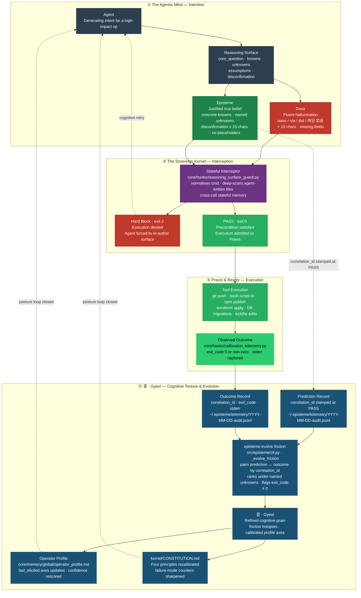

<h1 align="center">
  <picture>
    <source media="(prefers-color-scheme: dark)" srcset="docs/assets/logo-dark.svg?v=2">
    
  </picture>
</h1>

<p align="center">
  <a href="https://github.com/junjslee/episteme/releases"></a>
  <a href="https://github.com/junjslee/episteme/blob/master/LICENSE"></a>
  <a href="https://github.com/junjslee/episteme"></a>
</p>

<p align="center">
  <a href="README.md"><b>English</b></a> &bull;
  <a href="README.ko.md">한국어</a> &bull;
  <a href="README.es.md">Español</a> &bull;
  <a href="README.zh.md">中文</a>
</p>

<p align="center"><a href="https://epistemekernel.com"><b>epistemekernel.com</b></a></p>

> **episteme makes an AI agent show its work before it acts.**
>
> You know the feeling: the diff looks fine, the analysis sounds right, and a small voice says *I should probably read this more carefully.* episteme is that voice, given teeth. Before anything irreversible — a push, a deploy, a migration — your agent has to write down what it knows, what it doesn't, and what would prove it wrong. On disk, where you can read it. A quiet, deterministic gate holds the door until the thinking is real.
>
> It plugs into the tools you already use (Claude Code today; a vendor-neutral adapter layer for others). Lessons from verified decisions stick around as tamper-evident protocols that resurface exactly when they matter again — so the agent gets sharper on *your* codebase over time, and your docs are held to the same standard as your code.

**[What it looks like ↓](#what-it-looks-like)** · **[Install ↓](#install)** · **[The demos ↓](#the-demos)** · **[How it compares ↓](#how-it-compares)** · **[Under the hood ↓](#under-the-hood)** · **[Does it work? ↗](docs/EVALUATION_METHOD.md)**

---

## What it looks like

Say you ask your agent: *"Evaluate whether our retrieval-augmented memory system is actually improving response quality."*

**Without episteme**, the agent treats this as a measurement chore. It pulls 30 days of metrics, finds a 7% lift in thumbs-up rate, and writes you a confident memo: *"memory helps; keep shipping."* It reads beautifully. It's also wrong three ways at once:

- Thumbs-up tracks response *confidence*, not *correctness* — it measured a proxy for your question, not the question.
- Memory responses run 30% longer, and length independently drives thumbs-up — the "lift" might be the length effect.
- No condition was ever named under which the conclusion would be judged wrong — so it can't be.

**With episteme**, the memo can't land yet. First, the agent has to put this on disk:

| Field | What the agent must write |
|---|---|
| **Core Question** | The one question this work actually answers — *"does memory improve correctness, controlled for length?"* |
| **Knowns** | Verified facts with sources — not plausible-sounding guesses |
| **Unknowns** | Named gaps (*"whether the lift survives length control"*) — a blank here fails the gate |
| **Assumptions** | Load-bearing beliefs, flagged so they can be falsified |
| **Disconfirmation** | A pre-committed observable — *"if the lift disappears under length-controlled re-run, memory is adding tokens, not signal"* |

Lazy answers (`none`, `n/a`, `tbd`, `해당 없음`) don't pass. Vague hedges (*"if issues arise"*) don't pass either — only a concrete, observable way to be proven wrong does. And here's the quiet magic: the act of writing that surface is exactly what exposes that thumbs-up was never the question. That's the product. **The agent has to think in a way you can audit, before the consequences exist.**


*Recorded from `scripts/demo_posture.sh` — a blocked constraint-removal, a validated rewrite, a refactor forced to declare its blast radius, and the synthesized protocol firing on a later decision.*

## What you get

- **A gate at the point of no return.** High-impact operations get intercepted before they run, and the agent's reasoning is checked for substance — including the sneaky shapes (`subprocess.run(['git','push'])`, agent-written shell scripts, wrapped commands). No real surface, no execution. Strict by default; you can soften it per project if you want.
- **A second opinion the draft never touched.** Structure alone can't tell thinking from theater. So for load-bearing decisions, the gate accepts a stronger artifact: the decision broken into claims, each one verified by a fresh context that never saw the original reasoning, with the strongest opposition actually argued. If the verdict says stop, it stops.
- **Memory that compounds instead of decaying.** Every verified lesson becomes a tamper-evident protocol scoped to its context. The next time a matching decision comes up, the kernel brings the lesson to you — `Protocol: In context X, do Y` — without you having to remember it exists. The agent gets sharper on your codebase specifically.
- **Docs that stay honest.** Every tracked doc carries a lifecycle marker, and CI fails when reality drifts — an unclassified doc, a living doc citing a retired one, a version string someone hand-copied. Stale docs greet you at session start, and only when something is genuinely stale. One source of truth, enforced rather than aspired to.
- **A system that cleans up after itself.** Queues have caps with visible backpressure, logs rotate, expired markers get swept at session start. Nothing stacks up in a corner; deletion is a designed operation, not an accident of neglect.
- **One identity across tools.** Your working style, risk posture, and reasoning preferences live in versioned markdown — synced to every adapter with one command. The kernel outlives whichever tool you're using this year.

## Install

**Option A — Claude Code plugin (two commands, self-contained):**

```
/plugin marketplace add junjslee/episteme
/plugin install episteme@episteme
```

Hooks, agents, and skills are live in your session; no pip involved.

**Option B — clone the kernel (CLI + editable source):**

```bash
git clone https://github.com/junjslee/episteme ~/episteme
cd ~/episteme && pip install -e .

episteme init      # generate personal memory files from templates
episteme setup .   # score working style + reasoning posture
episteme sync      # push identity to every adapter
episteme doctor    # verify wiring
```

Adopting in an existing repo? Run `episteme docs lint` first — it asks every tracked doc to declare what it is, and that first run is usually the most honest inventory the repo has ever had. Details, project harnesses, and the full command reference live in [`INSTALL.md`](./INSTALL.md) · [`docs/SETUP.md`](./docs/SETUP.md) · [`docs/COMMANDS.md`](./docs/COMMANDS.md).

## The demos

Every demo ships its real artifacts. Read them before you read any philosophy — they're the receipts.

| Demo | What it proves |
|---|---|
| [`demos/04_symbiosis/`](./demos/04_symbiosis/) | **The thesis, from real history (2026-04-27, Events 65–67):** the operator proposed an anxiety-driven irreversible bundle; the kernel's adversarial review surfaced 3 Critical findings; the decomposed path became constitutional in `AGENTS.md`. Agent and human debugging *each other's* intent. [`DIFF.md`](./demos/04_symbiosis/DIFF.md) shows the alternate world side-by-side. |
| [`demos/03_differential/`](./demos/03_differential/) | **Same prompt, framework off vs on.** Off answers *how*; on answers *whether*. [`DIFF.md`](./demos/03_differential/DIFF.md) names the failure modes caught. |
| [`demos/02_debug_slow_endpoint/`](./demos/02_debug_slow_endpoint/) | A p95 regression where the fluent-wrong *"add a cache"* dies at the Core Question gate; a schema-level root cause is produced instead. |
| [`demos/01_attribution-audit/`](./demos/01_attribution-audit/) | The canonical four-artifact shape (reasoning-surface → decision-trace → verification → handoff) — the kernel auditing its own attributions. |
| [`demos/05_contract_gate/`](./demos/05_contract_gate/) | The behavioral complement: declared contracts run at turn-end. |

Re-record the hero demo yourself: `scripts/demo_posture.sh` (recipe in the script header). The live dashboard renders against the kernel's own hash chain — [`web/README.md`](./web/README.md).

## How it compares

| Axis | episteme | Memory APIs (mem0, OpenMemory) | Agent runtimes (Agno, opencode) |
|---|---|---|---|
| **What it is** | Reasoning governance + identity layer over your existing tools | Memory API embedded in an app | A runtime that executes agents |
| **Where identity lives** | Governed, versioned markdown/JSON — cross-tool | Vector/graph store, per app | System prompt, per session |
| **Know-how** | Extracted at the file-system boundary, hash-chained, resurfaced by context | Opaque retrieval | Prompt-tuned, per session |
| **Docs/state hygiene** | Lifecycle-linted, GC'd, drift-gated in CI | N/A | N/A |

**Isn't this just contract testing?** Contract tests ask *did the code do what the spec says.* The Reasoning Surface asks something earlier and harder: *was that the right spec, the right question, and what would have told us otherwise?* A green test suite can't tell you you're solving the wrong problem beautifully — that failure happens before the spec exists. episteme ships both layers ([`docs/CONTRACT_GATE.md`](./docs/CONTRACT_GATE.md)).

**Why can't a prompt do this?** Because prompts are suggestions. They live for one call, get skipped when you're in a hurry, and quietly fall out of context. A hook that exits non-zero doesn't negotiate. The MIRROR benchmark ([arXiv 2604.19809](https://arxiv.org/abs/2604.19809); 16 models, 8 labs, ~250k instances) tested this directly: showing a model its own calibration scores changed nothing — *only architectural constraint helped* (confident-failure rate 0.60 → 0.14). Posture beats prompting.

## Honest limits

- [`kernel/KERNEL_LIMITS.md`](./kernel/KERNEL_LIMITS.md) says plainly when this is the wrong tool for you. *A discipline without a boundary is just a creed.*
- It holds itself to the same standard. In June 2026 the protocol-synthesis loop tripped its own falsifiability condition — 49 days, zero protocols synthesized — and got rebuilt around verified interrogations instead. The whole trail is public ([`kernel/FAILURE_MODES.md`](./kernel/FAILURE_MODES.md), [`docs/EVALUATION_METHOD.md`](./docs/EVALUATION_METHOD.md)). A tool that demands disconfirmation from your decisions owes you the same about itself.
- Every borrowed idea is credited, alongside the 2025–26 work that arrived at similar patterns independently: [`kernel/REFERENCES.md`](./kernel/REFERENCES.md).

## Under the hood

Status: **<!-- episteme-fact:version -->1.10.0-rc.1<!-- /episteme-fact:version -->** · The practice is five stages — Frame → Decompose → Execute → Verify → Handoff — and each one exists to counter a specific way minds go wrong under fluency: question substitution, WYSIATI, anchoring, narrative fallacy, planning fallacy, overconfidence. The full story is in [`docs/THE_WAY_TO_THINK.md`](./docs/THE_WAY_TO_THINK.md); the four Cognitive Blueprints (Axiomatic Judgment · Fence Reconstruction · Consequence Chain · Architectural Cascade) are specced in [`docs/ARCHITECTURE.md`](./docs/ARCHITECTURE.md).



Four ideas, in the colors above. **Doxa** (red) is fluent-but-unvalidated output — the failure state this whole thing exists to prevent. **Episteme** (green) is a surface that actually holds up, and it's the price of admission for execution. **Praxis** is the action that got through, plus what really happened. **결 · Gyeol** (blue) is the loop that folds those outcomes back into how you're calibrated next time. Stack-agnostic by construction: the kernel is plain markdown, the profile plain JSON, the adapters (Claude Code, Hermes, OMO/OMX) swappable.

The kernel itself — markdown, no code, nothing to lock you in — starts at [`kernel/`](./kernel/):

| File | What it defines |
|---|---|
| [`SUMMARY.md`](./kernel/SUMMARY.md) | 30-line operational distillation |
| [`CONSTITUTION.md`](./kernel/CONSTITUTION.md) | Root claim, four principles, reasoner failure modes |
| [`FAILURE_MODES.md`](./kernel/FAILURE_MODES.md) | Full 12-mode taxonomy ↔ counter artifacts |
| [`REASONING_SURFACE.md`](./kernel/REASONING_SURFACE.md) | The Knowns / Unknowns / Assumptions / Disconfirmation protocol |
| [`MEMORY_ARCHITECTURE.md`](./kernel/MEMORY_ARCHITECTURE.md) | Five memory tiers (working → reflective) |
| [`KERNEL_LIMITS.md`](./kernel/KERNEL_LIMITS.md) | When the kernel is the wrong tool |
| [`REFERENCES.md`](./kernel/REFERENCES.md) | Attribution + convergent contemporary work |

```
episteme/
├── kernel/          philosophy (markdown; travels across runtimes)
├── core/hooks/      deterministic gates + session automation
├── src/episteme/    CLI + core library (doc lifecycle, sync, telemetry)
├── adapters/        delivery layers (Claude Code, Hermes, …)
├── demos/           end-to-end reference deliverables
├── skills/          reusable operator skills
├── templates/       project scaffolds
└── docs/            architecture, contracts, runtime docs — lifecycle-linted
```

Authority hierarchy: **project docs > operator profile > kernel defaults > runtime defaults.** Repo operating contract for agents: [`AGENTS.md`](./AGENTS.md) · LLM sitemap: [`llms.txt`](./llms.txt).

## Read next

| Topic | Where |
|---|---|
| The practice, operationalized | [`docs/THE_WAY_TO_THINK.md`](./docs/THE_WAY_TO_THINK.md) |
| Architecture + blueprint specs | [`docs/ARCHITECTURE.md`](./docs/ARCHITECTURE.md) |
| Does it work? (evaluation method) | [`docs/EVALUATION_METHOD.md`](./docs/EVALUATION_METHOD.md) |
| Install paths (marketplace, CLI, dev) | [`INSTALL.md`](./INSTALL.md) |
| Doc lifecycle + memory contracts | [`docs/MEMORY_CONTRACT.md`](./docs/MEMORY_CONTRACT.md) · [`docs/SYNC_AND_MEMORY.md`](./docs/SYNC_AND_MEMORY.md) |
| Hooks + governance packs | [`docs/HOOKS.md`](./docs/HOOKS.md) |
| Security posture (OWASP Agentic 2026 mapping) | [`docs/COMPLIANCE_CROSSWALK.md`](./docs/COMPLIANCE_CROSSWALK.md) |
| Personal customization | [`docs/CUSTOMIZATION.md`](./docs/CUSTOMIZATION.md) |
| Full docs index (generated) | [`docs/README.md`](./docs/README.md) |

## Commercial licensing

Need a commercial license, or want help adopting this? [Say hello](mailto:junseong.lee652@gmail.com) — I'd genuinely like to hear what you're building.
