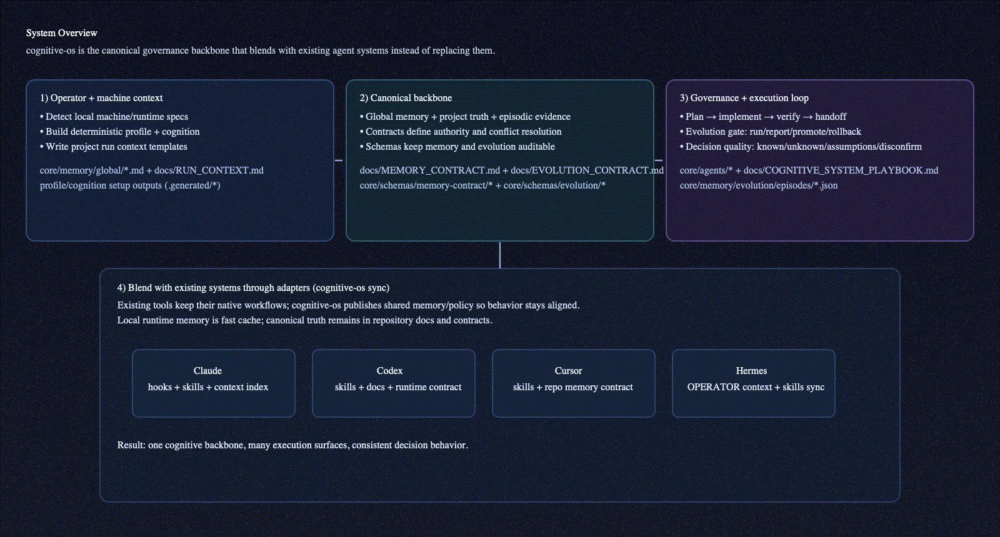
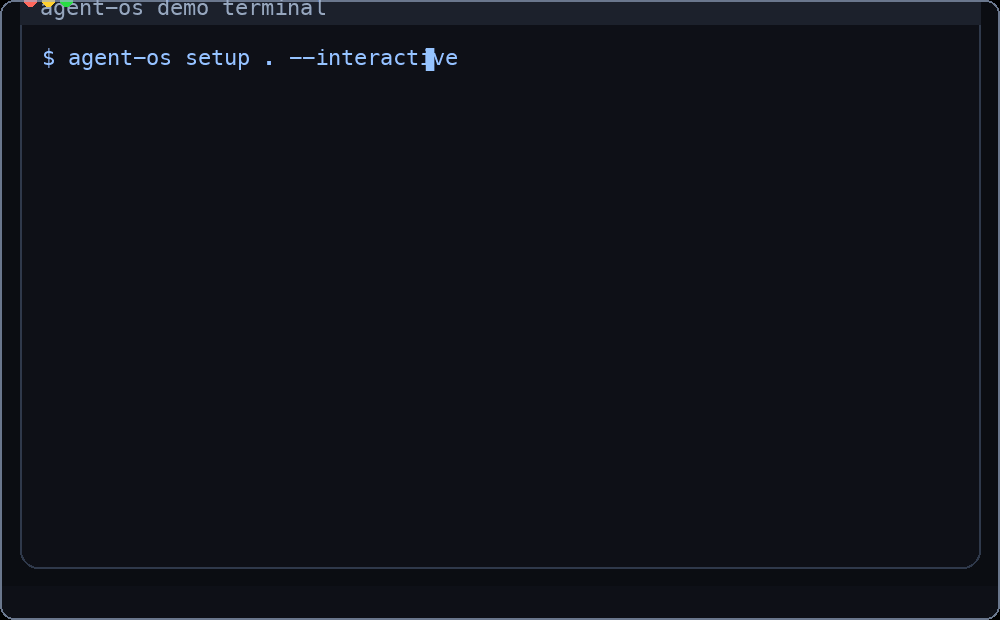

# cognitive-os

**Every AI tool you open starts cold. cognitive-os fixes that.**

`cognitive-os` is a cognitive + execution operating system for AI work that operationalizes decision quality, memory governance, how agents think, how agents execute, and accountable evolution.

`cognitive-os` is a platform-agnostic CLI that provisions memory, skills, hooks, and project harnesses across Claude Code, Codex CLI, Cursor, Hermes, and future adapters.

> Not a web UI, not a session manager, not a skill marketplace. It's the layer that runs *before* your agent starts work.

## System Overview

<p align="center">
  
</p>

System map source: `docs/assets/system-overview.svg`

Structure summary:
- Ontological + operational stack defines roles and authority boundaries.
- Canonical memory + policy defines what persists and how conflicts resolve.
- Workflow + evolution governs execution and safe improvement.
- `cognitive-os sync` propagates the same operating contract to Claude, Codex, Cursor, and Hermes.

## Quick start

```bash
git clone https://github.com/junjslee/cognitive-os ~/cognitive-os
cd ~/cognitive-os
pip install -e .
cognitive-os init
cognitive-os sync
```

## Verify setup

```bash
cognitive-os doctor
```

Expected outcome:
- `Doctor passed.`
- Claude/Codex/Cursor/Hermes adapter wiring checks shown as `[ok]` or `[info]`

## Quick terminal tools (optional but recommended)

For speed in interactive terminal work:
- `rg` (ripgrep): faster content search than grep
- `fd`: faster file discovery than find
- `bat`: better file preview than cat
- `sd`: easier replacements than sed
- `ov`: modern pager alternative to less

These are optional. `cognitive-os doctor` reports presence but does not require them.

## Read this next

- Docs index: `docs/README.md`
- Architecture: `docs/AGENT_OS_ARCHITECTURE.md`
- Cognitive System Playbook: `docs/COGNITIVE_SYSTEM_PLAYBOOK.md`

---

## Why cognitive-os

You use multiple AI coding agents. Each one starts cold. You repeat yourself. Skills drift out of sync. One agent knows your workflow; another doesn't. A context reset wipes everything. Every project gets the same generic scaffold regardless of whether it's ML research on a GPU cluster or a React app on your laptop.

`cognitive-os` fixes this with a single repo that acts as the operating layer for your entire AI stack.

---

## Design principles

- cognitive-os operationalizes cognitive policy (how agents think) and execution policy (how agents act) into repeatable workflows.
- Canonical project truth lives in repository docs (`AGENTS.md`, `docs/*`), not in any single agent tool.
- Global operator memory (cross-project) is separate from project memory (repo-local delivery context).
- Adapters (Claude, Codex, Cursor, Hermes, others) are delivery mechanisms for the same operating contract, not separate authorities.
- Plugin or tool-native memory systems accelerate retrieval, but do not replace canonical records.

---

## Architecture at a glance

cognitive-os has four layers:

1) **Global operator layer** (`core/memory/global/*`)
- your stable workflow + cognitive defaults across projects

2) **Story layer** (`core/memory/global/build_story.md`, `docs/DECISION_STORY.md`)
- narratable what/why/how traces so decisions are replayable in your head and explainable to others

3) **Project truth layer** (`AGENTS.md`, `docs/*`)
- what this specific repo is building right now

4) **Adapter layer** (Claude/Codex/Cursor/Hermes)
- delivery surfaces that consume the same contract

Adapters are not the authority. Repo docs + global memory are.

---

## Why this architecture wins

- Cross-tool consistency: one canonical operating contract across Claude/Codex/Cursor/Hermes.
- Deterministic setup: profile/cognition onboarding is explainable (`survey`/`infer`/`hybrid`) instead of implicit drift.
- Canonical boundary: repo docs + global memory are authority; tool-native memories are acceleration layers.

### Coexistence model (self-evolving agents)

`cognitive-os` is designed to work with agent runtimes that keep learning locally (Hermes memory/skills, Claude/Codex/Cursor local context):

1. Local runtime memory evolves fast during execution (high-velocity adaptation).
2. Durable lessons are promoted into canonical files (`core/memory/global/*`, `docs/*`, reusable skills).
3. `cognitive-os sync` republishes that contract to every runtime.
4. Runtime-native memory remains a cache/acceleration layer, not the source of truth.

This gives you both: fast local learning and deterministic cross-platform consistency.

### Demo

Guided setup in one command:



### 60-second demo (workflow + cognition + sync)

```bash
cognitive-os profile hybrid . --write
cognitive-os cognition survey --write
cognitive-os sync
cognitive-os doctor
```

Expected outcome:
- deterministic score artifacts generated under `core/memory/global/.generated/`
- global memory markdown updated (if `--write` and overwrite rules allow)
- adapters receive updated runtime context after `sync`

That's it. Every agent you open now inherits your memory, skills, and hooks.

To provision the right operating environment for your project type:

```bash
cognitive-os detect .                          # analyze repo and recommend a harness
cognitive-os harness apply ml-research .       # apply it
# or in one shot:
cognitive-os new-project . --harness auto      # scaffold + auto-detect harness
```

---

## What gets synced

| Asset | Claude Code | Codex CLI | Cursor | Hermes |
|---|---|---|---|---|
| Global memory index (`CLAUDE.md`) | ✅ | — | — | — |
| Operator/cognitive/workflow source files (`core/memory/global/*.md`) | via include | source only | source only | composed into `OPERATOR.md` |
| Agent personas | ✅ | — | — | — |
| Skills | ✅ | ✅ | ✅ | ✅ |
| Lifecycle hooks | ✅ | — | — | — |
| Operator context composite (`OPERATOR.md`) | — | — | — | ✅ |

Note: this matrix describes current adapter capabilities, not architectural authority. Canonical truth remains in repository docs and global cognitive-os memory.

---

## Deterministic safety hooks (Claude adapter)

Hooks run deterministically — they can't be overridden by model behavior.

| Hook | Event | What it does |
|---|---|---|
| `session_context.py` | `SessionStart` | Prints branch, git status, and `NEXT_STEPS.md` at session open |
| `block_dangerous.py` | `PreToolUse Bash` | Blocks `rm -rf`, `git reset --hard`, `git push --force`, `sudo`, `pkill`, and more |
| `format.py` | `PostToolUse Write\|Edit` | Auto-runs `ruff` (Python) or `prettier` (JS/TS) after every file write |
| `test_runner.py` | `PostToolUse Write\|Edit` | Runs pytest / jest on the file if it's a test file |
| `quality_gate.py` | `Stop` | Blocks completion if tests fail (opt-in via `.quality-gate` in project root) |
| `checkpoint.py` | `Stop` | Auto-commits uncommitted changes as `chkpt:` after every turn |
| `precompact_backup.py` | `PreCompact` | Backs up session transcripts before context compaction |

---

## Skills included

### Custom (your own)
`repo-bootstrap` · `requirements-to-plan` · `progress-handoff` · `worktree-split` · `bounded-loop-runner` · `review-gate` · `research-synthesis`

### Vendor (curated upstream)
`swing-clarify` · `swing-options` · `swing-research` · `swing-review` · `swing-trace` · `swing-mortem` · `create-prd` · `sprint-plan` · `pre-mortem` · `test-scenarios` · `prioritization-frameworks` · `retro` · `release-notes`

Add your own skills under `skills/custom/` — each skill is a folder with a `SKILL.md`.

---

## Agent personas included

Eleven subagent definitions installed into `~/.claude/agents/`:

Execution: `planner` · `researcher` · `implementer` · `reviewer` · `test-runner` · `docs-handoff`

Ontological governance: `ontologist` · `epistemic-auditor` · `governance-safety` · `orchestrator` · `domain-owner`

---

## Project scaffold

`cognitive-os new-project [path]` creates a standard project structure:

```
AGENTS.md            vendor-neutral operating manual for any agent
CLAUDE.md            Claude-native memory index
docs/
REQUIREMENTS.md    what is being built
PLAN.md            staged execution
PROGRESS.md        completed work and decisions
NEXT_STEPS.md      next-session handoff
RUN_CONTEXT.md     runtime assumptions, APIs, execution profiles
DECISION_STORY.md  narratable what/why/how for major decisions
.claude/
settings.json      permission rules
settings.local.json  machine-local overrides (gitignored)
```

---

## Command reference (essential)

```bash
cognitive-os init
cognitive-os doctor
cognitive-os sync
cognitive-os new-project [path] --harness auto
cognitive-os detect [path]
cognitive-os harness apply <type> [path]
cognitive-os profile [survey|infer|hybrid] [path] [--write]
cognitive-os cognition [survey|infer|hybrid] [path] [--write]
cognitive-os setup [path] [--interactive] [--write] [--sync] [--doctor]
cognitive-os evolve [run|report|promote|rollback] ...
```

Full command list is available in `docs/README.md`.

---

## Memory model

```
global memory (this repo)
└── stable cross-project context: who you are, how you work, safety policy, build narrative

project memory (each repo's docs/)
└── what is being built, current state, next handoff, decision story (what/why/how)

episodic memory (session/run traces)
└── observations, decisions, verification outcomes for replay and audit

plugin memory (claude-mem, etc.)
└── cache and retrieval — never the canonical record
```

Global memory never belongs in chat. Project memory never belongs in global. Plugins help but don't replace either.

### Memory Contract v1 (schema + conflict semantics)

For portable integrations and deterministic reconciliation, `cognitive-os` defines a formal contract:
- Spec: `docs/MEMORY_CONTRACT.md`
- Schemas: `core/schemas/memory-contract/*.json`

Includes:
- required provenance fields (`source_type`, `source_ref`, `captured_at`, `captured_by`, `confidence`)
- explicit memory classes (`global`, `project`, `episodic`)
- conflict order (`project > global > episodic`, then status/recency/confidence, with human override)

### Evolution Contract v1 (gated self-evolution)

cognitive-os adds a safe self-improvement loop inspired by self-evolving agent systems while preserving canonical governance:
- Spec: `docs/EVOLUTION_CONTRACT.md`
- Schemas: `core/schemas/evolution/*.json`

Core loop:
1. Generator proposes bounded mutation
2. Critic attempts disconfirmation
3. Deterministic replay + evaluation
4. Promotion gates decide pass/fail
5. Human-approved promotion + rollback reference

---

## Customization

### Personal memory
Edit `core/memory/global/*.md` — these are gitignored and never leave your machine. The `*.example.md` files in the same directory are committed templates that show what belongs in each file.

Recommended additions:
- `core/memory/global/build_story.md` from `build_story.example.md`
- keep it short and stable; it should describe your recurring builder narrative, not project-specific details.

### Skills
- Add to `skills/custom/` for your own skills
- Add to `skills/vendor/` and declare in `runtime_manifest.json` for curated upstream skills
- Add to `skills/private/` for experimental skills that are never synced globally

### Hooks
Edit scripts in `core/hooks/`. All hooks run with your Conda Python — no extra dependencies needed. The path is resolved dynamically so the same scripts work on any machine.

### Conda root
```bash
export AGENT_OS_CONDA_ROOT=/path/to/your/conda   # default: ~/miniconda3
```

---

## Harness system

A **harness** defines the operating environment for a specific project type — execution profile, workflow constraints, safety notes, and recommended agents. Where a generic scaffold gives every project the same shape, a harness gives it the right shape.

```
cognitive-os detect .
```

```
Analyzing /your/project ...

Harness scores:

ml-research            score 11  ← recommended
· dependency: torch
· dependency: transformers
· file: **/*.ipynb (3+ found)
· directory: checkpoints/

Recommended: ml-research
cognitive-os harness apply ml-research .
```

Applying a harness writes `HARNESS.md` to the project root and extends `docs/RUN_CONTEXT.md` with profile-specific context — GPU constraints, cost acknowledgment requirements, data safety rules, or dev-server reminders, depending on type.

| Harness | Best for |
|---|---|
| `ml-research` | PyTorch / JAX / HuggingFace projects, GPU training, experiment tracking |
| `python-library` | Packages and libraries intended for distribution or reuse |
| `web-app` | React / Vue / Next.js frontends with optional backend |
| `data-pipeline` | ETL, dbt, Airflow, Prefect, analytics workflows |
| `generic` | Everything else |

Add your own by dropping a JSON file into `core/harnesses/`.

---

## Story layer (mental model + narrative memory)

To make your system explainable in your own head (and to teammates), add:
- Global: `core/memory/global/build_story.md` (your stable builder narrative)
- Project: `docs/DECISION_STORY.md` (what/why/how trace for major decisions)

```bash
cp core/memory/global/build_story.example.md core/memory/global/build_story.md
```

Why this matters:
- avoids "good reasoning but no coherent story"
- preserves decision intent across sessions/tools
- improves handoffs by keeping causal context

## Deterministic profile + cognition setup

`cognitive-os profile` and `cognitive-os cognition` are deterministic onboarding layers:

- **profile** = how work runs (planning, testing, docs, automation)
- **cognition** = how decisions are made (reasoning depth, challenge style, uncertainty posture)

Important: treat survey/infer outputs as a starting point, not doctrine.
For long-term quality, manually author your canonical philosophy in `core/memory/global/cognitive_profile.md`
using a top-down structure (epistemics -> agency -> adaptation -> governance -> operating thesis), then sync.

`cognitive-os` includes deterministic profiling to bootstrap this process and keep it explainable.

Modes:
- `survey` — explicit questionnaire, 4-level choices mapped to scores 0..3
- `infer` — deterministic repo-signal scoring (docs/tests/CI/branch patterns/guardrails)
- `hybrid` — weighted merge (`60% survey + 40% infer`, rounded)

Tip: `survey` and `hybrid` support `--answers-file templates/profile_answers.example.json` for non-interactive runs.

Dimensions (all scored 0..3):
- `planning_strictness`
- `risk_tolerance`
- `testing_rigor`
- `parallelism_preference`
- `documentation_rigor`
- `automation_level`

Examples:

```bash
cognitive-os profile survey --answers-file templates/profile_answers.example.json
cognitive-os profile infer .
cognitive-os profile hybrid . --answers-file templates/profile_answers.example.json --write
cognitive-os profile show
```

Generated artifacts (machine-generated):
- `core/memory/global/.generated/workstyle_profile.json`
- `core/memory/global/.generated/workstyle_scores.json`
- `core/memory/global/.generated/workstyle_explanations.md`
- `core/memory/global/.generated/personalization_blueprint.md` (combined user system profile)

To compile generated scores into global memory files:

```bash
cognitive-os profile hybrid . --write --overwrite
```

Local integration after `--write`:

```bash
cognitive-os sync
cognitive-os doctor
```

### One-command setup wizard

For first-time setup (or reconfiguration), use:

Defaults by mode:
- Non-interactive (`cognitive-os setup .`): `profile-mode=infer`, `cognition-mode=infer`
- Interactive (`cognitive-os setup . --interactive`): questionnaire-first (`profile-mode=survey`, `cognition-mode=survey`)
- `write=false` (preview first)
- `overwrite=false`
- `sync=false`
- `doctor=false`

Important:
- In non-interactive setup, `survey` or `hybrid` requires complete answers via `--profile-answers-file` / `--cognition-answers-file` (or shared `--answers-file`).
- In interactive setup, you can accept questionnaire-first onboarding or manually choose modes.
- Use `--interactive` if you want terminal prompts for each question.

```bash
# interactive prompts (questionnaire-first by default; you can choose manual mode selection)
cognitive-os setup . --interactive

# non-interactive with explicit post-steps
cognitive-os setup . --write --sync --doctor

# fully scripted with separate answer files (required for survey/hybrid in non-interactive mode)
cognitive-os setup . \
--profile-mode hybrid \
--cognition-mode infer \
--profile-answers-file templates/profile_answers.example.json \
--cognition-answers-file templates/profile_answers.example.json \
--write --overwrite --sync --doctor
```

Answer-file precedence in setup:
1) `--profile-answers-file` / `--cognition-answers-file` (most specific)
2) `--answers-file` fallback for both

This command is designed for end users to self-select setup options instead of editing files manually.

### Deterministic cognitive profile

For philosophy of work, thinking posture, and decision attitude:

Modes:
- `survey` — explicit cognitive questionnaire
- `infer` — deterministic repo-signal cognitive scoring
- `hybrid` — weighted merge (`60% survey + 40% infer`, rounded)

Tip: `survey` and `hybrid` support `--answers-file templates/profile_answers.example.json` for non-interactive runs.

```bash
cognitive-os cognition survey --answers-file templates/profile_answers.example.json
cognitive-os cognition infer .
cognitive-os cognition hybrid . --answers-file templates/profile_answers.example.json --write
cognitive-os cognition show
```

Cognitive dimensions (0..3):
- `first_principles_depth`
- `exploration_breadth`
- `speed_vs_rigor_balance`
- `challenge_orientation`
- `uncertainty_tolerance`
- `autonomy_preference`

---

## Push-readiness checklist

Before publishing:
- `PYTHONPATH=. pytest -q tests/test_profile_cognition.py`
- `python3 -m py_compile src/agent_os/cli.py`
- `cognitive-os doctor`
- `git status` and `git rev-list --left-right --count @{u}...HEAD`

If these pass, the repo is in a clean, reproducible state for push.
