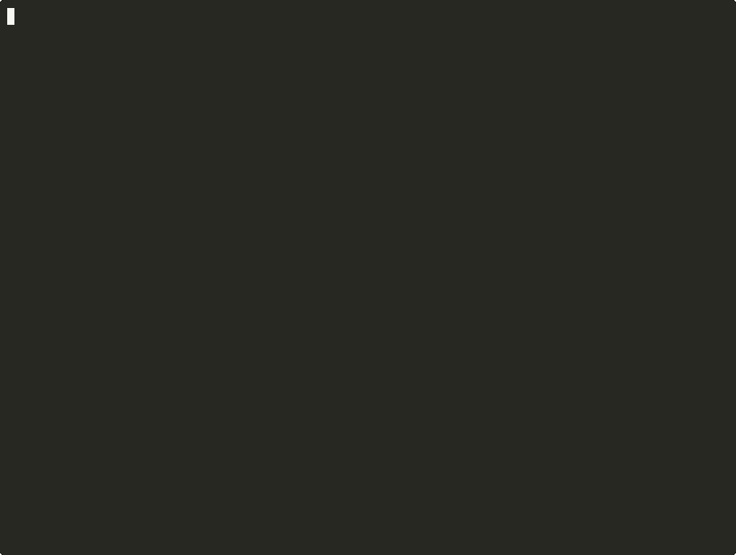
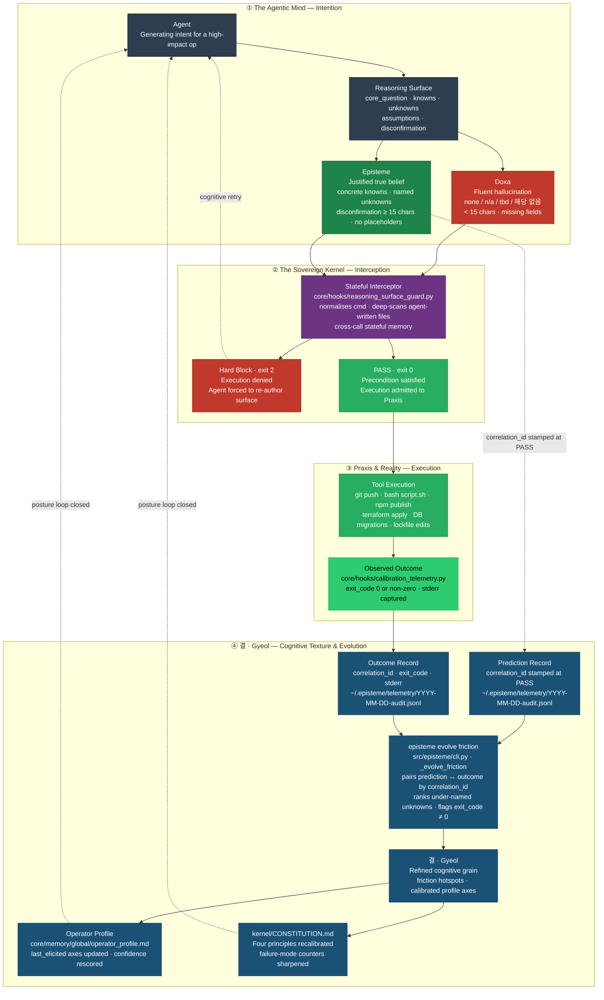

<h1 align="center">
  <picture>
    <source media="(prefers-color-scheme: dark)" srcset="docs/assets/logo-dark.svg?v=2">
    
  </picture>
</h1>

<p align="center">
  <a href="https://github.com/junjslee/episteme/releases"></a>
  <a href="https://github.com/junjslee/episteme/blob/master/LICENSE"></a>
  <a href="https://github.com/junjslee/episteme"></a>
</p>

<p align="center">
  <a href="README.md">English</a> &bull;
  <a href="README.ko.md">한국어</a> &bull;
  <a href="README.es.md">Español</a> &bull;
  <a href="README.zh.md"><b>中文</b></a>
</p>

<p align="center"><a href="https://epistemekernel.com"><b>epistemekernel.com</b></a></p>

> **episteme 让 AI 代理在行动之前，先把思考摆出来。**
>
> 那种感觉你一定不陌生：diff 看着没问题，分析听着也对，可心里有个小声音说*我大概该再仔细读一遍。* episteme 就是那个声音，只不过给了它真正的牙齿。在任何不可逆的事情发生之前 —— 一次 push、一次部署、一次迁移 —— 代理必须写下它知道什么、不知道什么，以及什么会证明它错了。写在磁盘上，写在你看得见的地方。在这份思考变得真实之前，一道安静的确定性闸门会一直把着门。
>
> 它就装在你已经在用的工具里（今天是 Claude Code，其余通过一个厂商中立的适配器层）。来自已验证决策的经验会作为防篡改的协议留下来，并在它重新变得重要的那一刻浮现 —— 于是代理随着时间在*你的*代码库上越来越敏锐，而你的文档，也被拿来和代码同一个标准要求。

**[它是什么样子 ↓](#它是什么样子)** · **[安装 ↓](#安装)** · **[演示 ↓](#演示)** · **[如何对比 ↓](#如何对比)** · **[底层原理 ↓](#底层原理)** · **[它有效吗？ ↗](docs/EVALUATION_METHOD.md)**

---

## 它是什么样子

假设你问你的代理：*"评估我们的 retrieval-augmented memory 系统是否真的在提升响应质量。"*

**没有 episteme**，代理会把这当成一件测量杂务。它取来 30 天的指标，发现 thumbs-up 率有 7% 的 lift，然后给你写了一份自信的备忘录：*"记忆有帮助，继续推进。"* 读起来漂亮极了。但它同时错了三处：

- thumbs-up 追踪的是响应的*自信度*，不是*正确性* —— 它量的是问题的代理指标（proxy），不是问题本身。
- 带记忆的响应长 30%，而长度本身就会拉高 thumbs-up —— 那个 "lift" 很可能只是长度效应。
- 从来没有人指明过：什么情况下这个结论算是错的 —— 所以它根本没法被判错。

**有了 episteme**，这份备忘录还落不了地。代理得先把这些写进磁盘：

| 字段 | 代理必须写下的内容 |
|---|---|
| **Core Question** | 这项工作真正回答的那一个问题 —— *"在控制长度后，记忆是否提升正确性？"* |
| **Knowns** | 有出处的已核实事实，不是听起来合理的猜测 |
| **Unknowns** | 点了名的缺口（*"lift 在长度控制后是否还在"*）—— 这里留空，gate 就不放行 |
| **Assumptions** | 承重的那些信念，标出来，好让它们能被证伪 |
| **Disconfirmation** | 事先承诺好的可观测量 —— *"如果在控制长度的重跑下 lift 消失，那记忆加的是 token，不是信号"* |

敷衍的答案（`none`、`n/a`、`tbd`、`해당 없음`）过不了。含糊的搪塞（*"如果出现问题"*）同样过不了 —— 只有具体的、可观测的"怎样算我错了"才行。而安静的魔法就在这里：写下这份 surface 的动作本身，恰恰暴露了 thumbs-up 从来就不是那个问题。这就是产品本身。**在后果出现之前，代理必须以一种你能审计的方式思考。**



*录制自 `scripts/demo_posture.sh` —— 一次被阻断的约束移除、一次通过验证的重写、一次被强制声明其 blast radius 的重构，以及在之后的决策上触发的合成协议。*

## 你会得到什么

- **一道设在不可回头之处的闸门。** 高影响操作在真正执行之前就被拦下，代理的推理会被检查有没有实质内容 —— 包括那些想绕过去的形态（`subprocess.run(['git','push'])`、代理自己写的 shell 脚本、被包装过的命令）。没有真正的 surface，就没有执行。默认 strict；如果你愿意，也可以按项目放松一些。
- **一个从没碰过草稿的第二意见。** 光有结构，分不出思考和表演。所以对承重的决策，闸门接受一种更强的工件：把决策拆成一条条主张，每一条都交给一个从未见过原始推理的全新上下文去验证，并且真的把最强的反方论证一遍。裁决说停，那就停。
- **会累积而不是衰减的记忆。** 每一条验证过的经验都会变成一份防篡改的协议，绑定在它自己的上下文上。下次遇到对得上的决策，kernel 会主动把这条经验递到你面前 —— `Protocol: In context X, do Y` —— 你不需要记得它存在。代理是在你的代码库上、而不是别处变得更敏锐。
- **一直保持诚实的文档。** 每个被跟踪的文档都带着生命周期标记，一旦和现实脱节，CI 就会失败 —— 未经分类的文档、把已退役文档当现行引用的 living 文档、某人手抄进去的版本号。陈旧的文档会在会话开始时来打个招呼，而且只在确实陈旧时才来。单一事实来源，是被强制的，不是被向往的。
- **一个会自己收拾的系统。** 队列有上限，带看得见的背压，日志会轮转，过期标记在会话开始时被扫掉。没有什么会堆在角落里；删除是设计出来的动作，不是疏忽造成的意外。
- **跨工具的同一个身份。** 你的工作风格、风险姿态和推理偏好，都活在带版本的 markdown 里 —— 一条命令就同步到每个适配器。kernel 比你今年在用的那个工具活得更久。

## 安装

**方式 A —— Claude Code 插件（两条命令，自包含）：**

```
/plugin marketplace add junjslee/episteme
/plugin install episteme@episteme
```

Hooks、代理和 skills 会在你的会话里直接生效，全程不涉及 pip。

**方式 B —— 克隆 kernel（CLI + 可编辑源码）：**

```bash
git clone https://github.com/junjslee/episteme ~/episteme
cd ~/episteme && pip install -e .

episteme init      # generate personal memory files from templates
episteme setup .   # score working style + reasoning posture
episteme sync      # push identity to every adapter
episteme doctor    # verify wiring
```

要在一个已经跑起来的仓库里采用它？先跑一次 `episteme docs lint` —— 它会要求每个被跟踪的文档说清楚自己是什么，而这第一次运行，往往就是这个仓库有史以来最诚实的一份清单。细节、项目 harness 和完整命令参考都在这里：[`INSTALL.md`](./INSTALL.md) · [`docs/SETUP.md`](./docs/SETUP.md) · [`docs/COMMANDS.md`](./docs/COMMANDS.md)。

## 演示

每个演示都带着它真实产出的工件。先读它们，再读任何哲学 —— 那些才是凭据。

| 演示 | 它证明了什么 |
|---|---|
| [`demos/04_symbiosis/`](./demos/04_symbiosis/) | **来自真实历史的论点（2026-04-27，Events 65–67）：** 操作者提出了一个由焦虑驱动的不可逆捆绑包；kernel 的对抗式审查浮现出 3 个 Critical 发现；被分解后的路径在 `AGENTS.md` 中成为了宪法。代理与人类在调试*彼此的*意图。[`DIFF.md`](./demos/04_symbiosis/DIFF.md) 把那个另一种世界并排展示出来。 |
| [`demos/03_differential/`](./demos/03_differential/) | **同一个 prompt，框架 off vs on。** off 回答*怎么做*；on 回答*该不该*。[`DIFF.md`](./demos/03_differential/DIFF.md) 点名了被抓住的 failure modes。 |
| [`demos/02_debug_slow_endpoint/`](./demos/02_debug_slow_endpoint/) | 一次 p95 回归，流畅却错误的*"加个 cache"* 死在 Core Question gate 上；取而代之产出的是一个 schema 层面的根因。 |
| [`demos/01_attribution-audit/`](./demos/01_attribution-audit/) | 正典的四工件形态（reasoning-surface → decision-trace → verification → handoff）—— kernel 在审计它自己的归属。 |
| [`demos/05_contract_gate/`](./demos/05_contract_gate/) | 行为层面的补充：声明的契约在回合结束时运行。 |

这段主打演示你可以自己重录一遍：`scripts/demo_posture.sh`（配方就在脚本头部）。实时仪表板是对照 kernel 自己的哈希链渲染出来的 —— [`web/README.md`](./web/README.md)。

## 如何对比

| 维度 | episteme | Memory APIs (mem0, OpenMemory) | Agent 运行时 (Agno, opencode) |
|---|---|---|---|
| **它是什么** | 架在你现有工具之上的推理治理 + 身份层 | 嵌入某个应用里的记忆 API | 一个执行代理的运行时 |
| **身份住在哪里** | 受治理、带版本的 markdown/JSON —— 跨工具 | 向量/图存储，按应用 | 系统提示，按会话 |
| **Know-how** | 在文件系统边界处抽取、哈希链接、按上下文重新浮现 | 不透明的检索 | 按会话做 prompt 调优 |
| **文档/状态卫生** | 生命周期 lint、GC、CI 中做 drift 门控 | N/A | N/A |

**这不就是 contract testing 吗？** 契约测试问的是*代码有没有照 spec 说的做。* Reasoning Surface 问的是更早、也更难的一层：*那到底是不是对的 spec、对的问题，如果不是，什么本该提醒我们？* 一套全绿的测试没法告诉你，你正在把错误的问题解得很漂亮 —— 那种失败发生在 spec 存在之前。episteme 两层都给（[`docs/CONTRACT_GATE.md`](./docs/CONTRACT_GATE.md)）。

**为什么 prompt 做不到？** 因为 prompt 只是建议。它只活一次调用，赶时间的时候就被跳过，然后悄无声息地滑出上下文。而一个以非零退出的 hook 不跟你讨价还价。MIRROR 基准（[arXiv 2604.19809](https://arxiv.org/abs/2604.19809)；16 个模型、8 个实验室、约 25 万个实例）测的正是这件事：把模型自己的校准分数摆给它看，什么都没改变 —— *只有架构性的约束真正起了作用*（confident-failure rate 0.60 → 0.14）。姿态胜过 prompt。

## 诚实的边界

- [`kernel/KERNEL_LIMITS.md`](./kernel/KERNEL_LIMITS.md) 老老实实写清楚了：什么时候这东西对你来说是错的工具。*没有边界的纪律，只是一种信条。*
- 它也拿同一把尺子量自己。2026 年 6 月，协议合成循环触发了它自己设下的可证伪条件 —— 49 天，零条合成协议 —— 于是被重建为从已验证的审问中合成。整条轨迹都是公开的（[`kernel/FAILURE_MODES.md`](./kernel/FAILURE_MODES.md)、[`docs/EVALUATION_METHOD.md`](./docs/EVALUATION_METHOD.md)）。一个要求你的决策接受 disconfirmation 的工具，也欠你对它自己交代同样的东西。
- 每一个借来的想法都注明了出处，旁边还列着 2025–26 年独立走到相似模式上的工作：[`kernel/REFERENCES.md`](./kernel/REFERENCES.md)。

## 底层原理

状态：**<!-- episteme-fact:version -->1.10.0-rc.1<!-- /episteme-fact:version -->** · 这套实践一共五步 —— Frame → Decompose → Execute → Verify → Handoff —— 而每一步的存在，都是为了对付人在"顺畅"状态下出错的一种特定方式：question substitution、WYSIATI、anchoring、narrative fallacy、planning fallacy、overconfidence。完整的来龙去脉在 [`docs/THE_WAY_TO_THINK.md`](./docs/THE_WAY_TO_THINK.md)；四个 Cognitive Blueprints（Axiomatic Judgment · Fence Reconstruction · Consequence Chain · Architectural Cascade）的规格在 [`docs/ARCHITECTURE.md`](./docs/ARCHITECTURE.md)。



上面这些颜色，对应四个概念。**Doxa**（红色）是流畅但未经验证的输出 —— 也正是这整套东西存在要防的那个失败状态。**Episteme**（绿色）是一份真正站得住的 surface，也是准许执行的入场费。**Praxis** 是被放行的那个行动，以及它实际带来的结果。**결 · Gyeol**（蓝色）则是把这些结果折回到你下一次校准里的那个循环。设计上就不挑技术栈：kernel 是普通 markdown，profile 是普通 JSON，适配器（Claude Code、Hermes、OMO/OMX）可以随时换掉。

kernel 本身 —— 只有 markdown，没有代码，也没有什么能把你锁住 —— 从 [`kernel/`](./kernel/) 开始：

| 文件 | 它定义了什么 |
|---|---|
| [`SUMMARY.md`](./kernel/SUMMARY.md) | 30 行的运行蒸馏 |
| [`CONSTITUTION.md`](./kernel/CONSTITUTION.md) | 根主张、四条原则、推理者 failure modes |
| [`FAILURE_MODES.md`](./kernel/FAILURE_MODES.md) | 完整的 12 模式分类学 ↔ 反制工件 |
| [`REASONING_SURFACE.md`](./kernel/REASONING_SURFACE.md) | Knowns / Unknowns / Assumptions / Disconfirmation 协议 |
| [`MEMORY_ARCHITECTURE.md`](./kernel/MEMORY_ARCHITECTURE.md) | 五个记忆层级（working → reflective） |
| [`KERNEL_LIMITS.md`](./kernel/KERNEL_LIMITS.md) | kernel 何时是错的工具 |
| [`REFERENCES.md`](./kernel/REFERENCES.md) | 归属 + 收敛的同期工作 |

```
episteme/
├── kernel/          philosophy (markdown; travels across runtimes)
├── core/hooks/      deterministic gates + session automation
├── src/episteme/    CLI + core library (doc lifecycle, sync, telemetry)
├── adapters/        delivery layers (Claude Code, Hermes, …)
├── demos/           end-to-end reference deliverables
├── skills/          reusable operator skills
├── templates/       project scaffolds
└── docs/            architecture, contracts, runtime docs — lifecycle-linted
```

权威层级：**项目文档 > 操作者 profile > kernel 默认值 > 运行时默认值。** 仓库对代理的运营契约：[`AGENTS.md`](./AGENTS.md) · 面向 LLM 的站点地图：[`llms.txt`](./llms.txt)。

## 继续阅读

| 主题 | 位置 |
|---|---|
| 被操作化的实践 | [`docs/THE_WAY_TO_THINK.md`](./docs/THE_WAY_TO_THINK.md) |
| 架构 + blueprint 规格 | [`docs/ARCHITECTURE.md`](./docs/ARCHITECTURE.md) |
| 它有效吗？（评估方法） | [`docs/EVALUATION_METHOD.md`](./docs/EVALUATION_METHOD.md) |
| 安装路径（marketplace、CLI、开发） | [`INSTALL.md`](./INSTALL.md) |
| 文档生命周期 + 记忆契约 | [`docs/MEMORY_CONTRACT.md`](./docs/MEMORY_CONTRACT.md) · [`docs/SYNC_AND_MEMORY.md`](./docs/SYNC_AND_MEMORY.md) |
| Hooks + governance packs | [`docs/HOOKS.md`](./docs/HOOKS.md) |
| 安全姿态（OWASP Agentic 2026 映射） | [`docs/COMPLIANCE_CROSSWALK.md`](./docs/COMPLIANCE_CROSSWALK.md) |
| 个性化定制 | [`docs/CUSTOMIZATION.md`](./docs/CUSTOMIZATION.md) |
| 完整文档索引（生成的） | [`docs/README.md`](./docs/README.md) |

## 商业授权

需要商业授权，或者想找人帮忙把它落地？[跟我说一声](mailto:junseong.lee652@gmail.com) —— 我是真的很想知道你在做什么。

---

> **关于翻译的说明。** 本 README 是与权威英文版 [`README.md`](./README.md) 一同维护的中文翻译。若需最深入的文档、演示走查与架构图，请参阅英文文档树。承重的 kernel 术语（Reasoning Surface、Core Question、Blueprint、hook、kernel、doxa/episteme/praxis 等）刻意保留英文。
