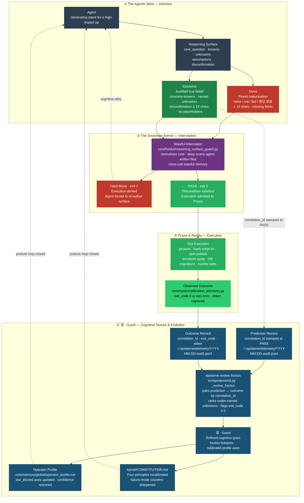

<h1 align="center">
  <picture>
    <source media="(prefers-color-scheme: dark)" srcset="docs/assets/logo-dark.svg?v=2">
    
  </picture>
</h1>

<p align="center">
  <a href="https://github.com/junjslee/episteme/releases"></a>
  <a href="https://github.com/junjslee/episteme/blob/master/LICENSE"></a>
  <a href="https://github.com/junjslee/episteme"></a>
</p>

<p align="center">
  <a href="README.md">English</a> &bull;
  <a href="README.ko.md">한국어</a> &bull;
  <a href="README.es.md">Español</a> &bull;
  <a href="README.zh.md"><b>中文</b></a>
</p>

<p align="center"><a href="https://epistemekernel.com"><b>epistemekernel.com</b></a></p>

> **episteme 让 AI 代理在行动之前先展示它的推理 —— 并让你仓库里的文档不再对你的代码撒谎。**
>
> 它安装进你已经在用的编码工具里（今天是 Claude Code；其余通过一个厂商中立的适配器层）。在任何高影响操作之前 —— `git push`、一次部署、一次迁移、删除一条约束 —— 代理必须在磁盘上写下：它知道什么、不知道什么、以及什么可观测事件会证明它错了。一个确定性 hook 检查这个工件，在它变得真实之前拒绝继续（`exit 2`）。来自已验证决策的经验教训成为防篡改（tamper-evident）、按上下文限定的协议，在下一个匹配的决策处重新浮现 —— 于是代理随时间对*你的*代码库变得更敏锐，而你的文档会像你的代码对照测试被 lint 一样，对照你的代码被 lint。

**[它是什么样子 ↓](#它是什么样子)** · **[安装 ↓](#安装)** · **[演示 ↓](#演示)** · **[如何对比 ↓](#如何对比)** · **[底层原理 ↓](#底层原理)** · **[它有效吗？ ↗](docs/EVALUATION_METHOD.md)**

---

## 它是什么样子

你问你的代理：*"评估我们的 retrieval-augmented memory 系统是否真的在提升响应质量。"*

**没有 episteme 时** —— 代理把这当作一件测量杂务。它取来 30 天的指标，发现 thumbs-up 率有 7% 的 lift，然后写下一份自信的备忘录：*"记忆有帮助；继续推进。"* 你读了它。它以三种方式、流畅地错着：

- Thumbs-up 追踪的是响应的*自信度*，不是*正确性* —— 它测量的是问题的代理指标（proxy），不是问题本身。
- 带记忆的响应长 30%，而长度会独立地拉高 thumbs-up —— 那个 "lift" 可能是长度效应。
- 从未命名过任何一个能判定结论为错的条件 —— 所以它无法被判错。

**有 episteme 时** —— 在备忘录落地之前，代理必须把这些提交到磁盘：

| 字段 | 代理必须写下的内容 |
|---|---|
| **Core Question** | 这项工作真正回答的那一个问题 —— *"在控制长度后，记忆是否提升正确性？"* |
| **Knowns** | 有出处的已核实事实 —— 不是听起来合理的猜测 |
| **Unknowns** | 已命名的缺口（*"lift 在长度控制后是否还在"*）—— 这里留空就会让 gate 失败 |
| **Assumptions** | 承重的信念，标注出来以便被证伪 |
| **Disconfirmation** | 预先承诺的可观测量 —— *"如果在控制长度的重跑下 lift 消失，那记忆加的是 token，不是信号"* |

懒惰的 token（`none`、`n/a`、`tbd`、`해당 없음`）被拒绝。含糊的搪塞（*"如果出现问题"*）被拒绝 —— 只有具体的证伪条件才能通过。写下 surface 这个行为本身，就揭示了那个代理指标并不是问题本身。这就是产品：**在后果存在之前，代理被强制以一种你可以审计的方式思考。**


*录制自 `scripts/demo_posture.sh` —— 一次被阻断的约束移除、一次通过验证的重写、一次被强制声明其 blast radius 的重构，以及在之后的决策上触发的合成协议。*

## 你会得到什么

- **一道设在不可回头之处的推理 gate。** Hooks 拦截高影响操作，并在结构上校验 Reasoning Surface —— 规范化命令扫描能抓住各种绕过形态（`subprocess.run(['git','push'])`、代理编写的 shell 脚本、被包装的执行器）。surface 缺失或空洞 → 操作被拒绝。默认 strict；advisory 模式按项目 opt-in。
- **对承重决策的审问。** 单靠结构无法区分思考与表演，所以 gate 还接受一种更强的工件：把决策分解为主张，每个承重主张都由一个**从未见过草稿推理的全新上下文**来验证，论证最强的反方，指出最薄弱的一环。`stop` 裁决以关闭状态失败。
- **会累积而非衰减的记忆。** 每一条已验证的教训都成为哈希链接、按上下文限定的协议 —— append-only 且防篡改，因此代理无法悄悄改写它学到的东西。在下一个匹配的决策处，kernel 会主动浮现该协议：`[episteme guide] … · overlap 5/6 · Protocol: In context X, do Y`。你不必记得去问。
- **对照现实被 lint 的文档。** 每个被跟踪的文档都带着机器可读的生命周期标记（`living / spec-implemented / design-history / report / tombstone`）。当一个新文档未经分类就落地、当一个 living 文档把已退役的文档当作现行来引用、或当一份时点报告试图强占 `docs/` 时，CI 都会失败。版本字符串从 release 清单中盖印，绝不手抄。陈旧的文档在会话开始时浮现 —— 悄无声息，只在确实陈旧时。**单一事实来源（single source of truth），是被强制的，而非仅仅被向往。**
- **一个会自己收拾的系统。** 审查队列有上限并带可见的背压，日志在大小上限处轮转，过期标记和旧遥测在会话开始时被回收。工件不会堆积；删除是一项被设计的操作，不是疏忽的意外。
- **跨工具的单一身份。** 你的工作风格、风险姿态和推理偏好，都活在受治理、带版本的 markdown 里 —— 一条命令即可同步到每个适配器。kernel 比工具活得更久。

## 安装

**方式 A —— Claude Code 插件（两条命令，自包含）：**

```
/plugin marketplace add junjslee/episteme
/plugin install episteme@episteme
```

Hooks、代理和 skills 在你的会话中即刻生效；不涉及 pip。

**方式 B —— 克隆 kernel（CLI + 可编辑源码）：**

```bash
git clone https://github.com/junjslee/episteme ~/episteme
cd ~/episteme && pip install -e .

episteme init      # generate personal memory files from templates
episteme setup .   # score working style + reasoning posture
episteme sync      # push identity to every adapter
episteme doctor    # verify wiring
```

在既有仓库中采用：`episteme docs lint` 会强制对每个被跟踪的文档做一次生命周期分类 —— 那第一次 lint 运行，就是大多数仓库从未拥有过的诚实清单。细节、项目 harness 与完整命令参考：[`INSTALL.md`](./INSTALL.md) · [`docs/SETUP.md`](./docs/SETUP.md) · [`docs/COMMANDS.md`](./docs/COMMANDS.md)。

## 演示

每个演示都随附它真实的工件 —— 在任何哲学之前先读它们。

| 演示 | 它证明了什么 |
|---|---|
| [`demos/04_symbiosis/`](./demos/04_symbiosis/) | **来自真实历史的论点（2026-04-27，Events 65–67）：** 操作者提出了一个由焦虑驱动的不可逆捆绑包；kernel 的对抗式审查浮现出 3 个 Critical 发现；被分解后的路径在 `AGENTS.md` 中成为了宪法。代理与人类在调试*彼此的*意图。[`DIFF.md`](./demos/04_symbiosis/DIFF.md) 把那个另一种世界并排展示出来。 |
| [`demos/03_differential/`](./demos/03_differential/) | **同一个 prompt，框架 off vs on。** off 回答*怎么做*；on 回答*该不该*。[`DIFF.md`](./demos/03_differential/DIFF.md) 点名了被抓住的 failure modes。 |
| [`demos/02_debug_slow_endpoint/`](./demos/02_debug_slow_endpoint/) | 一次 p95 回归，流畅却错误的*"加个 cache"* 死在 Core Question gate 上；取而代之产出的是一个 schema 层面的根因。 |
| [`demos/01_attribution-audit/`](./demos/01_attribution-audit/) | 正典的四工件形态（reasoning-surface → decision-trace → verification → handoff）—— kernel 在审计它自己的归属。 |
| [`demos/05_contract_gate/`](./demos/05_contract_gate/) | 行为层面的补充：声明的契约在回合结束时运行。 |

自己重新录制这段主打演示：`scripts/demo_posture.sh`（配方在脚本头部）。实时仪表板对照 kernel 自己的哈希链渲染 —— [`web/README.md`](./web/README.md)。

## 如何对比

| 维度 | episteme | Memory APIs (mem0, OpenMemory) | Agent 运行时 (Agno, opencode) |
|---|---|---|---|
| **它是什么** | 架在你现有工具之上的推理治理 + 身份层 | 嵌入某个应用里的记忆 API | 一个执行代理的运行时 |
| **身份住在哪里** | 受治理、带版本的 markdown/JSON —— 跨工具 | 向量/图存储，按应用 | 系统提示，按会话 |
| **Know-how** | 在文件系统边界处抽取、哈希链接、按上下文重新浮现 | 不透明的检索 | 按会话做 prompt 调优 |
| **文档/状态卫生** | 生命周期 lint、GC、CI 中做 drift 门控 | N/A | N/A |

**这不就是 contract testing 吗？** 契约测试抓的是*行为*回归 —— 代码有没有照 spec 说的做。Reasoning Surface 抓的是*认识论*回归 —— 我们有没有写对 spec、框对问题、说清楚什么会证明我们错了。一个通过的测试套件无法告诉你，你正在流畅地解决错误的问题；那种失败发生在 spec 存在之前。episteme 交付两层（[`docs/CONTRACT_GATE.md`](./docs/CONTRACT_GATE.md)）。

**为什么 prompt 做不到这个？** Prompt 是建议性的：只活一次调用，一到 deadline 就被跳过，然后从上下文里消失。一个以非零退出的 hook 无法被跳过。MIRROR 基准（[arXiv 2604.19809](https://arxiv.org/abs/2604.19809)；16 个模型、8 个实验室、约 25 万个实例）发现，向模型展示它自己的校准并没有帮助 —— *只有架构性约束才有效*（Confident Failure Rate 0.60 → 0.14）。姿态高于 prompt（Posture over prompt）。

## 诚实的边界

- [`kernel/KERNEL_LIMITS.md`](./kernel/KERNEL_LIMITS.md) 点名了这个 kernel 何时是错的工具。*没有边界的纪律，只是一种信条。*
- kernel 会度量它自己的主张：协议合成循环在 2026-06 触发了它自己的可证伪条件（49 天，零条合成协议），随后被重建为从已验证的审问中合成 —— 审计轨迹是公开的（[`kernel/FAILURE_MODES.md`](./kernel/FAILURE_MODES.md)、[`docs/EVALUATION_METHOD.md`](./docs/EVALUATION_METHOD.md)）。一个对你的决策强制 disconfirmation 的 kernel，也欠你对它自己做同样的事。
- 对每一个借用概念的归属，以及 2025–26 年独立收敛到相同模式的业界工作：[`kernel/REFERENCES.md`](./kernel/REFERENCES.md)。

## 底层原理

状态：**<!-- episteme-fact:version -->1.10.0-rc<!-- /episteme-fact:version -->** · 这套实践是 Frame → Decompose → Execute → Verify → Handoff，锚定于针对特定 System-1 failure modes（question substitution、WYSIATI、anchoring、narrative fallacy、planning fallacy、overconfidence）的具名反制 —— 完整的操作化在 [`docs/THE_WAY_TO_THINK.md`](./docs/THE_WAY_TO_THINK.md)，四个 Cognitive Blueprints（Axiomatic Judgment · Fence Reconstruction · Consequence Chain · Architectural Cascade）在 [`docs/ARCHITECTURE.md`](./docs/ARCHITECTURE.md) 中给出规格。



**Doxa**（红色）—— 流畅但未经验证的输出 —— 是 kernel 存在以阻止的失败状态。**Episteme**（绿色）—— 一个经过验证的 surface —— 是执行的前置条件。**Praxis** —— 被准入的行动及其被观测到的结果。**결 · Gyeol**（蓝色）—— 跨越周期打磨框架的校准循环。适用于任何技术栈：kernel 是纯 markdown，profile 是普通 JSON，适配器层（Claude Code、Hermes、OMO/OMX）可插拔。

kernel 本身 —— 纯 markdown，无代码，无厂商锁定 —— 从 [`kernel/`](./kernel/) 开始：

| 文件 | 它定义了什么 |
|---|---|
| [`SUMMARY.md`](./kernel/SUMMARY.md) | 30 行的运行蒸馏 |
| [`CONSTITUTION.md`](./kernel/CONSTITUTION.md) | 根主张、四条原则、推理者 failure modes |
| [`FAILURE_MODES.md`](./kernel/FAILURE_MODES.md) | 完整的 12 模式分类学 ↔ 反制工件 |
| [`REASONING_SURFACE.md`](./kernel/REASONING_SURFACE.md) | Knowns / Unknowns / Assumptions / Disconfirmation 协议 |
| [`MEMORY_ARCHITECTURE.md`](./kernel/MEMORY_ARCHITECTURE.md) | 五个记忆层级（working → reflective） |
| [`KERNEL_LIMITS.md`](./kernel/KERNEL_LIMITS.md) | kernel 何时是错的工具 |
| [`REFERENCES.md`](./kernel/REFERENCES.md) | 归属 + 收敛的同期工作 |

```
episteme/
├── kernel/          philosophy (markdown; travels across runtimes)
├── core/hooks/      deterministic gates + session automation
├── src/episteme/    CLI + core library (doc lifecycle, sync, telemetry)
├── adapters/        delivery layers (Claude Code, Hermes, …)
├── demos/           end-to-end reference deliverables
├── skills/          reusable operator skills
├── templates/       project scaffolds
└── docs/            architecture, contracts, runtime docs — lifecycle-linted
```

权威层级：**项目文档 > 操作者 profile > kernel 默认值 > 运行时默认值。** 仓库对代理的运营契约：[`AGENTS.md`](./AGENTS.md) · 面向 LLM 的站点地图：[`llms.txt`](./llms.txt)。

## 继续阅读

| 主题 | 位置 |
|---|---|
| 被操作化的实践 | [`docs/THE_WAY_TO_THINK.md`](./docs/THE_WAY_TO_THINK.md) |
| 架构 + blueprint 规格 | [`docs/ARCHITECTURE.md`](./docs/ARCHITECTURE.md) |
| 它有效吗？（评估方法） | [`docs/EVALUATION_METHOD.md`](./docs/EVALUATION_METHOD.md) |
| 安装路径（marketplace、CLI、开发） | [`INSTALL.md`](./INSTALL.md) |
| 文档生命周期 + 记忆契约 | [`docs/MEMORY_CONTRACT.md`](./docs/MEMORY_CONTRACT.md) · [`docs/SYNC_AND_MEMORY.md`](./docs/SYNC_AND_MEMORY.md) |
| Hooks + governance packs | [`docs/HOOKS.md`](./docs/HOOKS.md) |
| 安全姿态（OWASP Agentic 2026 映射） | [`docs/COMPLIANCE_CROSSWALK.md`](./docs/COMPLIANCE_CROSSWALK.md) |
| 个性化定制 | [`docs/CUSTOMIZATION.md`](./docs/CUSTOMIZATION.md) |
| 完整文档索引（生成的） | [`docs/README.md`](./docs/README.md) |

## 商业授权

如需商业授权或咨询，[联系我](mailto:junseong.lee652@gmail.com)。

---

> **关于翻译的说明。** 本 README 是与权威英文版 [`README.md`](./README.md) 一同维护的中文翻译。若需最深入的文档、演示走查与架构图，请参阅英文文档树。承重的 kernel 术语（Reasoning Surface、Core Question、Blueprint、hook、kernel、doxa/episteme/praxis 等）刻意保留英文。
