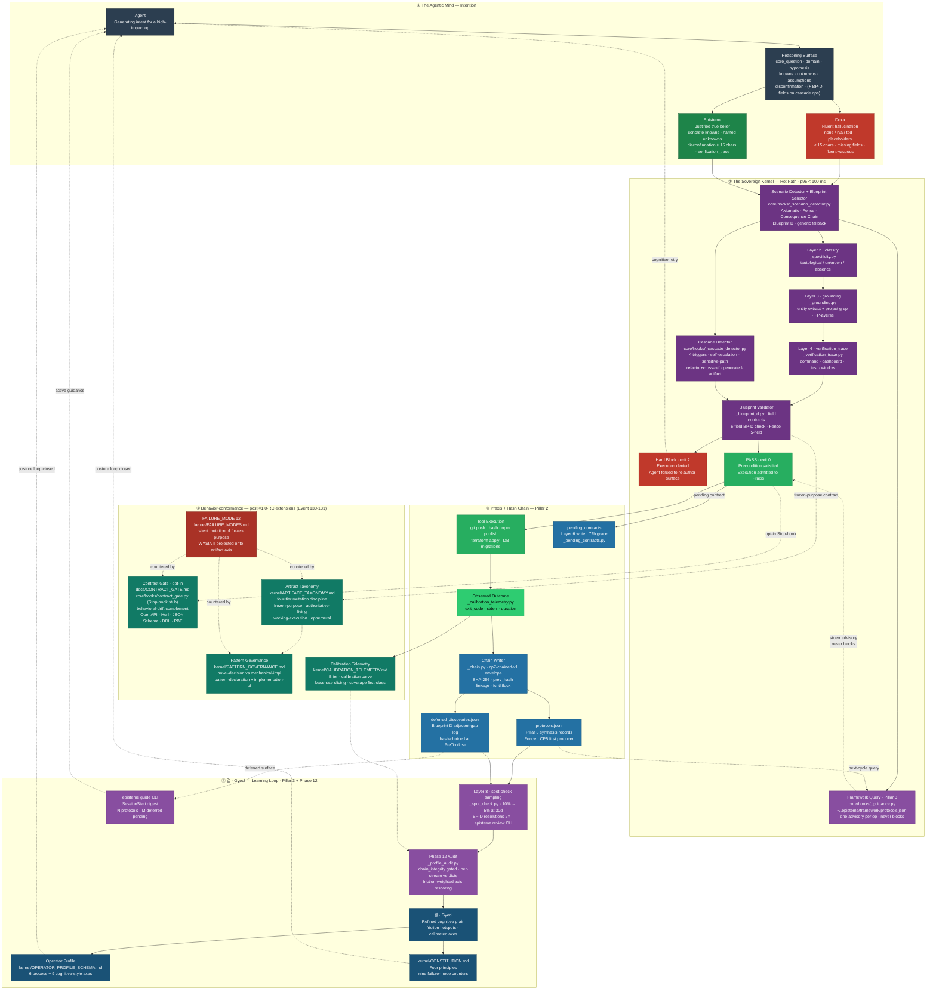

# Architecture — The Sovereign Kernel (v1.3.0-rc1 shipped · 1066 tests + 54 subtests green)

> Mermaid flowchart. Renders natively on GitHub, Obsidian, and any CommonMark viewer with Mermaid support. **Five** subgraphs trace the full lifecycle from agent intention through the three-pillar kernel — Cognitive Blueprints, Append-Only Hash Chain, Framework Synthesis & Active Guidance — into praxis, the learning loop, and the post-v1.0-RC behavior-conformance extensions (Event 130 — Contract Gate; Event 131 — FAILURE_MODES mode 12 + CALIBRATION_TELEMETRY).
>
> **State.** This diagram depicts the **v1.0 RC shipped state** (spec: [`./DESIGN_V1_0_SEMANTIC_GOVERNANCE.md`](./DESIGN_V1_0_SEMANTIC_GOVERNANCE.md), status *approved (reframed, third pass)* 2026-04-21) plus the v1.2-RC behavior-conformance extensions in Subgraph ⑤. All ten RC checkpoints shipped with paused-review-before-commit discipline. Current head: v1.3.0-rc1 (cut 2026-05-23 via release-please PR #80); 1066 tests + 54 subtests green. v1.3.0-rc2 stages from this Event's `feat:` commits; release-please regenerates the staging PR automatically — no manual version edit.

---



---

## Node annotations

### ① The Agentic Mind — Intention

| Node | Role | Key constraint |
|------|------|----------------|
| **Agent** | LLM generating a tool-call intent for a high-impact op | Any `git push`, `npm publish`, `terraform apply`, DB migration, lockfile edit, or architectural cascade triggers the guard |
| **Reasoning Surface** | Structured precondition: `core_question`, `domain`, `hypothesis`, `knowns`, `unknowns`, `assumptions`, `disconfirmation`. Cascade ops additionally require Blueprint D's six fields (`flaw_classification`, `posture_selected`, `patch_vs_refactor_evaluation`, `blast_radius_map`, `sync_plan`, `deferred_discoveries`) | Defined in `kernel/REASONING_SURFACE.md` |
| **Doxa** | Default LLM output — fluent but unvalidated | Fails on lazy placeholders (`none`, `n/a`, `tbd`), `< 15 chars`, fluent-vacuous patterns |
| **Episteme** | Validated surface — concrete, falsifiable, grounded, verifiable | All required fields filled, no placeholders, `disconfirmation ≥ 15 chars`, `verification_trace` attached on high-impact ops |

### ② The Sovereign Kernel — Hot Path

| Node | Implementation | Pillar | CP |
|------|---------------|--------|----|
| **Scenario Detector + Blueprint Selector** | `core/hooks/_scenario_detector.py` · `core/blueprints/*.yaml` | 1 | CP2 |
| **Cascade Detector** | `core/hooks/_cascade_detector.py` — four triggers (self-escalation, sensitive-path, refactor-lexicon + cross-ref ≥ 2, generated-artifact). Kernel-state-file exemption learned from live dogfood | 1 (Blueprint D) | CP10 |
| **Framework Query** | `core/hooks/_guidance.py` — reads `~/.episteme/framework/protocols.jsonl`, renders one stderr advisory per op; never blocking | 3 | CP9 |
| **Layer 2 · classify** | `core/hooks/_specificity.py` — syntactic `tautological` / `unknown` / `absence` classifier, blueprint-aware | — | CP1/CP3 |
| **Layer 3 · grounding** | `core/hooks/_grounding.py` — regex entity extraction + project grep, FP-averse gate | — | CP4 |
| **Layer 4 · verification_trace** | `core/hooks/_verification_trace.py` — command · dashboard · test · window schema; blocking on generic high-impact, advisory on A/C/D stubs | — | CP6 |
| **Blueprint Validator** | `core/hooks/_blueprint_d.py` (six-field check) · `_fence_reconstruction` (five-field check). Cascade theater + `other` admit with stderr hint | 1 | CP5/CP10 |
| **Hard Block / PASS** | `exit 2` denies; `exit 0` stamps `correlation_id`, admits to Praxis | — | — |

Advisory mode opt-in per-project: `touch .episteme/advisory-surface`.

### ③ Praxis + Hash Chain — Pillar 2

| Node | Implementation | Detail |
|------|---------------|--------|
| **Tool Execution** | Admitted shell command — `git push`, `npm publish`, `terraform apply`, DB migrations, kernel-adjacent edits |
| **Observed Outcome** | `core/hooks/calibration_telemetry.py` PostToolUse — `exit_code`, `stderr`, duration; `correlation_id` echoed from PASS |
| **Chain Writer** | `core/hooks/_chain.py` — `cp7-chained-v1` envelope (`schema_version`, `ts`, `prev_hash`, `payload`, `entry_hash`); SHA-256 linkage; `fcntl.flock` exclusive; genesis sentinel `sha256:GENESIS` |
| **`protocols.jsonl`** | `~/.episteme/framework/protocols.jsonl` — Pillar 3 synthesis records; Fence Reconstruction is the first producer (CP5); Axiomatic + Blueprint D write here in v1.0.1 |
| **`deferred_discoveries.jsonl`** | `~/.episteme/framework/deferred_discoveries.jsonl` — Blueprint D adjacent-gap log; every Blueprint D firing's `deferred_discoveries[]` entries hash-chained at PreToolUse (CP10) |
| **`pending_contracts`** | `core/hooks/_pending_contracts.py` — Layer 6 write; 72h grace archive; idempotent re-write (CP7) |

### ④ 결 · Gyeol — Learning Loop

| Node | Implementation | Detail |
|------|---------------|--------|
| **Layer 8 · spot-check sampling** | `core/hooks/_spot_check.py` — 10% → 5% at 30 days; blueprint-fired ops at 2×; Blueprint D resolutions at 2× with a `cascade-theater vs real sync` verdict; `episteme review` CLI (CP8) |
| **Phase 12 Audit** | `src/episteme/_profile_audit.py` — `chain_integrity` precondition per stream (episodic + protocols + deferred_discoveries + pending contracts); friction-weighted axis rescoring |
| **결 · Gyeol** | Derived calibration signal — per-field friction, axis drift, failure-mode frequencies |
| **Operator Profile** | `kernel/OPERATOR_PROFILE_SCHEMA.md` — 6 process axes + 9 cognitive-style axes; per-axis metadata |
| **CONSTITUTION.md** | `kernel/CONSTITUTION.md` — four principles; nine failure-mode counters recalibrated from observed friction |
| **`episteme guide` CLI** | `src/episteme/cli.py` — `guide [--context] [--since] [--deferred] [--json]`; SessionStart digest banner: `N protocols since last session · M deferred discoveries pending` (CP9) |

### ⑤ Behavior-conformance — post-v1.0-RC extensions

| Node | Implementation | Role |
|------|---------------|------|
| **Contract Gate** | [`docs/CONTRACT_GATE.md`](./CONTRACT_GATE.md) design + `core/hooks/contract_gate.py` Stop-hook stub | Behavioral-drift complement to the Reasoning Surface's epistemological gate. Dual-signal opt-in (`contracts/` dir + explicit `settings.json` registration). Supported formats: OpenAPI · Hurl · JSON Schema · DDL · state-machines · property-based tests (peer-reviewed per arXiv:2506.18315) |
| **Artifact Taxonomy** | [`kernel/ARTIFACT_TAXONOMY.md`](../kernel/ARTIFACT_TAXONOMY.md) | Four-tier mutation discipline — `frozen-purpose` · `authoritative-living` · `working-execution` · `ephemeral`. The Contract Gate's correctness depends on contracts being frozen-purpose so they cannot be silently rewritten to fit drifted implementation |
| **Pattern Governance** | [`kernel/PATTERN_GOVERNANCE.md`](../kernel/PATTERN_GOVERNANCE.md) | Novel-decision vs mechanical-implementation distinction; pattern-declaration artifact + implementation-of reference. Counters the PTSP uniform-application bottleneck at scale |
| **FAILURE_MODE 12** | [`kernel/FAILURE_MODES.md`](../kernel/FAILURE_MODES.md) § Mode 12 | *Silent mutation of frozen-purpose state* — WYSIATI (Mode 1) projected onto the artifact axis. Counter pair = Artifact Taxonomy tier discipline + Contract Gate Stop-hook enforcement. Closes the 1:1 mode↔counter mapping gap Event 130 opened |
| **Calibration Telemetry** | [`kernel/CALIBRATION_TELEMETRY.md`](../kernel/CALIBRATION_TELEMETRY.md) · `core/hooks/calibration_telemetry.py` | Measurement spec operationalizing Tetlock: Brier score · calibration curve · base-rate-aware slicing · coverage as first-class metric (refuses to emit Brier below 0.20 coverage). Falsifiability loop — if calibration curves don't trend toward the diagonal across windows on the same operator, the kernel's central empirical claim is falsified |

SG5 wires into the existing flow at three boundaries: (a) Blueprint Validator consults Artifact Taxonomy when an edit targets a tier-marked artifact; (b) PASS optionally invokes Contract Gate as an opt-in Stop-hook; (c) Observed Outcome feeds Calibration Telemetry, which drives Phase 12 audit alongside the existing spot-check verdicts. Failure Mode 12 names the failure class all three nodes jointly counter.

---

## Colour legend

| Colour | Meaning |
|--------|---------|
| Red | Doxa — unvalidated output, or Hard Block — execution denied |
| Green | Episteme / Praxis — validated surface or admitted execution |
| Purple (dark) | Sovereign Kernel — selectors, layers, validators |
| Purple (light) | Pillar 3 — framework query, spot-check, phase 12, active guidance |
| Blue (dark) | Pillar 2 — chain writer, protocols stream, deferred-discoveries stream, pending contracts |
| Blue (medium) | Gyeol — operator profile, constitution, learning feedback |
| Dark grey | Neutral infrastructure — Agent and Reasoning Surface |
| Teal | SG5 Behavior-conformance — Contract Gate, Artifact Taxonomy, Pattern Governance, Calibration Telemetry |
| Red (dark) | SG5 Failure mode — silent mutation of frozen-purpose state (Mode 12) |

---

## The feedforward contract (v1.0 RC)

```
Preconditions  →  Reasoning Surface (core_question + knowns + unknowns +
                  disconfirmation + verification_trace; Blueprint D adds
                  the six cascade fields when the cascade detector fires)
Hot path       →  Scenario Detector → Blueprint Selector → Framework Query
                  (advisory) → Layer 2 → Layer 3 → Layer 4 → Blueprint
                  Validator. p95 < 100 ms. BYOS — skill- / tool- / MCP-
                  agnostic.
Chain          →  PASS stamps correlation_id; PostToolUse writes Observed
                  Outcome; Pillar 2 chain envelopes land under
                  ~/.episteme/framework/; any break fails-closed on
                  session boot.
Postconditions →  Layer 8 spot-check (10% → 5%); Phase 12 audit with
                  chain_integrity precondition.
Feedback       →  Pillar 3 protocols query on the next matching op;
                  episteme guide surfaces active guidance; SessionStart
                  digest reports synthesis + deferred counts.
Invariants     →  kernel/CONSTITUTION.md — cannot be suspended per-cycle.
```

Nothing executes until preconditions hold. Nothing evolves until postconditions are verified. Nothing is trusted after a chain break. The kernel's four principles are invariants — not guidelines. Design by Contract (Bertrand Meyer) applied to agent cognition, with three pillars layered on top: Blueprints force causal-consequence modeling per action; the Chain gives tamper-evident memory; Framework Synthesis + Active Guidance extracts context-fit protocols and pushes them back at the next decision.

---

## Cross-references

- Hot-path hooks: `core/hooks/reasoning_surface_guard.py` · `_scenario_detector.py` · `_specificity.py` · `_grounding.py` · `_verification_trace.py` · `_cascade_detector.py` · `_blueprint_d.py`
- Pillar 2 substrate: `core/hooks/_chain.py` · `_pending_contracts.py` · `_framework.py`
- Pillar 3 substrate: `core/hooks/_framework.py` (protocols + deferred_discoveries streams) · `core/hooks/_guidance.py` · `core/hooks/_context_signature.py`
- Calibration telemetry: `core/hooks/calibration_telemetry.py` · `kernel/CALIBRATION_TELEMETRY.md` (measurement specification — Brier · calibration curve · base-rate-aware metrics · coverage as first-class)
- Spot-check: `core/hooks/_spot_check.py` · `episteme review` CLI
- Phase 12 audit: `src/episteme/_profile_audit.py`
- Active guidance CLI: `src/episteme/cli.py` · `episteme guide`
- Operator profile schema: `kernel/OPERATOR_PROFILE_SCHEMA.md`
- Kernel constitution: `kernel/CONSTITUTION.md`
- Failure modes: `kernel/FAILURE_MODES.md` (12-mode taxonomy as of v1.2 RC — 6 reasoner + 3 governance v0.11 + 2 v1.0 RC + 1 v1.2 RC silent-mutation-of-frozen-purpose)
- Reasoning Surface protocol: `kernel/REASONING_SURFACE.md`
- Memory architecture: `kernel/MEMORY_ARCHITECTURE.md`
- v1.0 RC spec: `docs/DESIGN_V1_0_SEMANTIC_GOVERNANCE.md`
- **Post-v1.0-RC extensions (Event 130-131):** `kernel/ARTIFACT_TAXONOMY.md` · `kernel/PATTERN_GOVERNANCE.md` · `docs/CONTRACT_GATE.md` · `core/hooks/contract_gate.py` (stub) · `contracts/*` (declared spec format examples) · `kernel/CALIBRATION_TELEMETRY.md`

---

## Post-v1.0-RC extensions (Event 130-131)

The Mermaid diagram above depicts the **v1.0 RC shipped state**. Two further architectural extensions composed onto that foundation in May 2026 — both *additive*, neither modifying the four-subgraph hot path. They sit alongside the existing pillars at distinct boundaries the v1.0 RC architecture did not gate.

### Event 130 — Contract Gate (behavioral-drift complement)

**Insertion point.** Subgraph ② (Sovereign Kernel) gates *decisions* at the PreToolUse boundary. Subgraph ③ (Praxis + Hash Chain) records *outcomes* at the PostToolUse boundary. Neither subgraph gates *behavioral conformance* — the question of whether the running code matches its declared spec. The Contract Gate adds that layer at the Stop hook (turn-end), composed with the existing `core/hooks/quality_gate.py` and `core/hooks/checkpoint.py`.

| Artifact | Surface | Role |
|---|---|---|
| [`docs/CONTRACT_GATE.md`](./CONTRACT_GATE.md) | Design doc | Layer distinction (decisions vs behavior); supported formats (OpenAPI · Hurl · JSON Schema · DDL · state-machines · property-based tests, peer-reviewed per arXiv:2506.18315); composition with the Reasoning Surface; explicit non-goals |
| `core/hooks/contract_gate.py` | Stop-hook stub | Dual-signal opt-in (`contracts/` directory present + explicit `settings.json` registration); inert until activated to preserve loss-averse posture |
| [`kernel/ARTIFACT_TAXONOMY.md`](../kernel/ARTIFACT_TAXONOMY.md) | Kernel doc | Four-tier mutation discipline (frozen-purpose · authoritative-living · working-execution · ephemeral); the gate's correctness depends on contracts being frozen-purpose so they cannot be silently rewritten to fit drifted implementation |
| [`kernel/PATTERN_GOVERNANCE.md`](../kernel/PATTERN_GOVERNANCE.md) | Kernel doc | Novel-decision vs mechanical-implementation distinction; pattern-declaration artifact + implementation-of reference; counter to PTSP uniform-application bottleneck at scale |
| `contracts/*` | Declared specs | Frozen-purpose tier per ARTIFACT_TAXONOMY; whatever you declare, you ship conformance for |

### Event 131 — FAILURE_MODES mode 12 + CALIBRATION_TELEMETRY (taxonomy + measurement)

**Insertion point.** Subgraph ④ (Gyeol — Learning Loop) ties Layer 8 spot-checks + Phase 12 audit back into the Operator Profile + Constitution. Two refinements landed at v1.2 RC:

| Artifact | Surface | Role |
|---|---|---|
| [`kernel/FAILURE_MODES.md`](../kernel/FAILURE_MODES.md) § Mode 12 | Kernel taxonomy | *Silent mutation of frozen-purpose state* — WYSIATI (Mode 1) projected onto the artifact axis; counter pair = ARTIFACT_TAXONOMY tier discipline + Contract Gate Stop-hook enforcement. Closes the 1:1 mode↔counter mapping gap Event 130 opened |
| [`kernel/CALIBRATION_TELEMETRY.md`](../kernel/CALIBRATION_TELEMETRY.md) | Kernel doc | Measurement specification operationalizing the long-standing Tetlock citation: Brier score · calibration curve · base-rate-aware slicing · coverage as first-class metric (refuses to emit Brier below 0.20 coverage). Closes the falsifiability loop — if calibration curves do not trend toward the diagonal across windows on the same operator, the kernel's central empirical claim is falsified |

### Composition with the four subgraphs

Both extensions are *additive*. The four-subgraph hot path is unchanged; the extensions plug in at boundaries the original diagram did not address:

- **Frozen-purpose mutation** triggers an explicit Reasoning Surface in Subgraph ① with operator authorization required at edit time (taxonomy enforces what counts as frozen-purpose).
- **Contract Gate** fires at Subgraph ③'s Stop boundary alongside `quality_gate.py` + `checkpoint.py`; the gate is *opt-in*, gated on `contracts/` directory presence + explicit `settings.json` registration.
- **Mode 12** completes Subgraph ④'s failure-mode↔counter audit trail.
- **CALIBRATION_TELEMETRY** specifies the measurement that Subgraph ④'s Gyeol learning loop computes from Subgraph ③'s correlation_id-paired prediction + outcome records.

Event 133 landed the Mermaid expansion: Subgraph ⑤ now visualizes Contract Gate, Artifact Taxonomy, Pattern Governance, Failure Mode 12, and Calibration Telemetry alongside the four-subgraph hot path. The prose above remains as the conceptual explanation; the diagram above is the visual reference.
